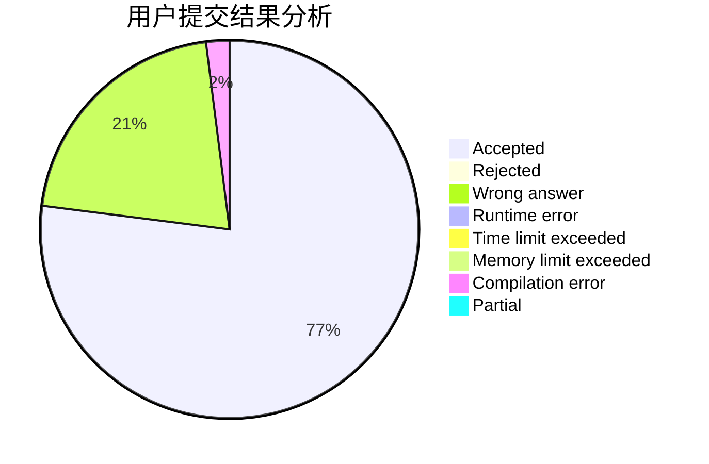
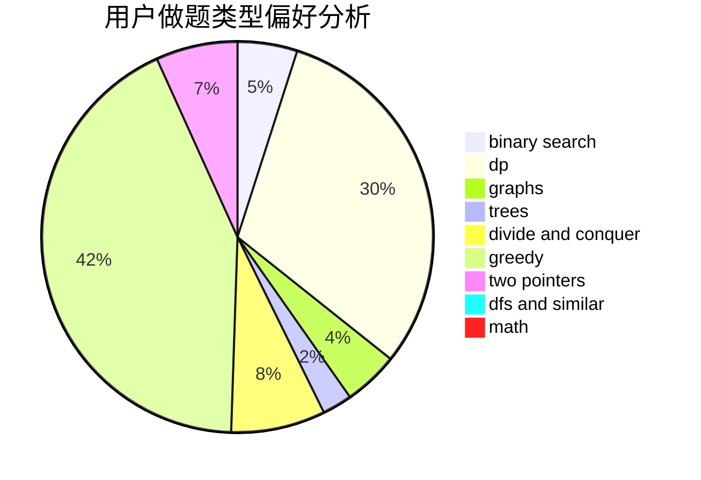

# qdd

<!-- tabs:start -->

#### **用户提交结果分析**

#### **用户做题类型偏好分析**

<!-- tabs:end -->
# 推荐题目
[36C](https://codeforces.com/contest/36/problem/C)
[1297A](https://codeforces.com/contest/1297/problem/A)
[672B](https://codeforces.com/contest/672/problem/B)
[acmsguru4](https://codeforces.com/contest/acmsguru/problem/4)
[788C](https://codeforces.com/contest/788/problem/C)
[460C](https://codeforces.com/contest/460/problem/C)
[698D](https://codeforces.com/contest/698/problem/D)
[475F](https://codeforces.com/contest/475/problem/F)
[822D](https://codeforces.com/contest/822/problem/D)
[68A](https://codeforces.com/contest/68/problem/A)
