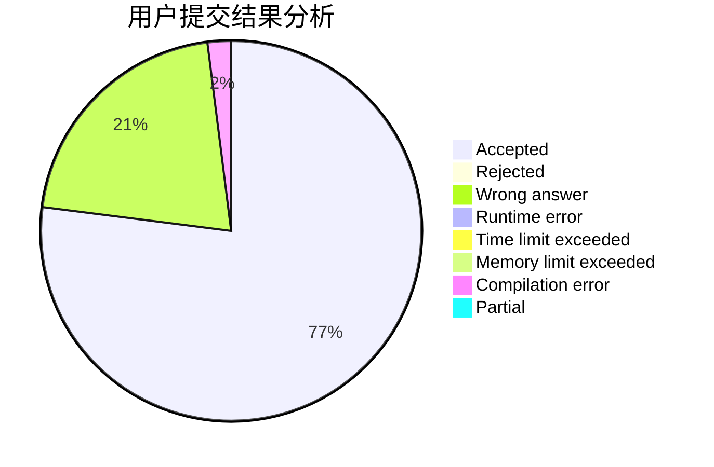
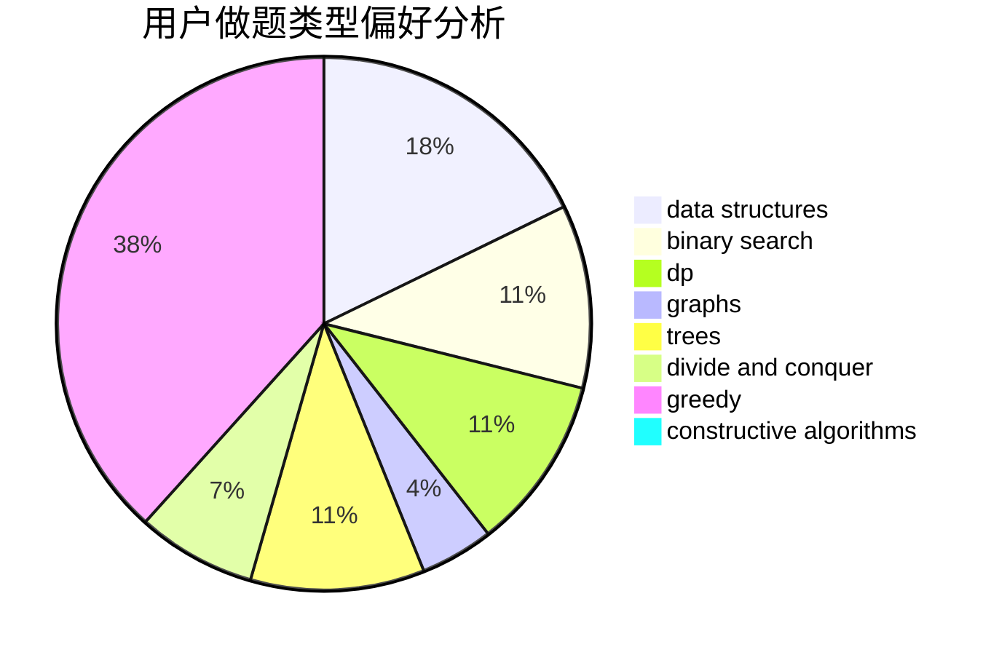

# qdd

<!-- tabs:start -->

#### **用户提交结果分析**

#### **用户做题类型偏好分析**

#### **用户错题知识点分析**

<!-- tabs:end -->
# 推荐题目
[36C](https://codeforces.com/contest/36/problem/C)		geometry,
                        implementation		  
[1297A](https://codeforces.com/contest/1297/problem/A)		*special problem,
                        implementation		  
[672B](https://codeforces.com/contest/672/problem/B)		constructive algorithms,
                        implementation,
                        strings		  
[acmsguru4](https://codeforces.com/contest/acmsguru/problem/4)		dsu,graphs,sortings,trees		  
[788C](https://codeforces.com/contest/788/problem/C)		dfs and similar,
                        graphs,
                        shortest paths		  
[460C](https://codeforces.com/contest/460/problem/C)		binary search,
                        data structures,
                        greedy		  
[698D](https://codeforces.com/contest/698/problem/D)		brute force,
                        geometry,
                        math		  
[475F](https://codeforces.com/contest/475/problem/F)		data structures		  
[822D](https://codeforces.com/contest/822/problem/D)		brute force,
                        dp,
                        greedy,
                        math,
                        number theory		  
[68A](https://codeforces.com/contest/68/problem/A)		implementation,
                        number theory		  
