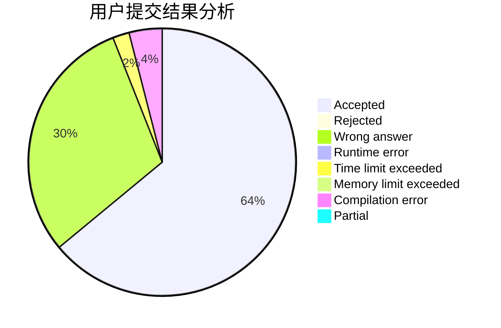
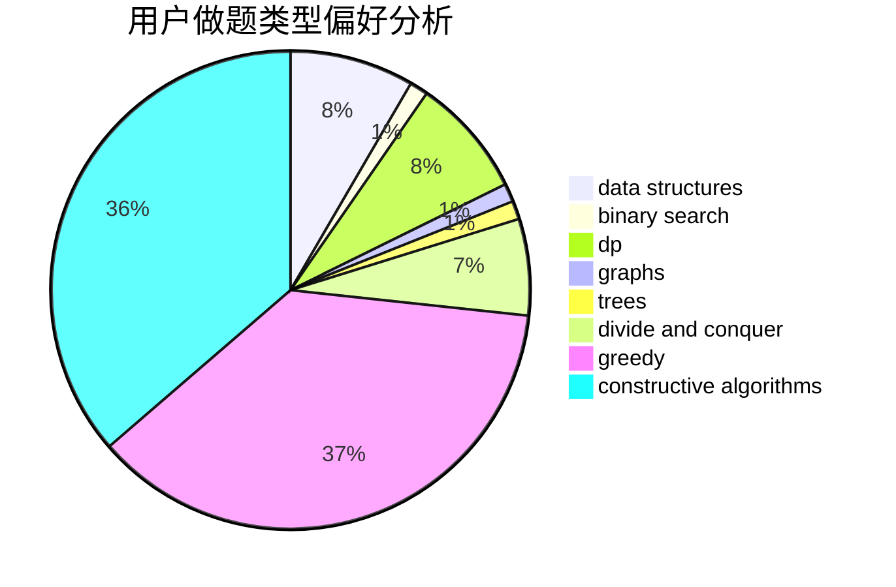
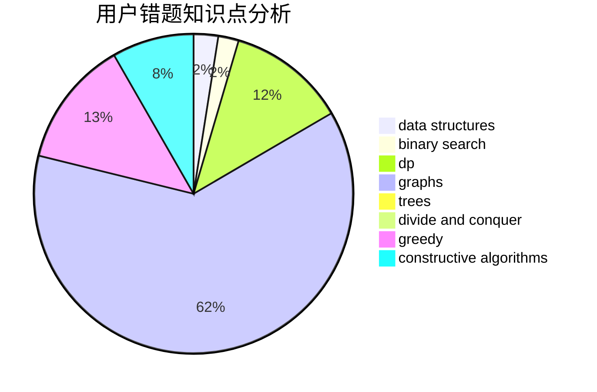

# qi_hai_qian_qiu

<!-- tabs:start -->

#### **用户提交结果分析**

#### **用户做题类型偏好分析**

#### **用户错题知识点分析**

<!-- tabs:end -->
# 推荐题目
[1461F](https://codeforces.com/contest/1461/problem/F)		constructive algorithms,
                        dp,
                        greedy		  
[784D](https://codeforces.com/contest/784/problem/D)		*special problem,
                        implementation		  
[120J](https://codeforces.com/contest/120/problem/J)		divide and conquer,
                        geometry,
                        sortings		  
[662E](https://codeforces.com/contest/662/problem/E)		brute force,
                        dp,
                        greedy		  
[983D](https://codeforces.com/contest/983/problem/D)		data structures		  
[1218C](https://codeforces.com/contest/1218/problem/C)		dp		  
[1442E](https://codeforces.com/contest/1442/problem/E)		binary search,
                        constructive algorithms,
                        dfs and similar,
                        dp,
                        greedy,
                        trees		  
[455A](https://codeforces.com/contest/455/problem/A)		dp		  
[125E](https://codeforces.com/contest/125/problem/E)		binary search,
                        graphs		  
[990D](https://codeforces.com/contest/990/problem/D)		constructive algorithms,
                        graphs,
                        implementation		  
