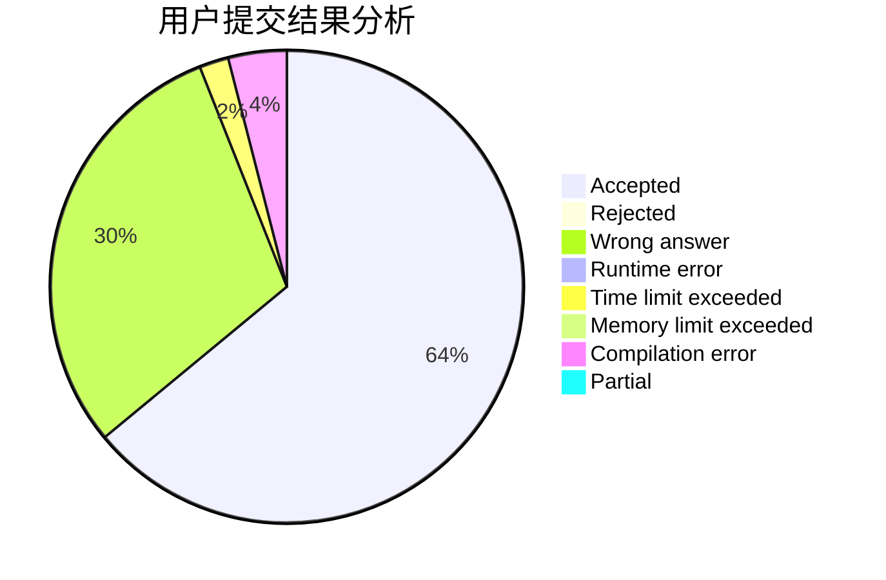
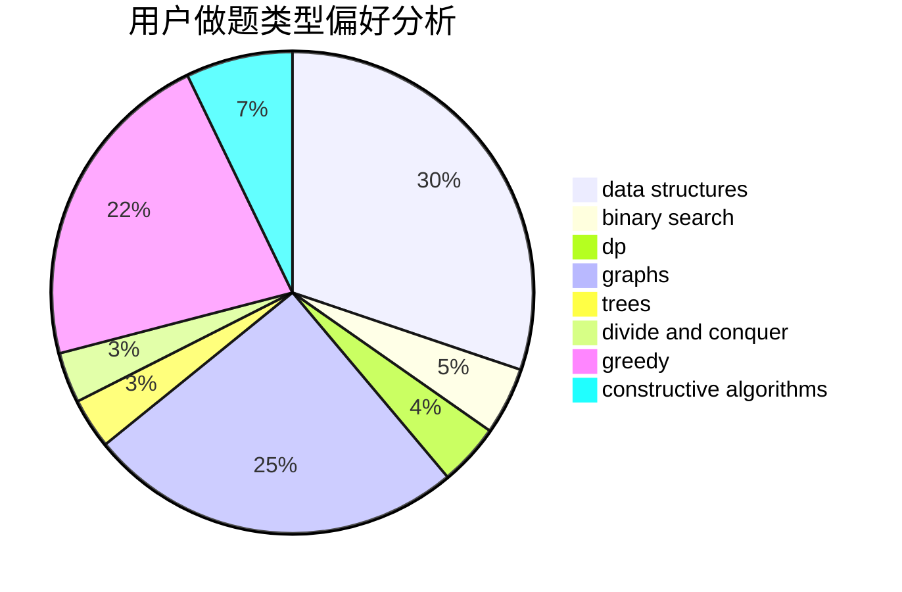
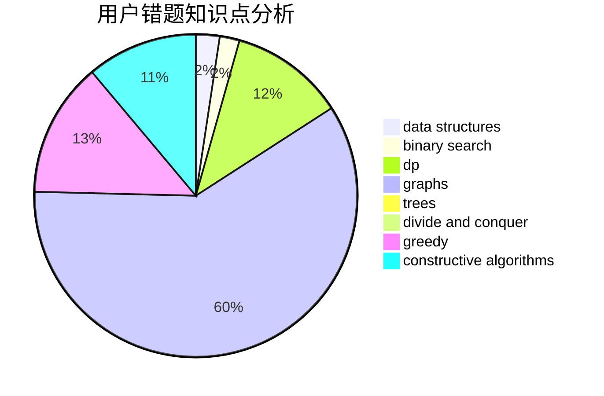

# qi_hai_qian_qiu

<!-- tabs:start -->

#### **用户提交结果分析**

#### **用户做题类型偏好分析**

#### **用户错题知识点分析**

<!-- tabs:end -->
# 推荐题目
[1452C](https://codeforces.com/contest/1452/problem/C)		greedy		  
[765A](https://codeforces.com/contest/765/problem/A)		implementation,
                        math		  
[1205F](https://codeforces.com/contest/1205/problem/F)		constructive algorithms,
                        math		  
[632B](https://codeforces.com/contest/632/problem/B)		brute force,
                        constructive algorithms		  
[961C](https://codeforces.com/contest/961/problem/C)		bitmasks,
                        brute force,
                        implementation		  
[1213D2](https://codeforces.com/contest/1213D/problem/2)		brute force,
                        math,
                        sortings		  
[1432F](https://codeforces.com/contest/1432/problem/F)		dsu,graphs,sortings,trees		  
[434B](https://codeforces.com/contest/434/problem/B)		dsu,graphs,sortings,trees		  
[1252J](https://codeforces.com/contest/1252/problem/J)		brute force,
                        dp		  
[976E](https://codeforces.com/contest/976/problem/E)		greedy,
                        sortings		  
