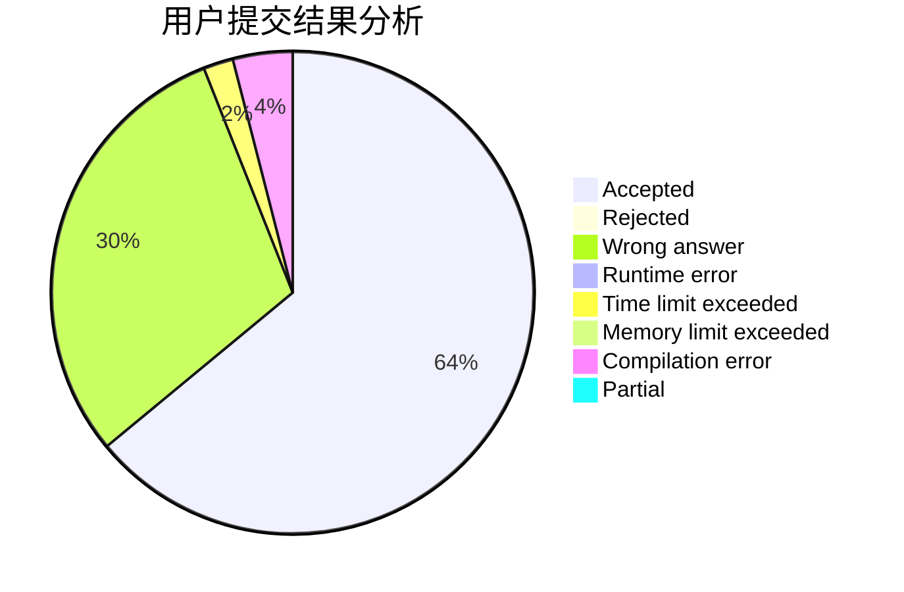
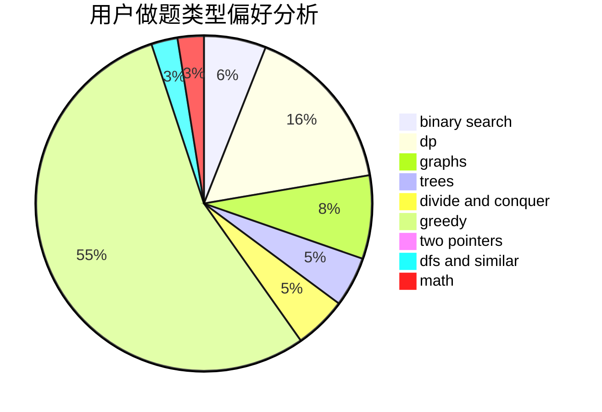

# qi_hai_qian_qiu

<!-- tabs:start -->

#### **用户提交结果分析**

#### **用户做题类型偏好分析**

<!-- tabs:end -->
# 推荐题目
[1461F](https://codeforces.com/contest/1461/problem/F)
[784D](https://codeforces.com/contest/784/problem/D)
[120J](https://codeforces.com/contest/120/problem/J)
[662E](https://codeforces.com/contest/662/problem/E)
[983D](https://codeforces.com/contest/983/problem/D)
[1218C](https://codeforces.com/contest/1218/problem/C)
[1442E](https://codeforces.com/contest/1442/problem/E)
[455A](https://codeforces.com/contest/455/problem/A)
[125E](https://codeforces.com/contest/125/problem/E)
[990D](https://codeforces.com/contest/990/problem/D)
