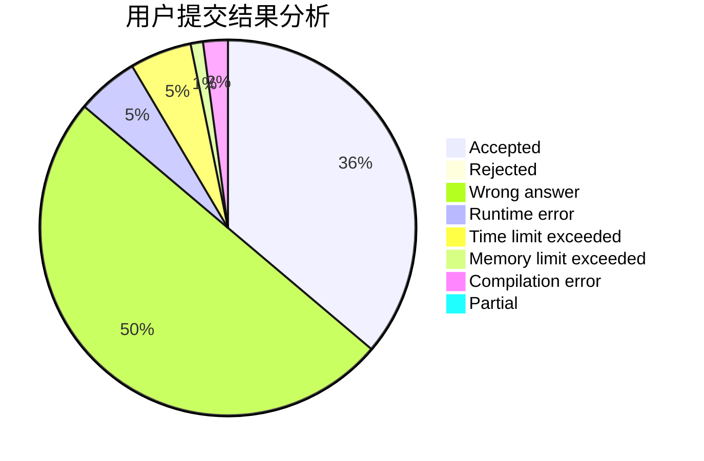
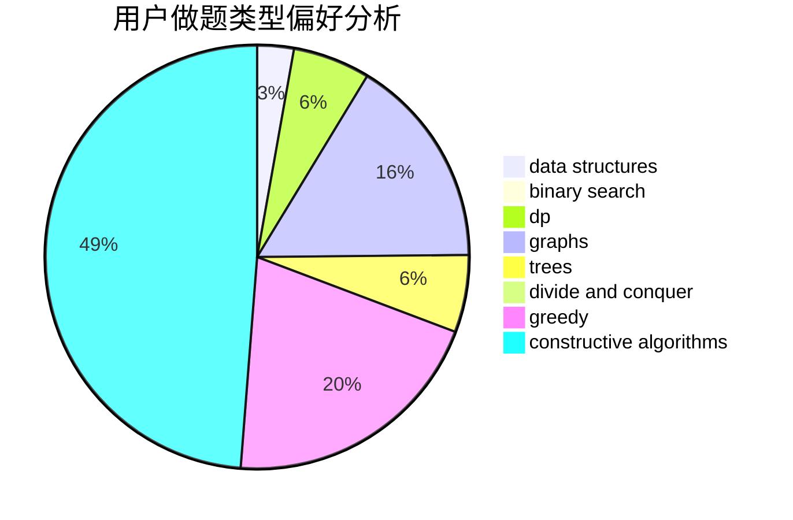

# qiankaihua

<!-- tabs:start -->

#### **用户提交结果分析**

#### **用户做题类型偏好分析**

#### **用户错题知识点分析**

<!-- tabs:end -->
# 推荐题目
[580D](https://codeforces.com/contest/580/problem/D)		bitmasks,
                        dp		  
[543E](https://codeforces.com/contest/543/problem/E)		constructive algorithms,
                        data structures		  
[1154D](https://codeforces.com/contest/1154/problem/D)		greedy		  
[1236B](https://codeforces.com/contest/1236/problem/B)		combinatorics,
                        math		  
[11962](https://codeforces.com/contest/1196/problem/2)		dsu,graphs,sortings,trees		  
[696B](https://codeforces.com/contest/696/problem/B)		dfs and similar,
                        math,
                        probabilities,
                        trees		  
[109A](https://codeforces.com/contest/109/problem/A)		brute force,
                        implementation		  
[1341B](https://codeforces.com/contest/1341/problem/B)		greedy,
                        implementation		  
[183D](https://codeforces.com/contest/183/problem/D)		dp,
                        greedy,
                        probabilities		  
[10C](https://codeforces.com/contest/10/problem/C)		number theory		  
