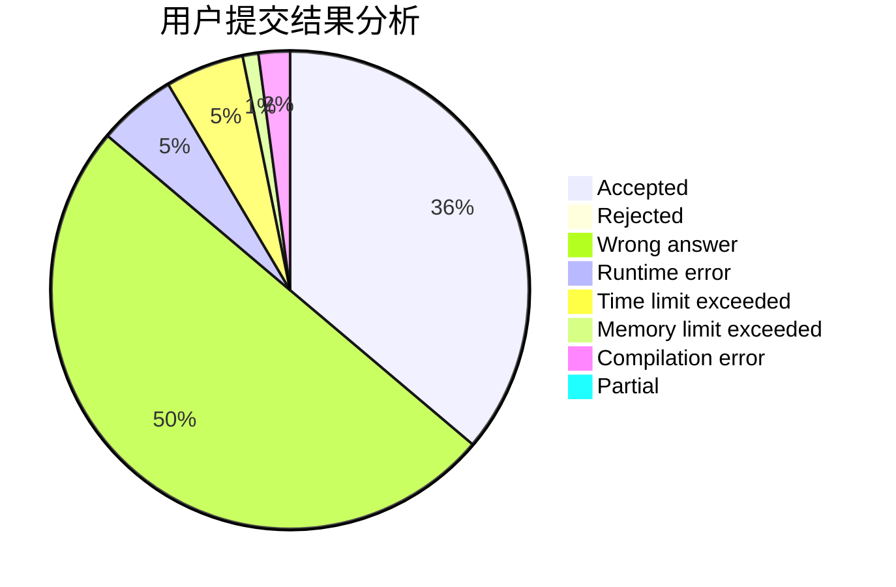
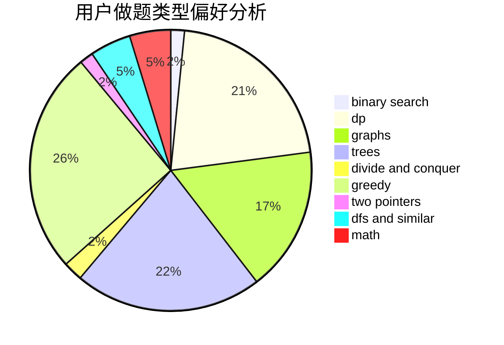

# qiankaihua

<!-- tabs:start -->

#### **用户提交结果分析**

#### **用户做题类型偏好分析**

<!-- tabs:end -->
# 推荐题目
[580D](https://codeforces.com/contest/580/problem/D)
[543E](https://codeforces.com/contest/543/problem/E)
[1154D](https://codeforces.com/contest/1154/problem/D)
[1236B](https://codeforces.com/contest/1236/problem/B)
[11962](https://codeforces.com/contest/1196/problem/2)
[696B](https://codeforces.com/contest/696/problem/B)
[109A](https://codeforces.com/contest/109/problem/A)
[1341B](https://codeforces.com/contest/1341/problem/B)
[183D](https://codeforces.com/contest/183/problem/D)
[10C](https://codeforces.com/contest/10/problem/C)
