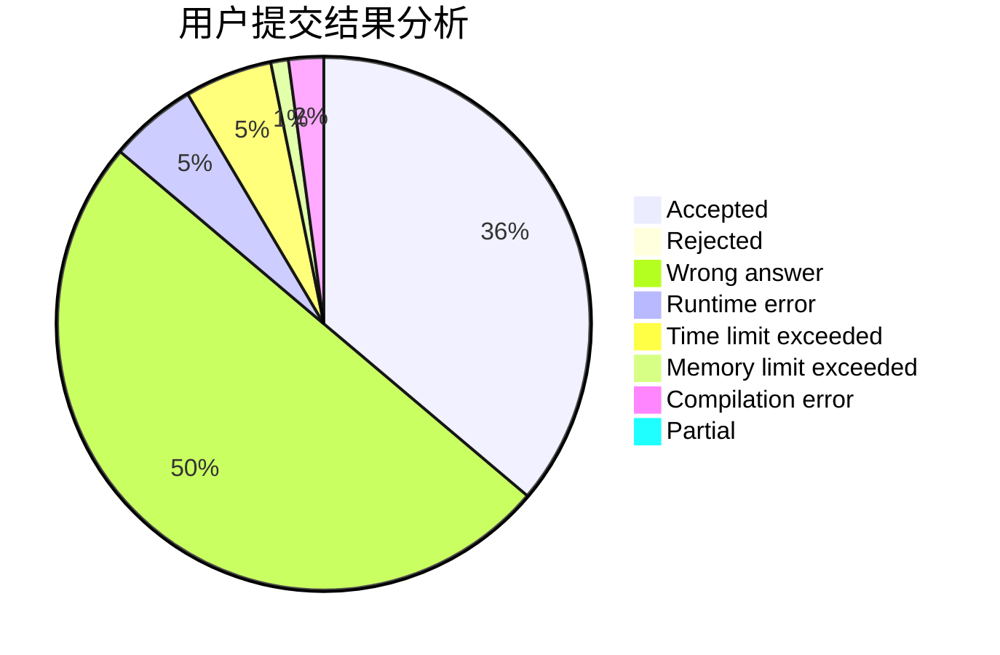
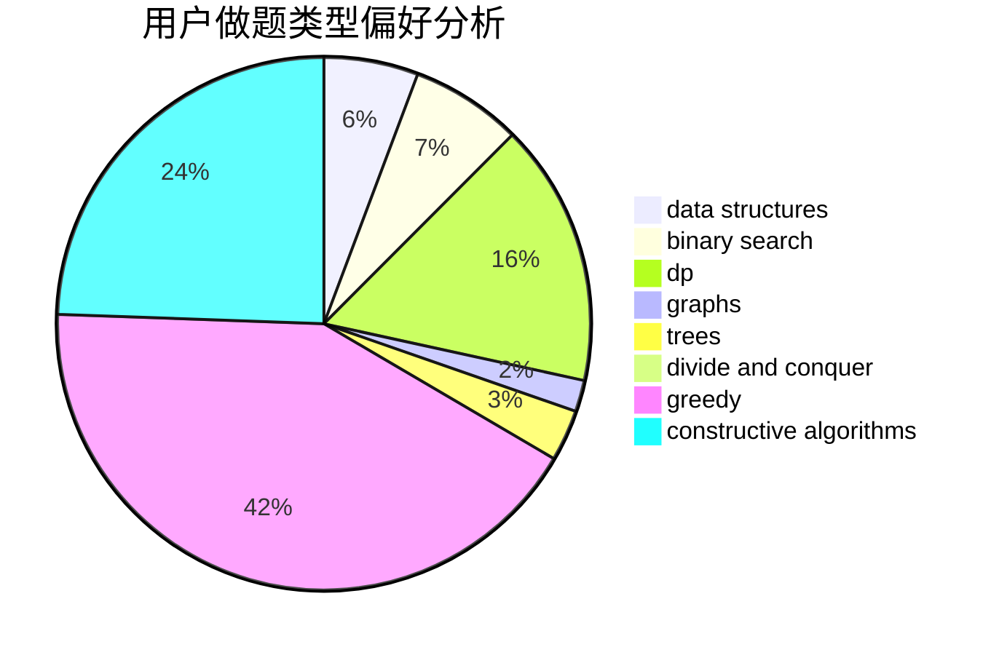

# qiankaihua

<!-- tabs:start -->

#### **用户提交结果分析**

#### **用户做题类型偏好分析**

#### **用户错题知识点分析**

<!-- tabs:end -->
# 推荐题目
[557C](https://codeforces.com/contest/557/problem/C)		brute force,
                        data structures,
                        dp,
                        greedy,
                        math,
                        sortings		  
[516E](https://codeforces.com/contest/516/problem/E)		math,
                        number theory		  
[1152D](https://codeforces.com/contest/1152/problem/D)		dp,
                        greedy,
                        trees		  
[1227D2](https://codeforces.com/contest/1227D/problem/2)		data structures,
                        greedy		  
[1190B](https://codeforces.com/contest/1190/problem/B)		games		  
[670D1](https://codeforces.com/contest/670D/problem/1)		binary search,
                        brute force,
                        implementation		  
[1099D](https://codeforces.com/contest/1099/problem/D)		dsu,graphs,sortings,trees		  
[1334C](https://codeforces.com/contest/1334/problem/C)		brute force,
                        constructive algorithms,
                        greedy,
                        math		  
[160A](https://codeforces.com/contest/160/problem/A)		greedy,
                        sortings		  
[109A](https://codeforces.com/contest/109/problem/A)		brute force,
                        implementation		  
