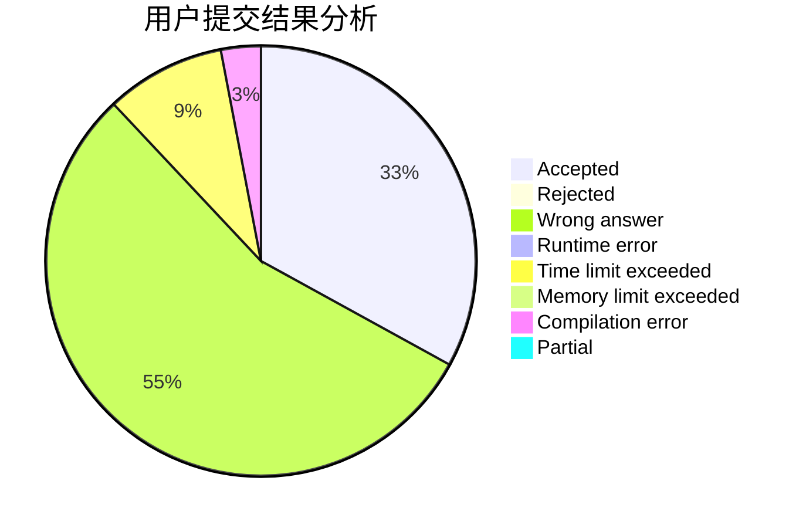
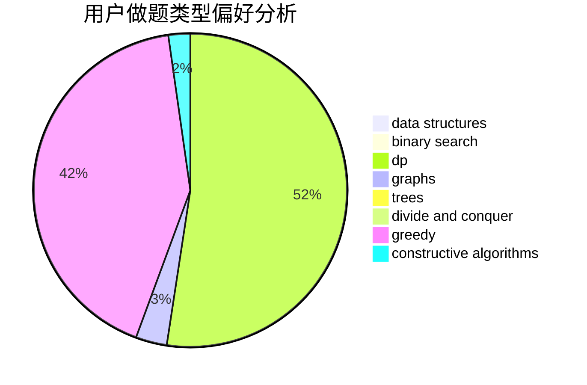

# qing_lin

<!-- tabs:start -->

#### **用户提交结果分析**

#### **用户做题类型偏好分析**

#### **用户错题知识点分析**

<!-- tabs:end -->
# 推荐题目
[1374C](https://codeforces.com/contest/1374/problem/C)		greedy,
                        strings		  
[498E](https://codeforces.com/contest/498/problem/E)		dp,
                        matrices		  
[1060B](https://codeforces.com/contest/1060/problem/B)		greedy		  
[762C](https://codeforces.com/contest/762/problem/C)		binary search,
                        hashing,
                        strings,
                        two pointers		  
[1493E](https://codeforces.com/contest/1493/problem/E)		bitmasks,
                        constructive algorithms,
                        greedy,
                        math,
                        strings,
                        two pointers		  
[844A](https://codeforces.com/contest/844/problem/A)		greedy,
                        implementation,
                        strings		  
[1003C](https://codeforces.com/contest/1003/problem/C)		brute force,
                        implementation,
                        math		  
[1083D](https://codeforces.com/contest/1083/problem/D)		data structures,
                        implementation		  
[1296D](https://codeforces.com/contest/1296/problem/D)		greedy,
                        sortings		  
[509D](https://codeforces.com/contest/509/problem/D)		constructive algorithms,
                        math		  
