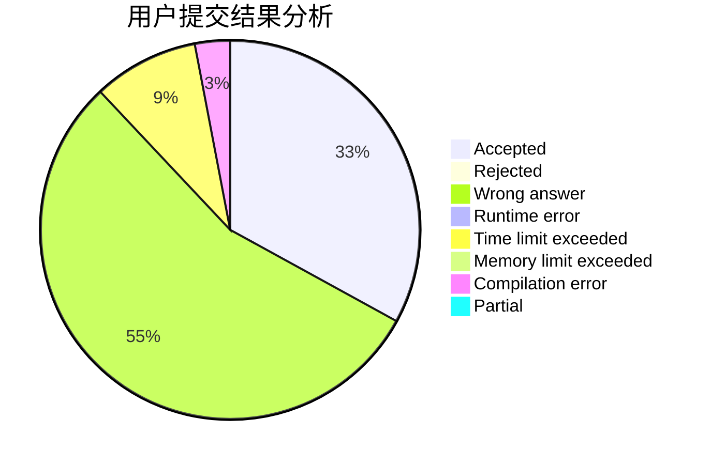
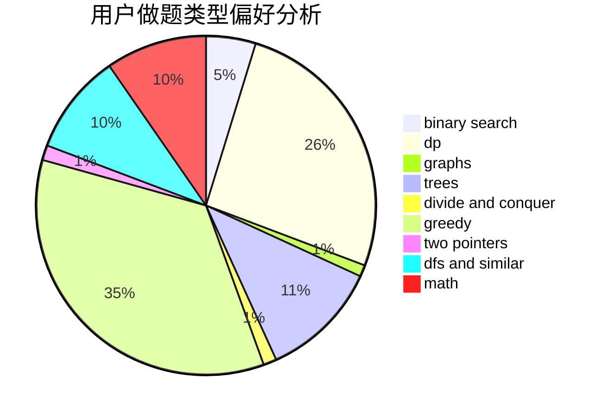

# qing_lin

<!-- tabs:start -->

#### **用户提交结果分析**

#### **用户做题类型偏好分析**

<!-- tabs:end -->
# 推荐题目
[1383B](https://codeforces.com/contest/1383/problem/B)
[519E](https://codeforces.com/contest/519/problem/E)
[1060E](https://codeforces.com/contest/1060/problem/E)
[780G](https://codeforces.com/contest/780/problem/G)
[1501E](https://codeforces.com/contest/1501/problem/E)
[863A](https://codeforces.com/contest/863/problem/A)
[1003F](https://codeforces.com/contest/1003/problem/F)
[1084B](https://codeforces.com/contest/1084/problem/B)
[1303F](https://codeforces.com/contest/1303/problem/F)
[52C](https://codeforces.com/contest/52/problem/C)
