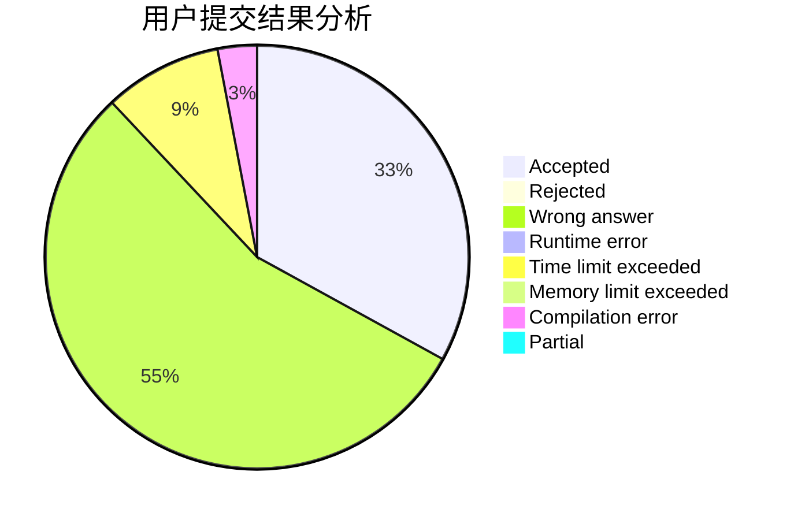
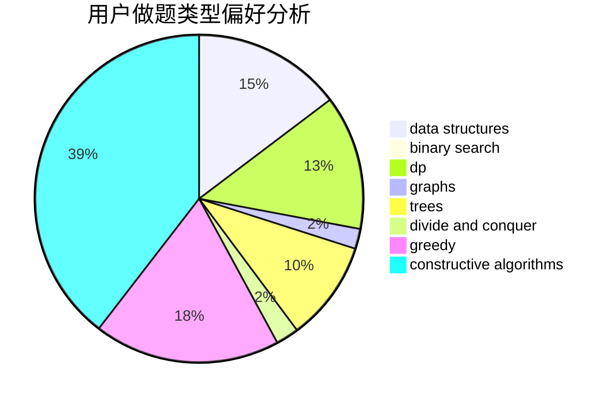

# qing_lin

<!-- tabs:start -->

#### **用户提交结果分析**

#### **用户做题类型偏好分析**

#### **用户错题知识点分析**

<!-- tabs:end -->
# 推荐题目
[1383B](https://codeforces.com/contest/1383/problem/B)		bitmasks,
                        constructive algorithms,
                        dp,
                        games,
                        greedy,
                        math		  
[519E](https://codeforces.com/contest/519/problem/E)		binary search,
                        data structures,
                        dfs and similar,
                        dp,
                        trees		  
[1060E](https://codeforces.com/contest/1060/problem/E)		dfs and similar,
                        dp,
                        trees		  
[780G](https://codeforces.com/contest/780/problem/G)		data structures,
                        dp		  
[1501E](https://codeforces.com/contest/1501/problem/E)		dsu,graphs,sortings,trees		  
[863A](https://codeforces.com/contest/863/problem/A)		brute force,
                        implementation		  
[1003F](https://codeforces.com/contest/1003/problem/F)		dp,
                        hashing,
                        strings		  
[1084B](https://codeforces.com/contest/1084/problem/B)		greedy,
                        implementation		  
[1303F](https://codeforces.com/contest/1303/problem/F)		dsu,
                        implementation		  
[52C](https://codeforces.com/contest/52/problem/C)		data structures		  
