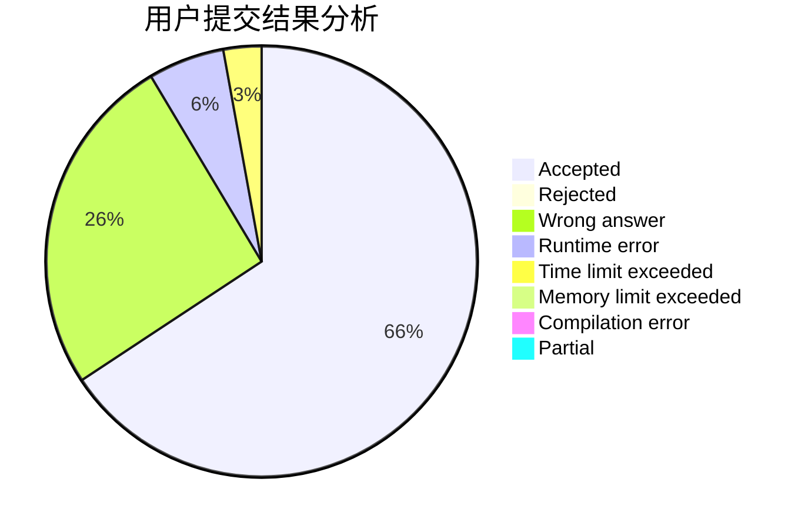
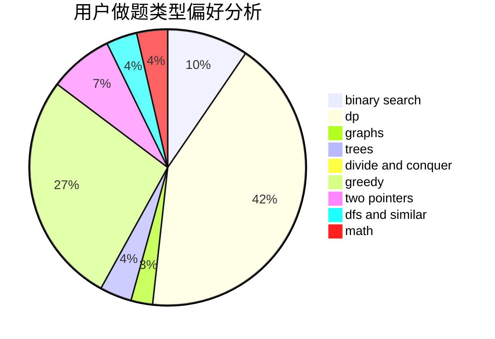

# qinyu123

<!-- tabs:start -->

#### **用户提交结果分析**

#### **用户做题类型偏好分析**

<!-- tabs:end -->
# 推荐题目
[1271A](https://codeforces.com/contest/1271/problem/A)
[1397C](https://codeforces.com/contest/1397/problem/C)
[1383B](https://codeforces.com/contest/1383/problem/B)
[95A](https://codeforces.com/contest/95/problem/A)
[1290F](https://codeforces.com/contest/1290/problem/F)
[1107C](https://codeforces.com/contest/1107/problem/C)
[1150C](https://codeforces.com/contest/1150/problem/C)
[107A](https://codeforces.com/contest/107/problem/A)
[1250F](https://codeforces.com/contest/1250/problem/F)
[107C](https://codeforces.com/contest/107/problem/C)
