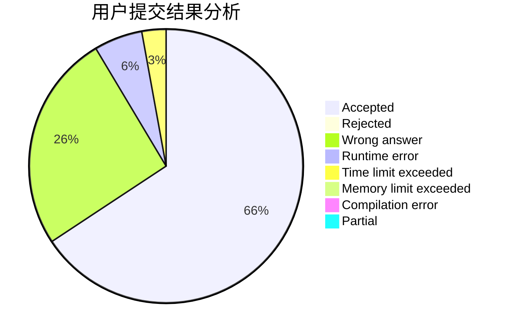
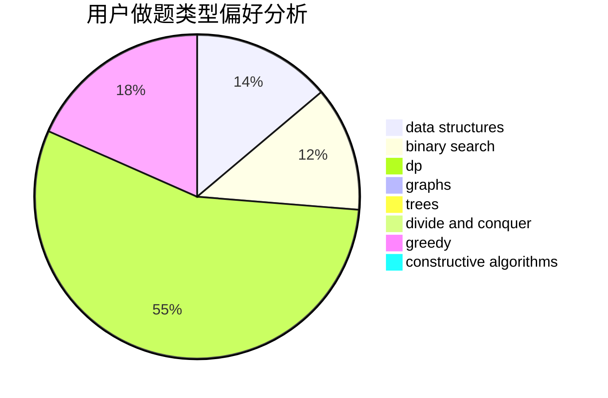
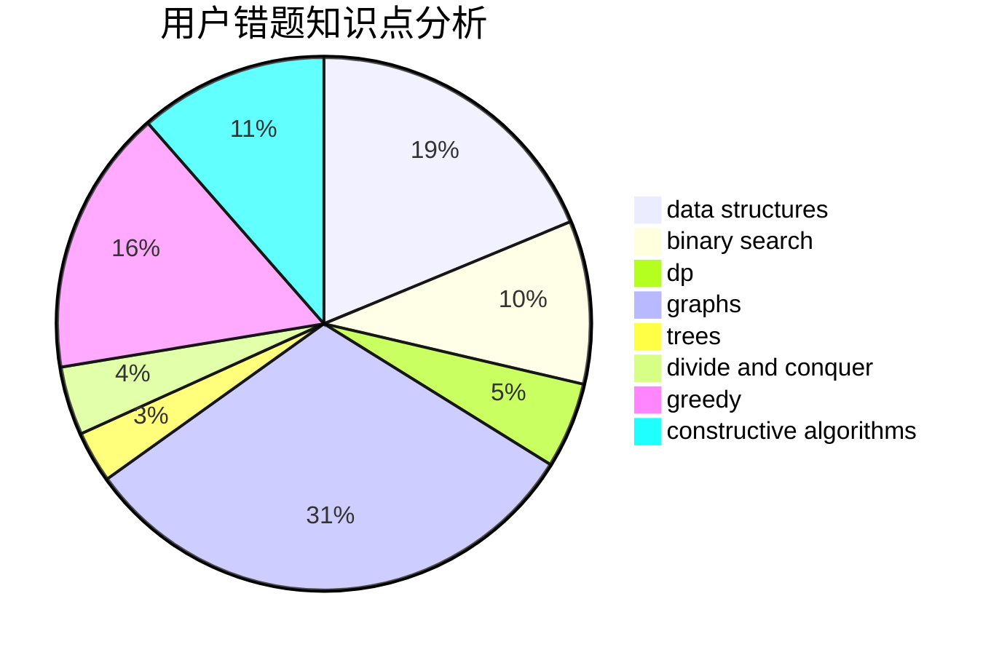

# qinyu123

<!-- tabs:start -->

#### **用户提交结果分析**

#### **用户做题类型偏好分析**

#### **用户错题知识点分析**

<!-- tabs:end -->
# 推荐题目
[1271A](https://codeforces.com/contest/1271/problem/A)		brute force,
                        greedy,
                        math		  
[1397C](https://codeforces.com/contest/1397/problem/C)		dsu,graphs,sortings,trees		  
[1383B](https://codeforces.com/contest/1383/problem/B)		bitmasks,
                        constructive algorithms,
                        dp,
                        games,
                        greedy,
                        math		  
[95A](https://codeforces.com/contest/95/problem/A)		implementation,
                        strings		  
[1290F](https://codeforces.com/contest/1290/problem/F)		dp		  
[1107C](https://codeforces.com/contest/1107/problem/C)		greedy,
                        sortings,
                        two pointers		  
[1150C](https://codeforces.com/contest/1150/problem/C)		dsu,graphs,sortings,trees		  
[107A](https://codeforces.com/contest/107/problem/A)		dfs and similar,
                        graphs		  
[1250F](https://codeforces.com/contest/1250/problem/F)		brute force,
                        implementation		  
[107C](https://codeforces.com/contest/107/problem/C)		bitmasks,
                        dp		  
