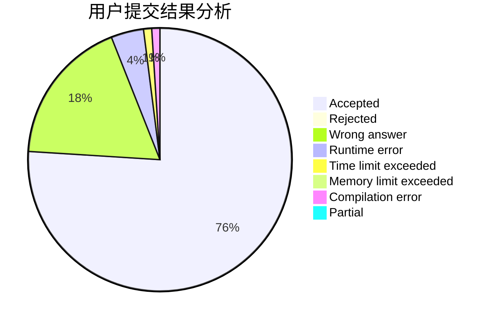
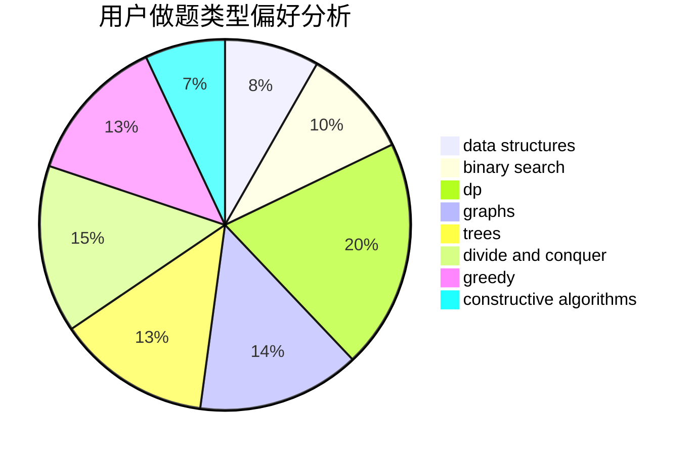
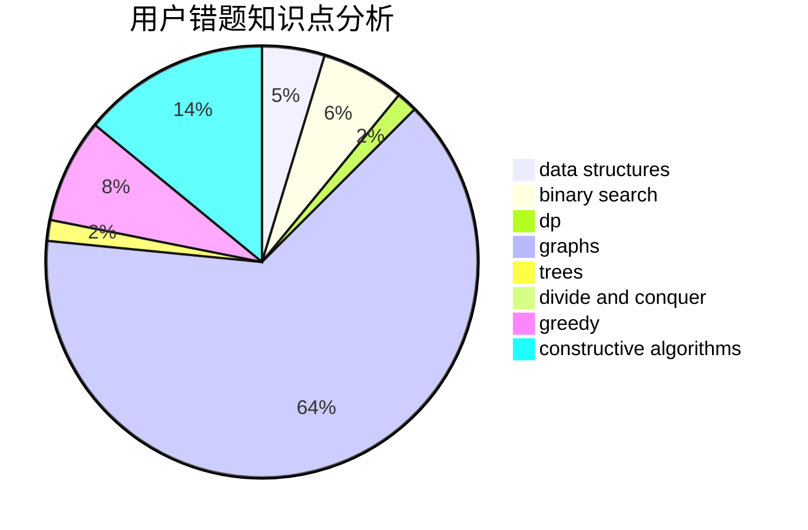

# C20191629

<!-- tabs:start -->

#### **用户提交结果分析**

#### **用户做题类型偏好分析**

#### **用户错题知识点分析**

<!-- tabs:end -->
# 推荐题目
[442B](https://codeforces.com/contest/442/problem/B)		greedy,
                        math,
                        probabilities		  
[576C](https://codeforces.com/contest/576/problem/C)		constructive algorithms,
                        divide and conquer,
                        geometry,
                        greedy,
                        sortings		  
[12871](https://codeforces.com/contest/1287/problem/1)		dsu,graphs,sortings,trees		  
[59A](https://codeforces.com/contest/59/problem/A)		implementation,
                        strings		  
[59E](https://codeforces.com/contest/59/problem/E)		graphs,
                        shortest paths		  
[477A](https://codeforces.com/contest/477/problem/A)		dsu,graphs,sortings,trees		  
[194E](https://codeforces.com/contest/194/problem/E)		dsu,graphs,sortings,trees		  
[304B](https://codeforces.com/contest/304/problem/B)		brute force,
                        implementation		  
[1089D](https://codeforces.com/contest/1089/problem/D)		graphs		  
[11292](https://codeforces.com/contest/1129/problem/2)		dsu,graphs,sortings,trees		  
