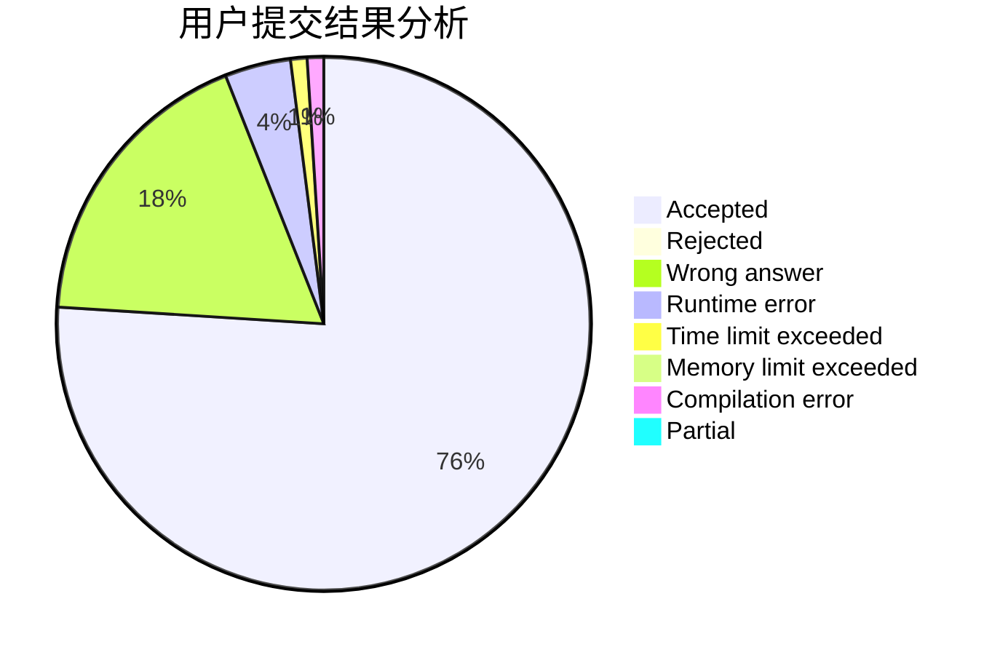
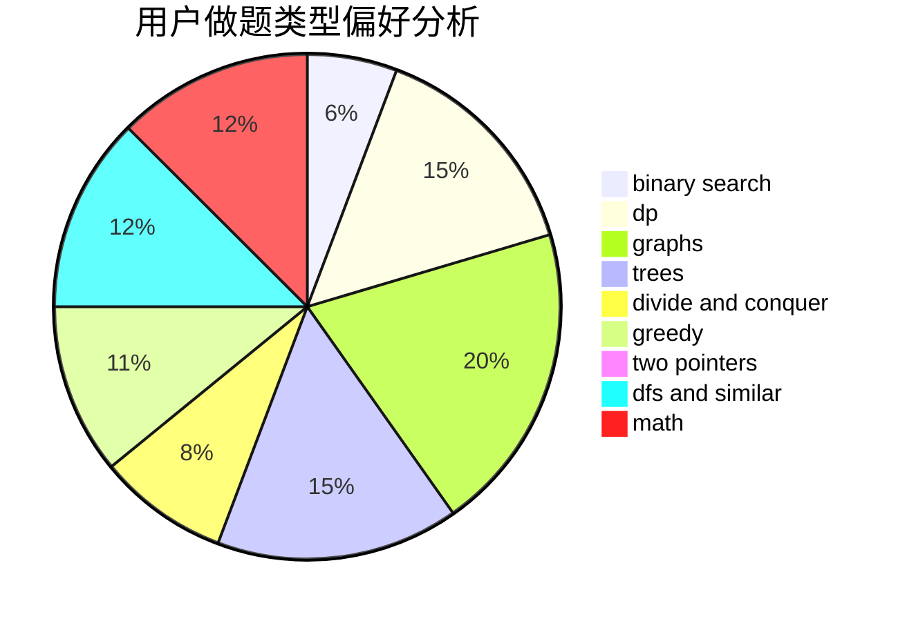

# C20191629

<!-- tabs:start -->

#### **用户提交结果分析**

#### **用户做题类型偏好分析**

<!-- tabs:end -->
# 推荐题目
[442B](https://codeforces.com/contest/442/problem/B)
[576C](https://codeforces.com/contest/576/problem/C)
[12871](https://codeforces.com/contest/1287/problem/1)
[59A](https://codeforces.com/contest/59/problem/A)
[59E](https://codeforces.com/contest/59/problem/E)
[477A](https://codeforces.com/contest/477/problem/A)
[194E](https://codeforces.com/contest/194/problem/E)
[304B](https://codeforces.com/contest/304/problem/B)
[1089D](https://codeforces.com/contest/1089/problem/D)
[11292](https://codeforces.com/contest/1129/problem/2)
