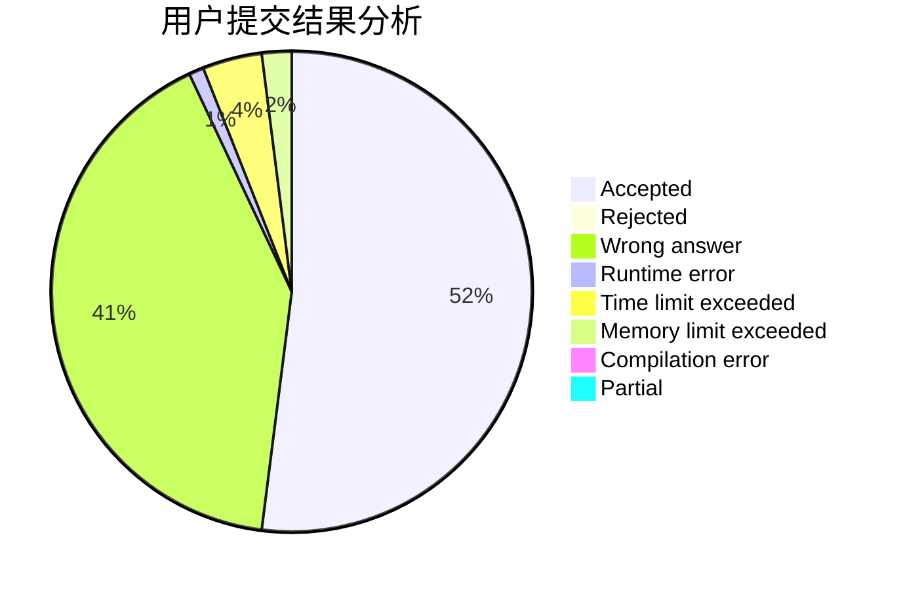
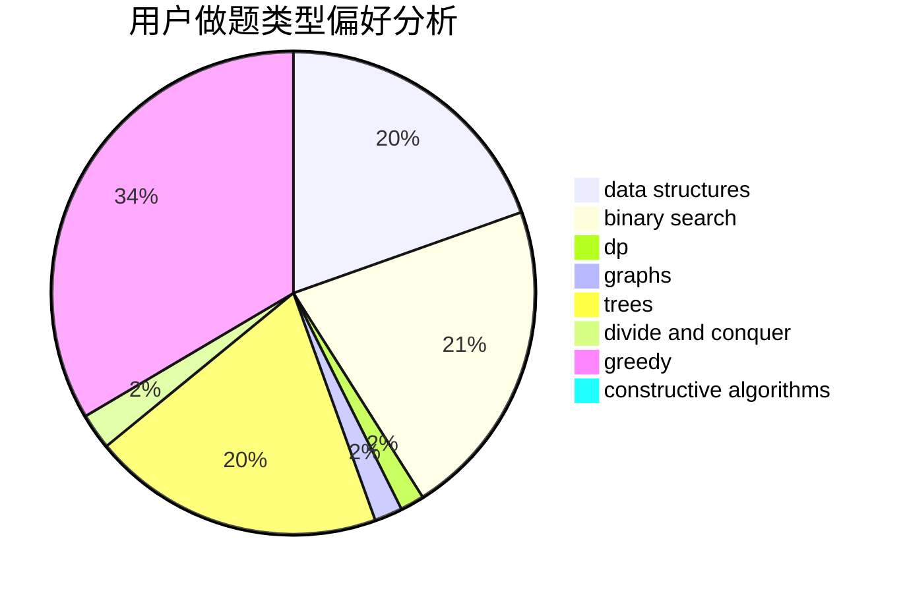
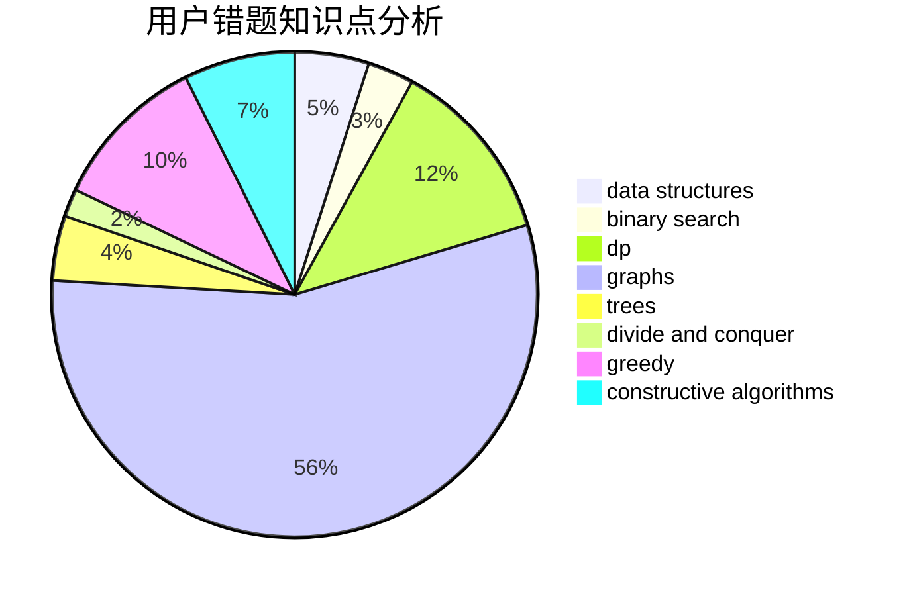

# qinzhaoyang

<!-- tabs:start -->

#### **用户提交结果分析**

#### **用户做题类型偏好分析**

#### **用户错题知识点分析**

<!-- tabs:end -->
# 推荐题目
[269D](https://codeforces.com/contest/269/problem/D)		data structures,
                        dp,
                        graphs,
                        sortings		  
[1156B](https://codeforces.com/contest/1156/problem/B)		dfs and similar,
                        greedy,
                        implementation,
                        sortings,
                        strings		  
[924B](https://codeforces.com/contest/924/problem/B)		binary search,
                        greedy,
                        two pointers		  
[442D](https://codeforces.com/contest/442/problem/D)		data structures,
                        trees		  
[1034B](https://codeforces.com/contest/1034/problem/B)		brute force,
                        constructive algorithms,
                        flows,
                        graph matchings		  
[1039E](https://codeforces.com/contest/1039/problem/E)		data structures		  
[476C](https://codeforces.com/contest/476/problem/C)		math		  
[1207E](https://codeforces.com/contest/1207/problem/E)		bitmasks,
                        interactive,
                        math		  
[652A](https://codeforces.com/contest/652/problem/A)		implementation,
                        math		  
[845F](https://codeforces.com/contest/845/problem/F)		bitmasks,
                        dp		  
