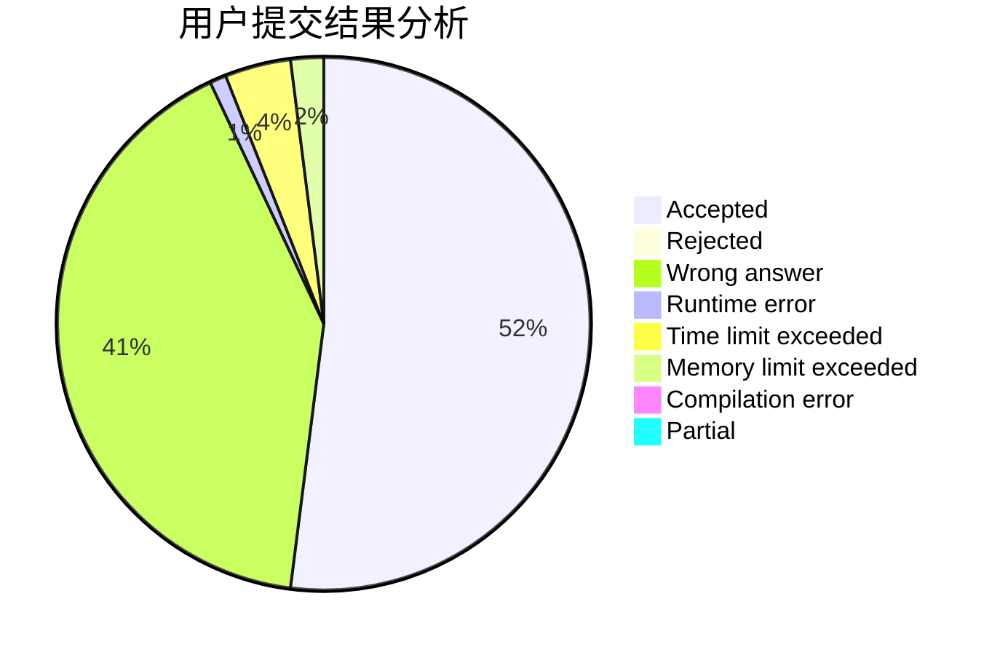
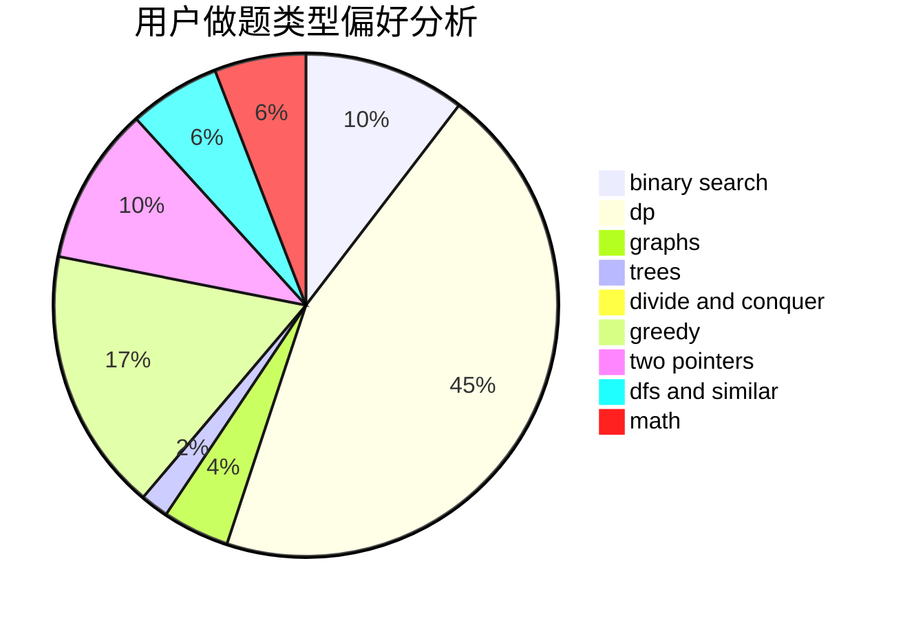

# qinzhaoyang

<!-- tabs:start -->

#### **用户提交结果分析**

#### **用户做题类型偏好分析**

<!-- tabs:end -->
# 推荐题目
[285E](https://codeforces.com/contest/285/problem/E)
[1157G](https://codeforces.com/contest/1157/problem/G)
[947E](https://codeforces.com/contest/947/problem/E)
[463B](https://codeforces.com/contest/463/problem/B)
[1034E](https://codeforces.com/contest/1034/problem/E)
[103C](https://codeforces.com/contest/103/problem/C)
[496A](https://codeforces.com/contest/496/problem/A)
[1213A](https://codeforces.com/contest/1213/problem/A)
[675E](https://codeforces.com/contest/675/problem/E)
[864A](https://codeforces.com/contest/864/problem/A)
