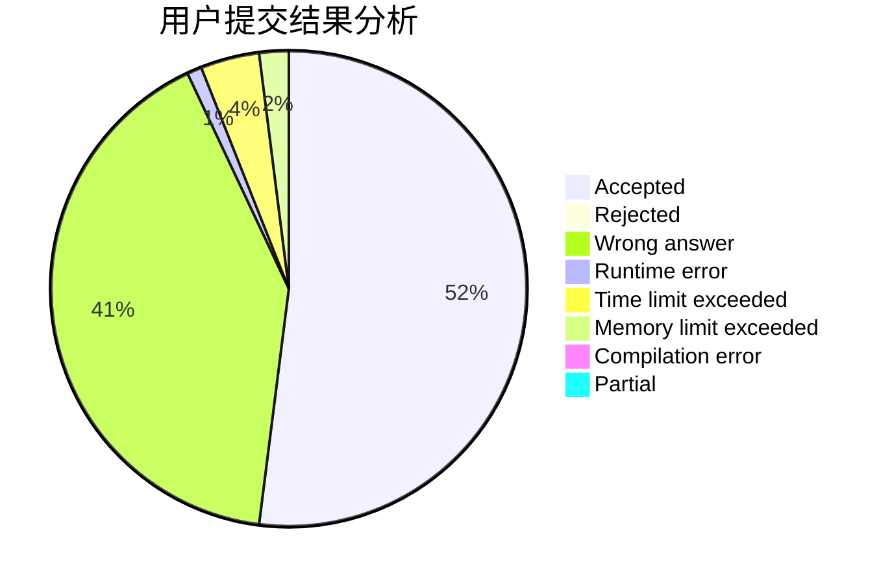
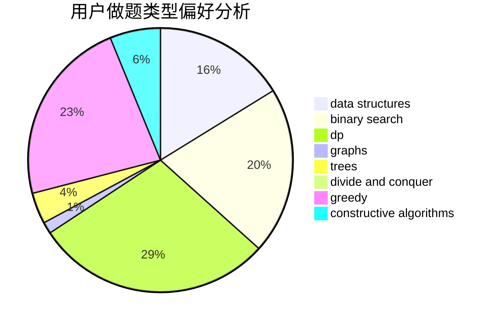
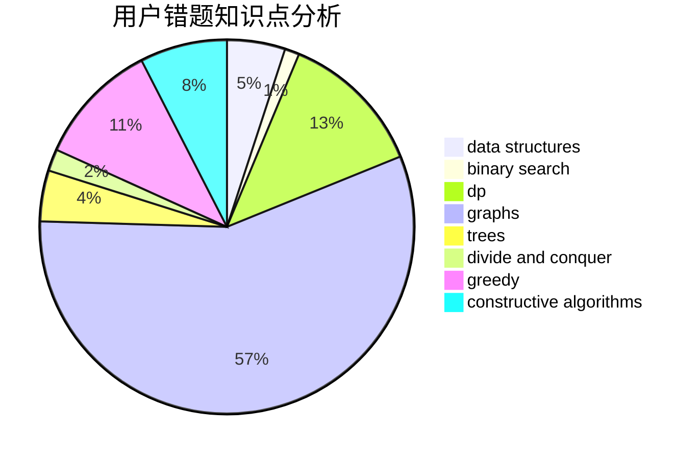

# qinzhaoyang

<!-- tabs:start -->

#### **用户提交结果分析**

#### **用户做题类型偏好分析**

#### **用户错题知识点分析**

<!-- tabs:end -->
# 推荐题目
[285E](https://codeforces.com/contest/285/problem/E)		combinatorics,
                        dp,
                        math		  
[1157G](https://codeforces.com/contest/1157/problem/G)		brute force,
                        constructive algorithms		  
[947E](https://codeforces.com/contest/947/problem/E)		dsu,graphs,sortings,trees		  
[463B](https://codeforces.com/contest/463/problem/B)		brute force,
                        implementation,
                        math		  
[1034E](https://codeforces.com/contest/1034/problem/E)		bitmasks,
                        dp,
                        math		  
[103C](https://codeforces.com/contest/103/problem/C)		constructive algorithms,
                        greedy		  
[496A](https://codeforces.com/contest/496/problem/A)		brute force,
                        implementation,
                        math		  
[1213A](https://codeforces.com/contest/1213/problem/A)		math		  
[675E](https://codeforces.com/contest/675/problem/E)		data structures,
                        dp,
                        greedy		  
[864A](https://codeforces.com/contest/864/problem/A)		implementation,
                        sortings		  
