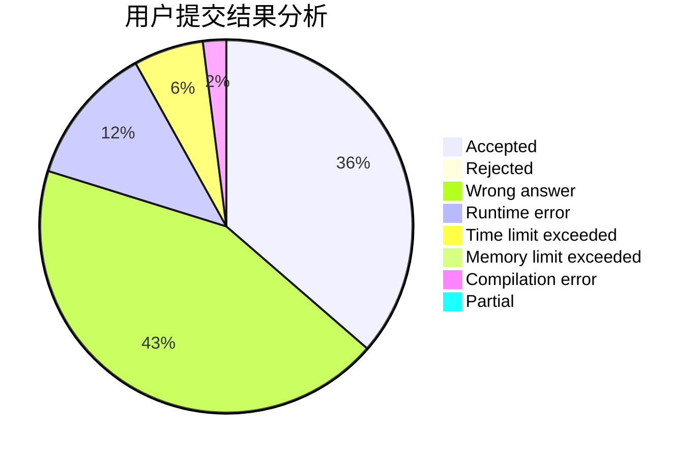
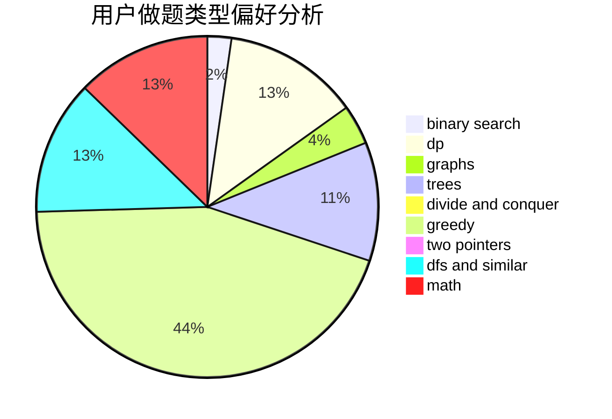

# qiubobo

<!-- tabs:start -->

#### **用户提交结果分析**

#### **用户做题类型偏好分析**

<!-- tabs:end -->
# 推荐题目
[819A](https://codeforces.com/contest/819/problem/A)
[185A](https://codeforces.com/contest/185/problem/A)
[1314C](https://codeforces.com/contest/1314/problem/C)
[1161B](https://codeforces.com/contest/1161/problem/B)
[1185D](https://codeforces.com/contest/1185/problem/D)
[1061C](https://codeforces.com/contest/1061/problem/C)
[804C](https://codeforces.com/contest/804/problem/C)
[1038A](https://codeforces.com/contest/1038/problem/A)
[1499F](https://codeforces.com/contest/1499/problem/F)
[1423J](https://codeforces.com/contest/1423/problem/J)
