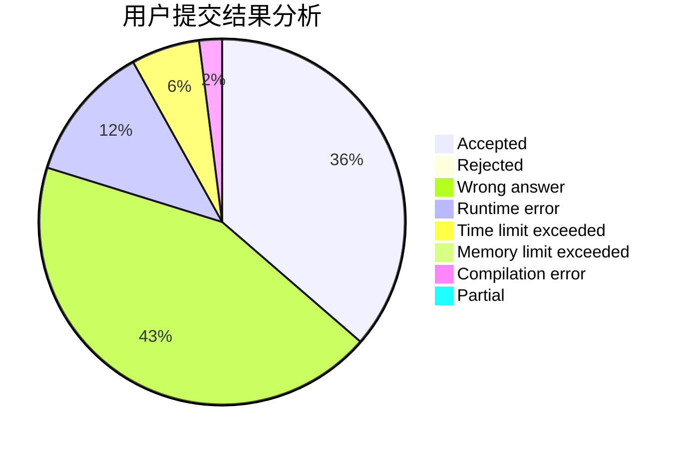
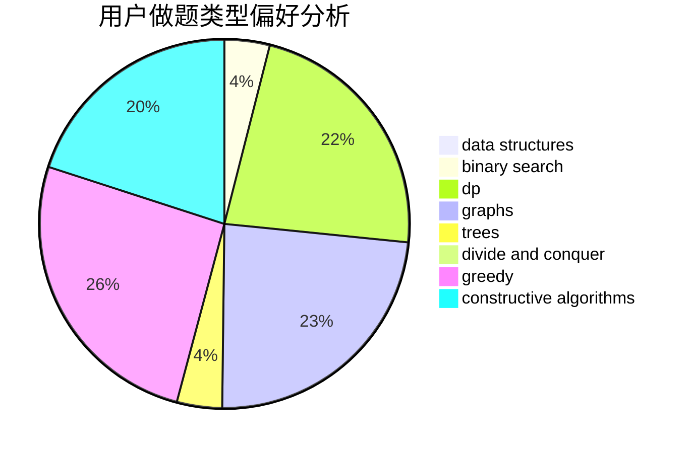

# qiubobo

<!-- tabs:start -->

#### **用户提交结果分析**

#### **用户做题类型偏好分析**

#### **用户错题知识点分析**

<!-- tabs:end -->
# 推荐题目
[803C](https://codeforces.com/contest/803/problem/C)		constructive algorithms,
                        greedy,
                        math		  
[160B](https://codeforces.com/contest/160/problem/B)		greedy,
                        sortings		  
[1305D](https://codeforces.com/contest/1305/problem/D)		constructive algorithms,
                        dfs and similar,
                        interactive,
                        trees		  
[1158C](https://codeforces.com/contest/1158/problem/C)		constructive algorithms,
                        data structures,
                        dfs and similar,
                        graphs,
                        greedy,
                        math,
                        sortings		  
[1183A](https://codeforces.com/contest/1183/problem/A)		implementation		  
[1060G](https://codeforces.com/contest/1060/problem/G)		data structures		  
[789A](https://codeforces.com/contest/789/problem/A)		implementation,
                        math		  
[1037F](https://codeforces.com/contest/1037/problem/F)		combinatorics,
                        data structures,
                        math		  
[1490G](https://codeforces.com/contest/1490/problem/G)		binary search,
                        data structures,
                        math		  
[1415F](https://codeforces.com/contest/1415/problem/F)		dp		  
