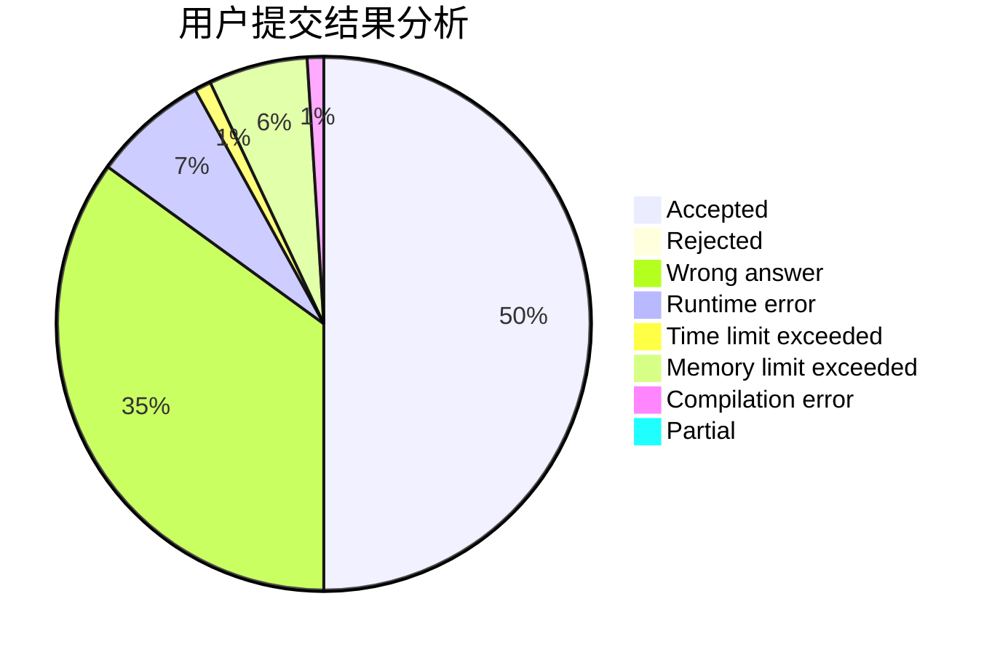
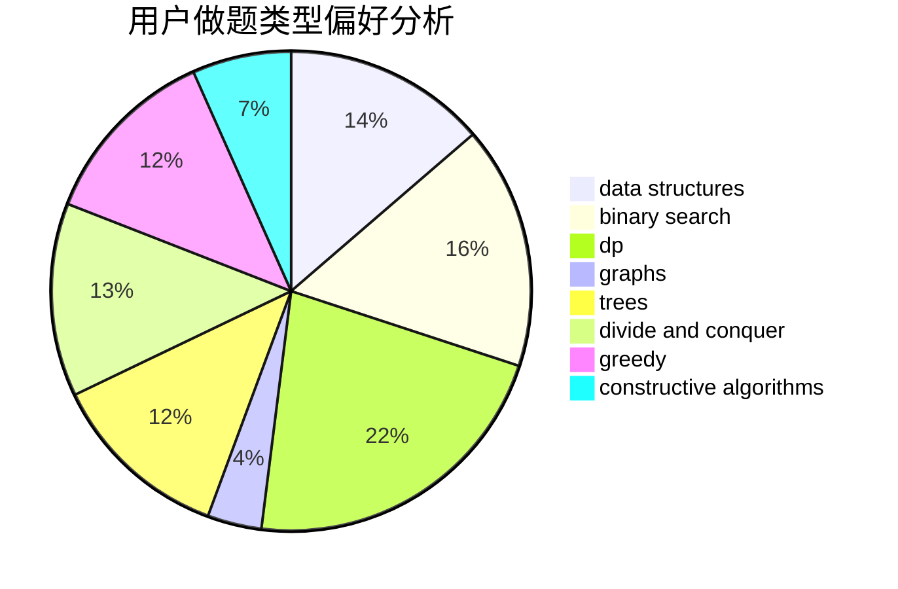
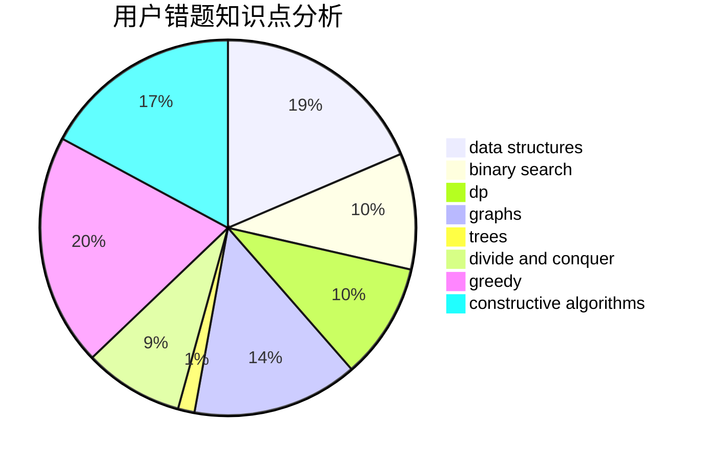

# qiuzx

<!-- tabs:start -->

#### **用户提交结果分析**

#### **用户做题类型偏好分析**

#### **用户错题知识点分析**

<!-- tabs:end -->
# 推荐题目
[1164H](https://codeforces.com/contest/1164/problem/H)		dsu,graphs,sortings,trees		  
[1413F](https://codeforces.com/contest/1413/problem/F)		data structures,
                        trees		  
[559C](https://codeforces.com/contest/559/problem/C)		combinatorics,
                        dp,
                        math,
                        number theory		  
[938B](https://codeforces.com/contest/938/problem/B)		brute force,
                        greedy		  
[547E](https://codeforces.com/contest/547/problem/E)		data structures,
                        string suffix structures,
                        strings,
                        trees		  
[710F](https://codeforces.com/contest/710/problem/F)		brute force,
                        data structures,
                        hashing,
                        interactive,
                        string suffix structures,
                        strings		  
[915C](https://codeforces.com/contest/915/problem/C)		dp,
                        greedy		  
[23B](https://codeforces.com/contest/23/problem/B)		constructive algorithms,
                        graphs,
                        math		  
[1508A](https://codeforces.com/contest/1508/problem/A)		constructive algorithms,
                        greedy,
                        implementation,
                        math,
                        strings,
                        two pointers		  
[514D](https://codeforces.com/contest/514/problem/D)		binary search,
                        data structures,
                        two pointers		  
