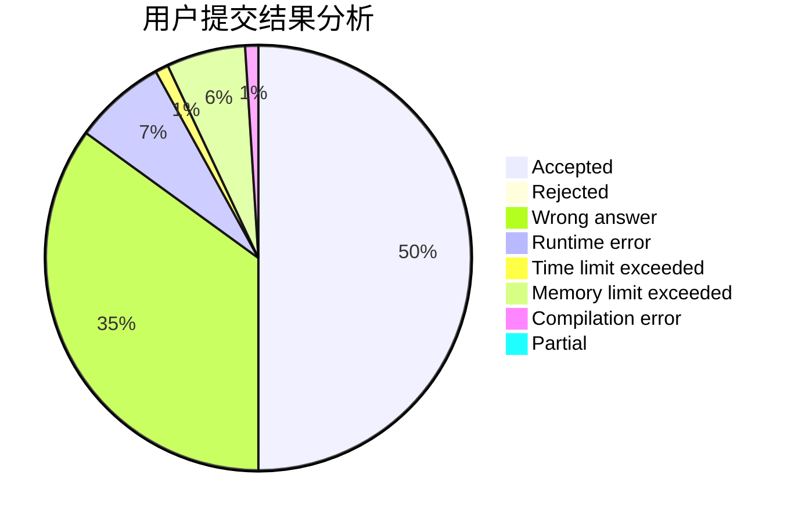
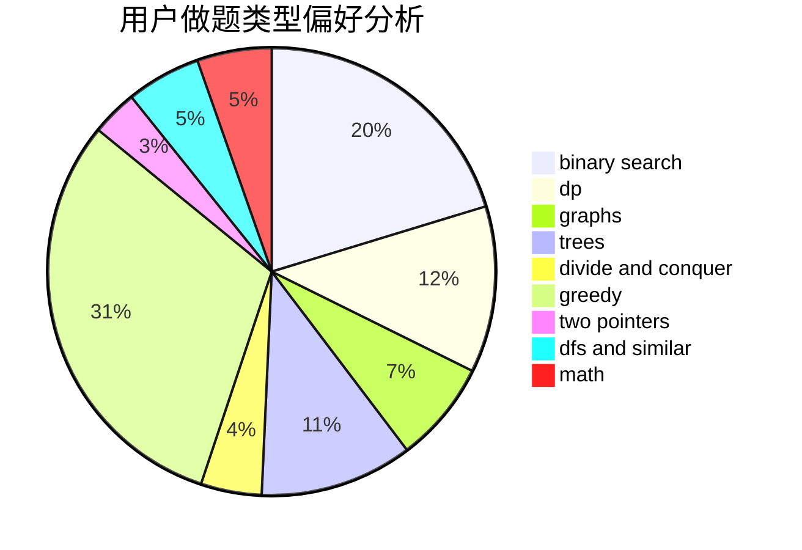

# qiuzx

<!-- tabs:start -->

#### **用户提交结果分析**

#### **用户做题类型偏好分析**

<!-- tabs:end -->
# 推荐题目
[1165E](https://codeforces.com/contest/1165/problem/E)
[1423C](https://codeforces.com/contest/1423/problem/C)
[582A](https://codeforces.com/contest/582/problem/A)
[95A](https://codeforces.com/contest/95/problem/A)
[573B](https://codeforces.com/contest/573/problem/B)
[730J](https://codeforces.com/contest/730/problem/J)
[935B](https://codeforces.com/contest/935/problem/B)
[260D](https://codeforces.com/contest/260/problem/D)
[158E](https://codeforces.com/contest/158/problem/E)
[540B](https://codeforces.com/contest/540/problem/B)
