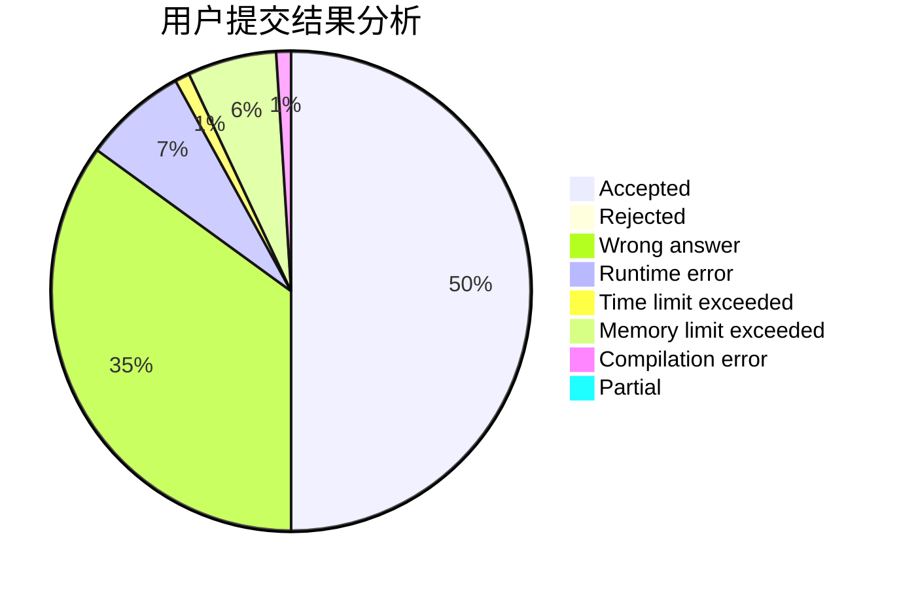
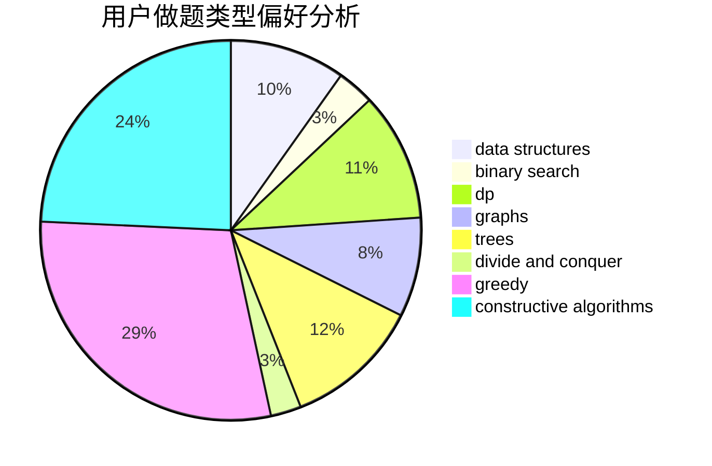
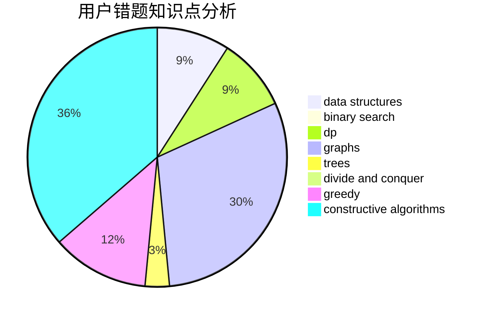

# qiuzx

<!-- tabs:start -->

#### **用户提交结果分析**

#### **用户做题类型偏好分析**

#### **用户错题知识点分析**

<!-- tabs:end -->
# 推荐题目
[1165E](https://codeforces.com/contest/1165/problem/E)		greedy,
                        math,
                        sortings		  
[1423C](https://codeforces.com/contest/1423/problem/C)		divide and conquer,
                        graphs,
                        trees		  
[582A](https://codeforces.com/contest/582/problem/A)		constructive algorithms,
                        greedy,
                        number theory		  
[95A](https://codeforces.com/contest/95/problem/A)		implementation,
                        strings		  
[573B](https://codeforces.com/contest/573/problem/B)		binary search,
                        data structures,
                        dp,
                        math		  
[730J](https://codeforces.com/contest/730/problem/J)		dp		  
[935B](https://codeforces.com/contest/935/problem/B)		implementation		  
[260D](https://codeforces.com/contest/260/problem/D)		constructive algorithms,
                        dsu,
                        graphs,
                        greedy,
                        trees		  
[158E](https://codeforces.com/contest/158/problem/E)		*special problem,
                        dp,
                        sortings		  
[540B](https://codeforces.com/contest/540/problem/B)		greedy,
                        implementation		  
