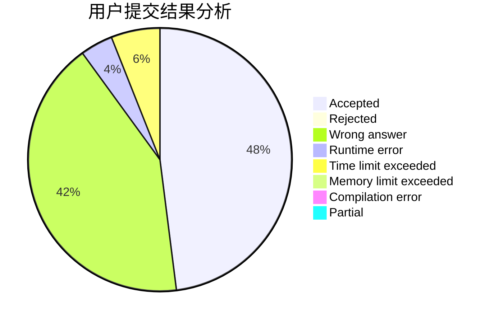
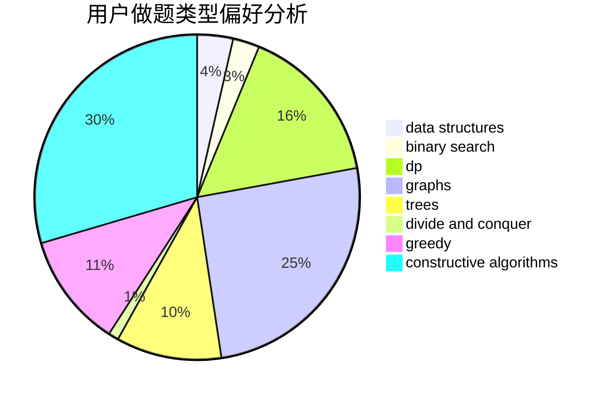
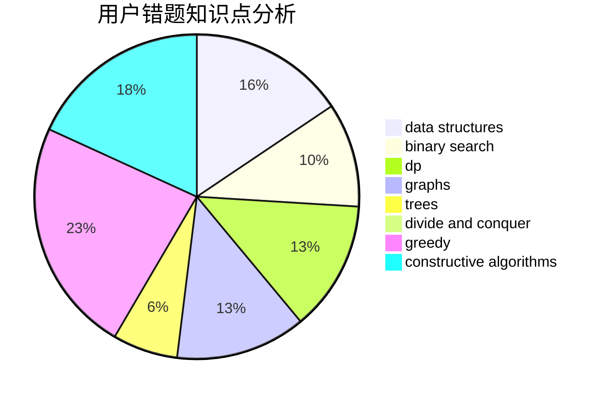

# qizz2015

<!-- tabs:start -->

#### **用户提交结果分析**

#### **用户做题类型偏好分析**

#### **用户错题知识点分析**

<!-- tabs:end -->
# 推荐题目
[1063C](https://codeforces.com/contest/1063/problem/C)		binary search,
                        constructive algorithms,
                        geometry,
                        interactive		  
[575A](https://codeforces.com/contest/575/problem/A)		data structures,
                        math,
                        matrices		  
[1361A](https://codeforces.com/contest/1361/problem/A)		constructive algorithms,
                        graphs,
                        greedy,
                        sortings		  
[1205E](https://codeforces.com/contest/1205/problem/E)		combinatorics,
                        strings		  
[20A](https://codeforces.com/contest/20/problem/A)		implementation		  
[639E](https://codeforces.com/contest/639/problem/E)		binary search,
                        greedy,
                        math,
                        sortings		  
[898A](https://codeforces.com/contest/898/problem/A)		implementation,
                        math		  
[431A](https://codeforces.com/contest/431/problem/A)		implementation		  
[472C](https://codeforces.com/contest/472/problem/C)		greedy		  
[425C](https://codeforces.com/contest/425/problem/C)		data structures,
                        dp		  
