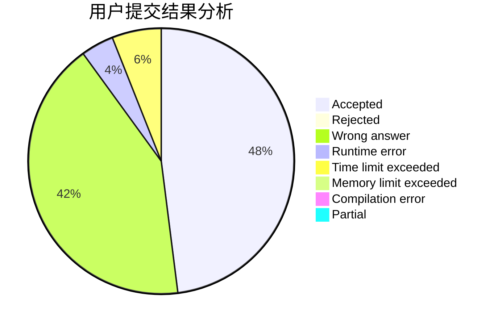
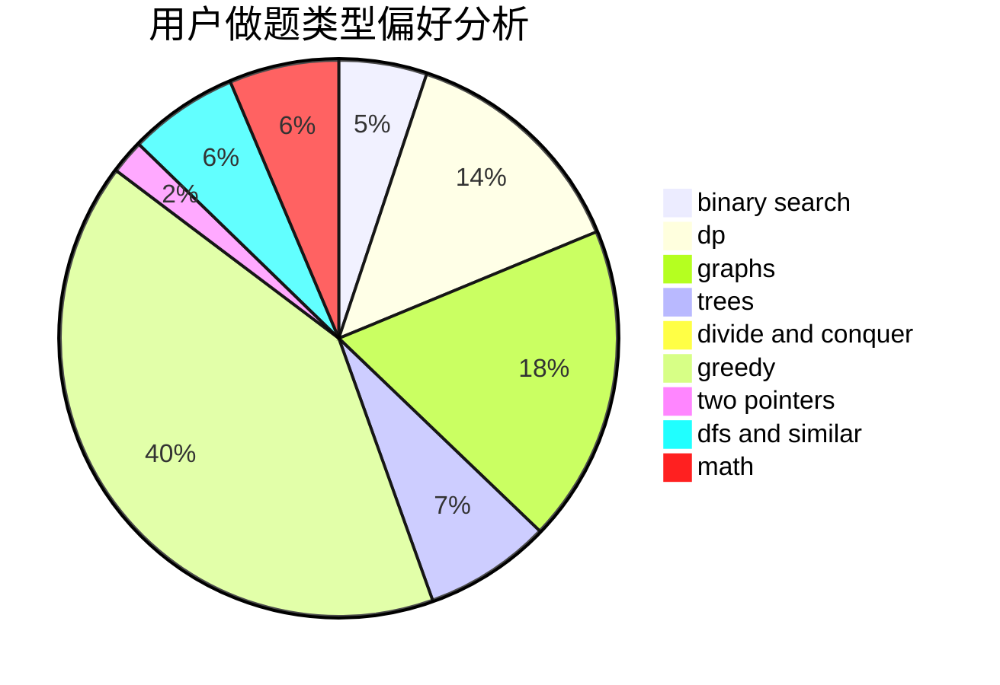

# qizz2015

<!-- tabs:start -->

#### **用户提交结果分析**

#### **用户做题类型偏好分析**

<!-- tabs:end -->
# 推荐题目
[1063C](https://codeforces.com/contest/1063/problem/C)
[575A](https://codeforces.com/contest/575/problem/A)
[1361A](https://codeforces.com/contest/1361/problem/A)
[1205E](https://codeforces.com/contest/1205/problem/E)
[20A](https://codeforces.com/contest/20/problem/A)
[639E](https://codeforces.com/contest/639/problem/E)
[898A](https://codeforces.com/contest/898/problem/A)
[431A](https://codeforces.com/contest/431/problem/A)
[472C](https://codeforces.com/contest/472/problem/C)
[425C](https://codeforces.com/contest/425/problem/C)
