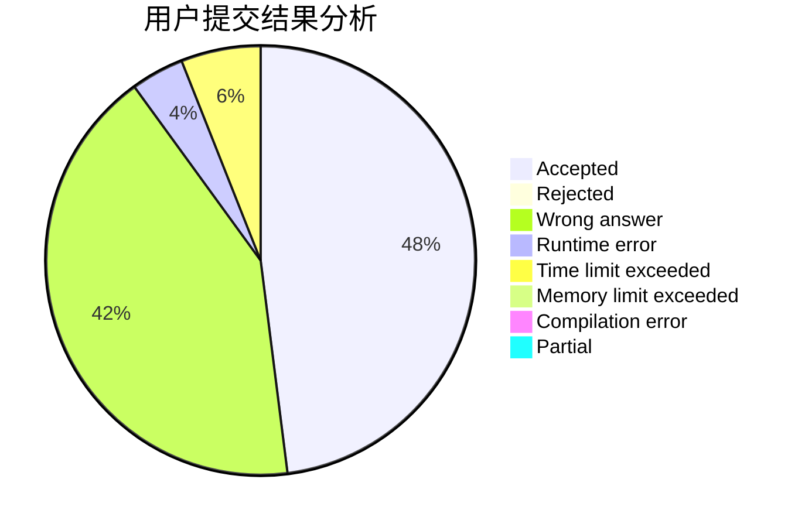
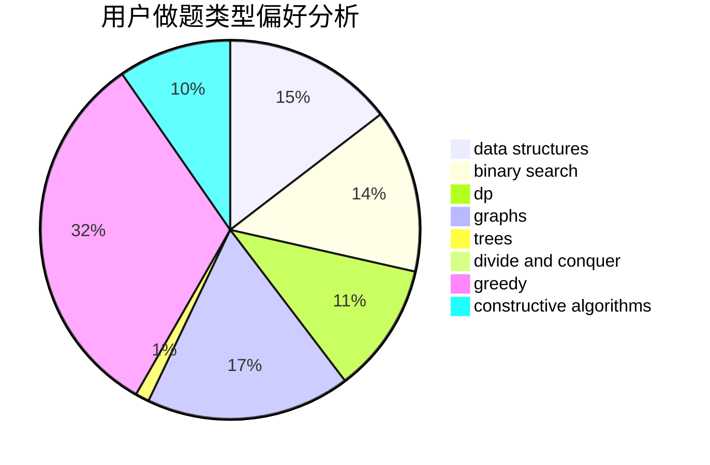
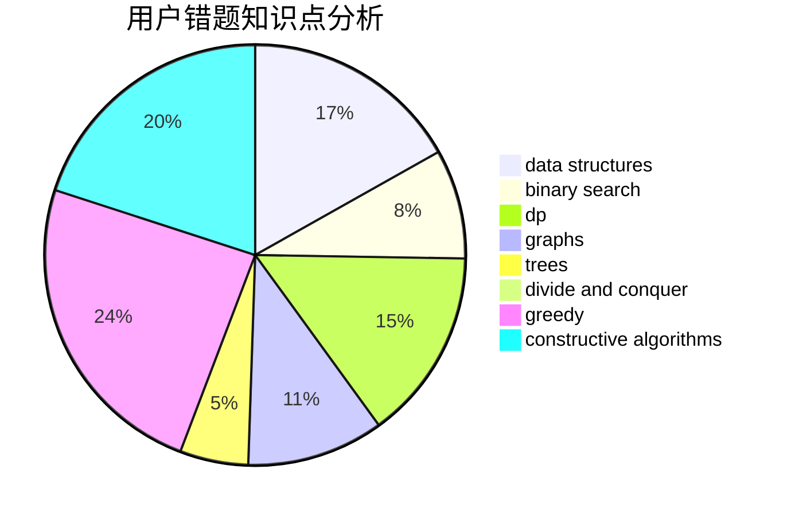

# qizz2015

<!-- tabs:start -->

#### **用户提交结果分析**

#### **用户做题类型偏好分析**

#### **用户错题知识点分析**

<!-- tabs:end -->
# 推荐题目
[1062F](https://codeforces.com/contest/1062/problem/F)		dfs and similar,
                        graphs		  
[54A](https://codeforces.com/contest/54/problem/A)		implementation		  
[1354D](https://codeforces.com/contest/1354/problem/D)		binary search,
                        data structures		  
[1201A](https://codeforces.com/contest/1201/problem/A)		implementation,
                        strings		  
[183D](https://codeforces.com/contest/183/problem/D)		dp,
                        greedy,
                        probabilities		  
[618F](https://codeforces.com/contest/618/problem/F)		constructive algorithms,
                        two pointers		  
[877B](https://codeforces.com/contest/877/problem/B)		brute force,
                        dp		  
[402D](https://codeforces.com/contest/402/problem/D)		dp,
                        greedy,
                        math,
                        number theory		  
[450B](https://codeforces.com/contest/450/problem/B)		implementation,
                        math		  
[39B](https://codeforces.com/contest/39/problem/B)		greedy		  
