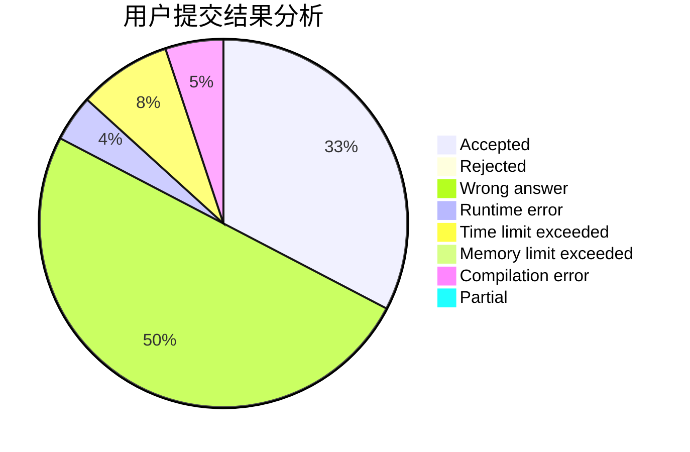
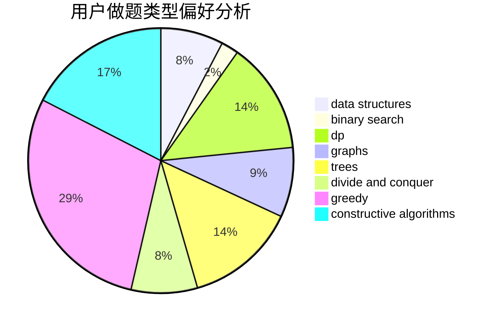
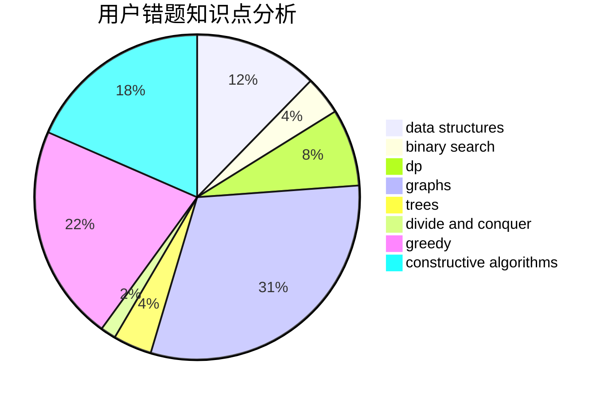

# qkm66666
<!-- tabs:start -->
#### **用户提交结果分析**

#### **用户做题类型偏好分析**

#### **用户错题知识点分析**

<!-- tabs:end -->
# 推荐题目
[Guess Your Way Out! II](http://codeforces.com/problemset/problem/558/D)		data structures,
                        implementation,
                        sortings		  
[Lucky Numbers](http://codeforces.com/problemset/problem/95/B)		dp,
                        greedy		  
[Points, Lines and Ready-made Titles](https://codeforces.com/contest/871/problem/C)		dfs and similar,
                        dsu,
                        graphs,
                        trees		  
[Cheap Travel](http://codeforces.com/problemset/problem/466/A)		implementation		  
[Unusual Product](http://codeforces.com/problemset/problem/405/C)		implementation,
                        math		  
[Delivery Oligopoly](http://codeforces.com/problemset/problem/1155/F)		brute force,
                        dp,
                        graphs		  
[Au Pont Rouge](http://codeforces.com/problemset/problem/1310/C)		binary search,
                        dp,
                        strings		  
[Useful Decomposition](http://codeforces.com/problemset/problem/981/C)		implementation,
                        trees		  
[The Shortest Statement](http://codeforces.com/problemset/problem/1051/F)		graphs,
                        shortest paths,
                        trees		  
[Jamie and Alarm Snooze](http://codeforces.com/problemset/problem/916/A)		brute force,
                        implementation,
                        math		  
<!-- tabs:start -->
#### **data structures**
[Guess Your Way Out! II](http://codeforces.com/problemset/problem/558/D)		data structures,
                        implementation,
                        sortings		  
[Lucky Numbers](https://codeforces.com/contest/879/problem/D)		data structures,
                        implementation		  
[Points, Lines and Ready-made Titles](http://codeforces.com/problemset/problem/173/E)		data structures,
                        sortings		  
[Cheap Travel](http://codeforces.com/problemset/problem/797/C)		data structures,
                        greedy,
                        strings		  
[Unusual Product](http://codeforces.com/problemset/problem/1195/E)		data structures,
                        two pointers		  
[Delivery Oligopoly](http://codeforces.com/problemset/problem/85/D)		binary search,
                        brute force,
                        data structures,
                        implementation		  
[Au Pont Rouge](http://codeforces.com/problemset/problem/834/B)		data structures,
                        implementation		  
[Useful Decomposition](http://codeforces.com/problemset/problem/364/A)		combinatorics,
                        data structures,
                        implementation		  
[The Shortest Statement](http://codeforces.com/problemset/problem/896/C)		data structures,
                        probabilities		  
[Jamie and Alarm Snooze](http://codeforces.com/problemset/problem/1492/C)		binary search,
                        data structures,
                        dp,
                        greedy,
                        two pointers		  
#### **binary search**
[Guess Your Way Out! II](http://codeforces.com/problemset/problem/1310/C)		binary search,
                        dp,
                        strings		  
[Lucky Numbers](http://codeforces.com/problemset/problem/24/E)		binary search		  
[Points, Lines and Ready-made Titles](http://codeforces.com/problemset/problem/1225/E)		binary search,
                        dp		  
[Cheap Travel](http://codeforces.com/problemset/problem/180/E)		binary search,
                        dp,
                        two pointers		  
[Unusual Product](http://codeforces.com/problemset/problem/842/E)		binary search,
                        dfs and similar,
                        divide and conquer,
                        graphs,
                        trees		  
[Delivery Oligopoly](http://codeforces.com/problemset/problem/85/D)		binary search,
                        brute force,
                        data structures,
                        implementation		  
[Au Pont Rouge](http://codeforces.com/problemset/problem/301/B)		binary search,
                        graphs,
                        shortest paths		  
[Useful Decomposition](http://codeforces.com/problemset/problem/1492/C)		binary search,
                        data structures,
                        dp,
                        greedy,
                        two pointers		  
[The Shortest Statement](http://codeforces.com/problemset/problem/1463/D)		binary search,
                        constructive algorithms,
                        greedy,
                        two pointers		  
[Jamie and Alarm Snooze](http://codeforces.com/problemset/problem/1490/G)		binary search,
                        data structures,
                        math		  
#### **dp**
[Guess Your Way Out! II](http://codeforces.com/problemset/problem/95/B)		dp,
                        greedy		  
[Lucky Numbers](http://codeforces.com/problemset/problem/1155/F)		brute force,
                        dp,
                        graphs		  
[Points, Lines and Ready-made Titles](http://codeforces.com/problemset/problem/1310/C)		binary search,
                        dp,
                        strings		  
[Cheap Travel](http://codeforces.com/problemset/problem/1225/E)		binary search,
                        dp		  
[Unusual Product](http://codeforces.com/problemset/problem/1038/D)		dp,
                        greedy,
                        implementation		  
[Delivery Oligopoly](http://codeforces.com/problemset/problem/372/B)		brute force,
                        divide and conquer,
                        dp		  
[Au Pont Rouge](http://codeforces.com/problemset/problem/180/E)		binary search,
                        dp,
                        two pointers		  
[Useful Decomposition](http://codeforces.com/problemset/problem/1070/G)		brute force,
                        dp,
                        greedy,
                        implementation		  
[The Shortest Statement](http://codeforces.com/problemset/problem/1237/F)		combinatorics,
                        dp		  
[Jamie and Alarm Snooze](http://codeforces.com/problemset/problem/1444/D)		constructive algorithms,
                        dp,
                        geometry		  
#### **graph**
[Guess Your Way Out! II](https://codeforces.com/contest/871/problem/C)		dfs and similar,
                        dsu,
                        graphs,
                        trees		  
[Lucky Numbers](http://codeforces.com/problemset/problem/1155/F)		brute force,
                        dp,
                        graphs		  
[Points, Lines and Ready-made Titles](http://codeforces.com/problemset/problem/1051/F)		graphs,
                        shortest paths,
                        trees		  
[Cheap Travel](http://codeforces.com/problemset/problem/1361/A)		constructive algorithms,
                        graphs,
                        greedy,
                        sortings		  
[Unusual Product](http://codeforces.com/problemset/problem/842/E)		binary search,
                        dfs and similar,
                        divide and conquer,
                        graphs,
                        trees		  
[Delivery Oligopoly](http://codeforces.com/problemset/problem/301/B)		binary search,
                        graphs,
                        shortest paths		  
[Au Pont Rouge](http://codeforces.com/problemset/problem/1176/D)		dfs and similar,
                        graphs,
                        greedy,
                        number theory,
                        sortings		  
[Useful Decomposition](http://codeforces.com/problemset/problem/1360/E)		dp,
                        graphs,
                        implementation,
                        shortest paths		  
[The Shortest Statement](http://codeforces.com/problemset/problem/1487/C)		brute force,
                        constructive algorithms,
                        dfs and similar,
                        graphs,
                        greedy,
                        implementation,
                        math		  
[Jamie and Alarm Snooze](http://codeforces.com/problemset/problem/1437/C)		dp,
                        flows,
                        graph matchings,
                        greedy,
                        math,
                        sortings		  
#### **trees**
[Guess Your Way Out! II](https://codeforces.com/contest/871/problem/C)		dfs and similar,
                        dsu,
                        graphs,
                        trees		  
[Lucky Numbers](http://codeforces.com/problemset/problem/981/C)		implementation,
                        trees		  
[Points, Lines and Ready-made Titles](http://codeforces.com/problemset/problem/1051/F)		graphs,
                        shortest paths,
                        trees		  
[Cheap Travel](http://codeforces.com/problemset/problem/842/E)		binary search,
                        dfs and similar,
                        divide and conquer,
                        graphs,
                        trees		  
[Unusual Product](http://codeforces.com/problemset/problem/526/G)		greedy,
                        trees		  
[Delivery Oligopoly](http://codeforces.com/problemset/problem/1479/D)		binary search,
                        bitmasks,
                        brute force,
                        data structures,
                        probabilities,
                        trees		  
[Au Pont Rouge](http://codeforces.com/problemset/problem/1511/C)		brute force,
                        data structures,
                        implementation,
                        trees		  
[Useful Decomposition](http://codeforces.com/problemset/problem/1499/F)		combinatorics,
                        dfs and similar,
                        dp,
                        trees		  
[The Shortest Statement](http://codeforces.com/problemset/problem/1491/E)		brute force,
                        dfs and similar,
                        divide and conquer,
                        number theory,
                        trees		  
[Jamie and Alarm Snooze](http://codeforces.com/problemset/problem/1466/D)		data structures,
                        greedy,
                        sortings,
                        trees		  
#### **divide and conquer**
[Guess Your Way Out! II](http://codeforces.com/problemset/problem/372/B)		brute force,
                        divide and conquer,
                        dp		  
[Lucky Numbers](http://codeforces.com/problemset/problem/842/E)		binary search,
                        dfs and similar,
                        divide and conquer,
                        graphs,
                        trees		  
[Points, Lines and Ready-made Titles](http://codeforces.com/problemset/problem/1461/D)		binary search,
                        brute force,
                        data structures,
                        divide and conquer,
                        implementation,
                        sortings		  
[Cheap Travel](http://codeforces.com/problemset/problem/1466/G)		combinatorics,
                        divide and conquer,
                        hashing,
                        math,
                        string suffix structures,
                        strings		  
[Unusual Product](http://codeforces.com/problemset/problem/1490/D)		dfs and similar,
                        divide and conquer,
                        implementation		  
[Delivery Oligopoly](https://codeforces.com/contest/1483/problem/C)		data structures,
                        divide and conquer,
                        dp		  
[Au Pont Rouge](http://codeforces.com/problemset/problem/1491/E)		brute force,
                        dfs and similar,
                        divide and conquer,
                        number theory,
                        trees		  
[Useful Decomposition](http://codeforces.com/problemset/problem/1303/G)		data structures,
                        divide and conquer,
                        geometry,
                        trees		  
[The Shortest Statement](http://codeforces.com/problemset/problem/1494/D)		constructive algorithms,
                        data structures,
                        dfs and similar,
                        divide and conquer,
                        dsu,
                        greedy,
                        sortings,
                        trees		  
[Jamie and Alarm Snooze](http://codeforces.com/problemset/problem/1482/E)		data structures,
                        divide and conquer,
                        dp		  
#### **greedy**
[Guess Your Way Out! II](http://codeforces.com/problemset/problem/95/B)		dp,
                        greedy		  
[Lucky Numbers](http://codeforces.com/problemset/problem/1361/A)		constructive algorithms,
                        graphs,
                        greedy,
                        sortings		  
[Points, Lines and Ready-made Titles](http://codeforces.com/problemset/problem/1038/D)		dp,
                        greedy,
                        implementation		  
[Cheap Travel](http://codeforces.com/problemset/problem/797/C)		data structures,
                        greedy,
                        strings		  
[Unusual Product](http://codeforces.com/problemset/problem/912/C)		brute force,
                        greedy,
                        sortings		  
[Delivery Oligopoly](http://codeforces.com/problemset/problem/1070/G)		brute force,
                        dp,
                        greedy,
                        implementation		  
[Au Pont Rouge](http://codeforces.com/problemset/problem/1139/B)		greedy,
                        implementation		  
[Useful Decomposition](http://codeforces.com/problemset/problem/1433/C)		constructive algorithms,
                        greedy		  
[The Shortest Statement](http://codeforces.com/problemset/problem/1176/D)		dfs and similar,
                        graphs,
                        greedy,
                        number theory,
                        sortings		  
[Jamie and Alarm Snooze](https://codeforces.com/contest/1478/problem/F)		constructive algorithms,
                        geometry,
                        greedy,
                        math,
                        sortings		  
#### **constructive algorithms**
[Guess Your Way Out! II](http://codeforces.com/problemset/problem/1361/A)		constructive algorithms,
                        graphs,
                        greedy,
                        sortings		  
[Lucky Numbers](http://codeforces.com/problemset/problem/460/D)		brute force,
                        constructive algorithms,
                        math		  
[Points, Lines and Ready-made Titles](http://codeforces.com/problemset/problem/1433/C)		constructive algorithms,
                        greedy		  
[Cheap Travel](http://codeforces.com/problemset/problem/1444/D)		constructive algorithms,
                        dp,
                        geometry		  
[Unusual Product](https://codeforces.com/contest/1478/problem/F)		constructive algorithms,
                        geometry,
                        greedy,
                        math,
                        sortings		  
[Delivery Oligopoly](http://codeforces.com/problemset/problem/1393/C)		constructive algorithms,
                        greedy,
                        math,
                        sortings		  
[Au Pont Rouge](https://codeforces.com/contest/1443/problem/D)		constructive algorithms,
                        dp,
                        greedy		  
[Useful Decomposition](http://codeforces.com/problemset/problem/1493/A)		constructive algorithms,
                        greedy		  
[The Shortest Statement](http://codeforces.com/problemset/problem/1463/D)		binary search,
                        constructive algorithms,
                        greedy,
                        two pointers		  
[Jamie and Alarm Snooze](https://codeforces.com/contest/1456/problem/B)		bitmasks,
                        brute force,
                        constructive algorithms		  
#### **sortings**
[Guess Your Way Out! II](http://codeforces.com/problemset/problem/558/D)		data structures,
                        implementation,
                        sortings		  
[Lucky Numbers](http://codeforces.com/problemset/problem/1361/A)		constructive algorithms,
                        graphs,
                        greedy,
                        sortings		  
[Points, Lines and Ready-made Titles](http://codeforces.com/problemset/problem/173/E)		data structures,
                        sortings		  
[Cheap Travel](http://codeforces.com/problemset/problem/378/B)		implementation,
                        sortings		  
[Unusual Product](http://codeforces.com/problemset/problem/912/C)		brute force,
                        greedy,
                        sortings		  
[Delivery Oligopoly](http://codeforces.com/problemset/problem/1176/D)		dfs and similar,
                        graphs,
                        greedy,
                        number theory,
                        sortings		  
[Au Pont Rouge](https://codeforces.com/contest/1478/problem/F)		constructive algorithms,
                        geometry,
                        greedy,
                        math,
                        sortings		  
[Useful Decomposition](http://codeforces.com/problemset/problem/1393/C)		constructive algorithms,
                        greedy,
                        math,
                        sortings		  
[The Shortest Statement](https://codeforces.com/contest/1496/problem/C)		geometry,
                        greedy,
                        math,
                        sortings		  
[Jamie and Alarm Snooze](http://codeforces.com/problemset/problem/1495/A)		geometry,
                        greedy,
                        math,
                        sortings		  
<!-- tabs:end -->
