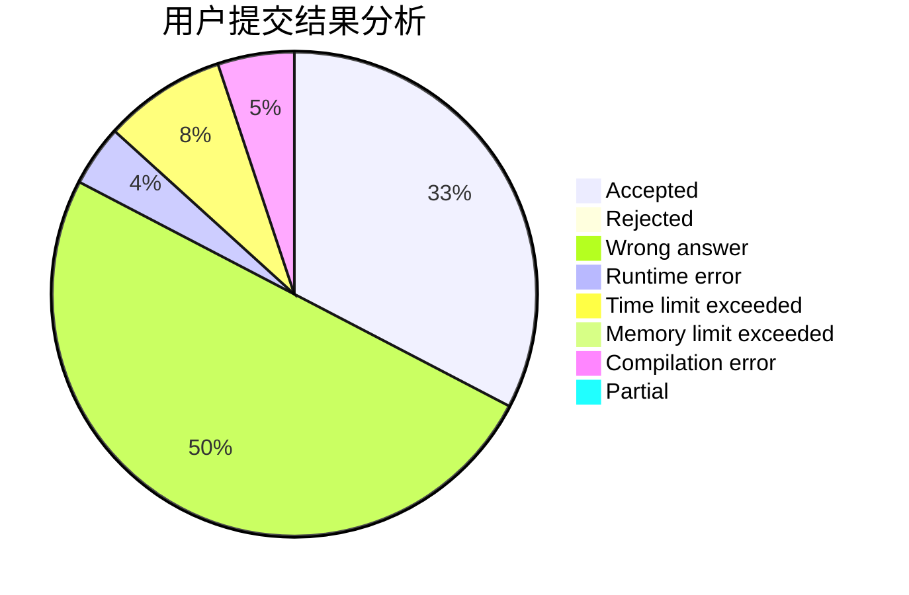
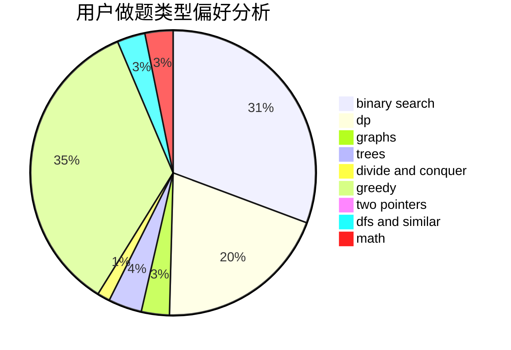

# qkm66666

<!-- tabs:start -->

#### **用户提交结果分析**

#### **用户做题类型偏好分析**

<!-- tabs:end -->
# 推荐题目
[581B](https://codeforces.com/contest/581/problem/B)
[36B](https://codeforces.com/contest/36/problem/B)
[936A](https://codeforces.com/contest/936/problem/A)
[19A](https://codeforces.com/contest/19/problem/A)
[485A](https://codeforces.com/contest/485/problem/A)
[1140F](https://codeforces.com/contest/1140/problem/F)
[119D](https://codeforces.com/contest/119/problem/D)
[434C](https://codeforces.com/contest/434/problem/C)
[551A](https://codeforces.com/contest/551/problem/A)
[811B](https://codeforces.com/contest/811/problem/B)
