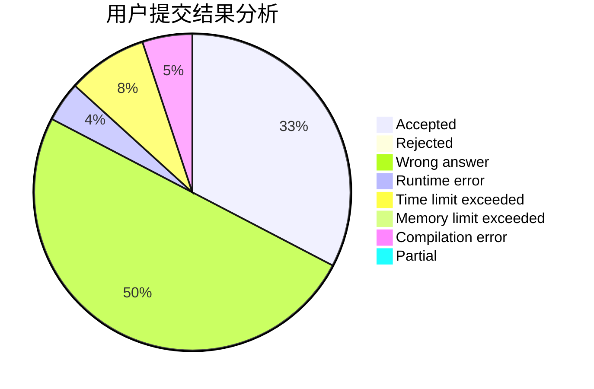
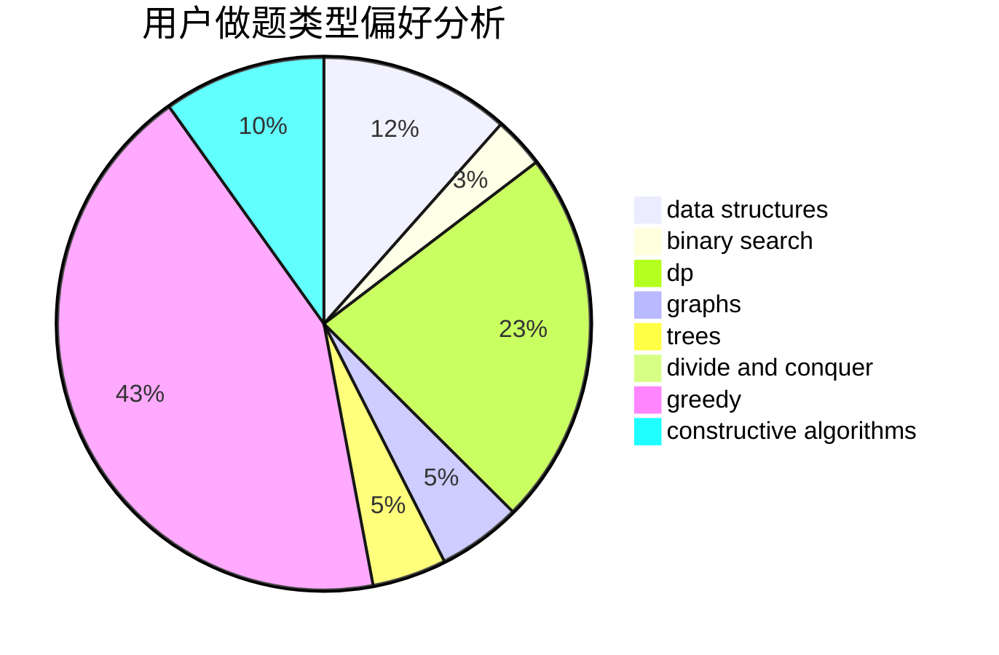
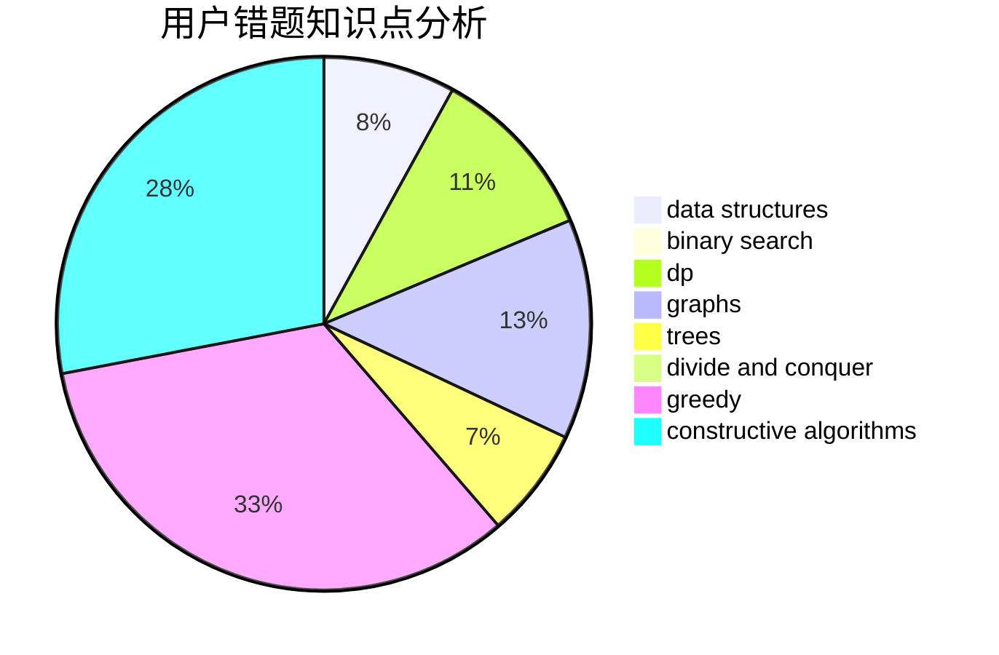

# qkm66666

<!-- tabs:start -->

#### **用户提交结果分析**

#### **用户做题类型偏好分析**

#### **用户错题知识点分析**

<!-- tabs:end -->
# 推荐题目
[581B](https://codeforces.com/contest/581/problem/B)		implementation,
                        math		  
[36B](https://codeforces.com/contest/36/problem/B)		implementation		  
[936A](https://codeforces.com/contest/936/problem/A)		binary search,
                        implementation,
                        math		  
[19A](https://codeforces.com/contest/19/problem/A)		implementation		  
[485A](https://codeforces.com/contest/485/problem/A)		implementation,
                        math,
                        matrices		  
[1140F](https://codeforces.com/contest/1140/problem/F)		data structures,
                        divide and conquer,
                        dsu		  
[119D](https://codeforces.com/contest/119/problem/D)		hashing,
                        strings		  
[434C](https://codeforces.com/contest/434/problem/C)		dsu,graphs,sortings,trees		  
[551A](https://codeforces.com/contest/551/problem/A)		brute force,
                        implementation,
                        sortings		  
[811B](https://codeforces.com/contest/811/problem/B)		implementation,
                        sortings		  
