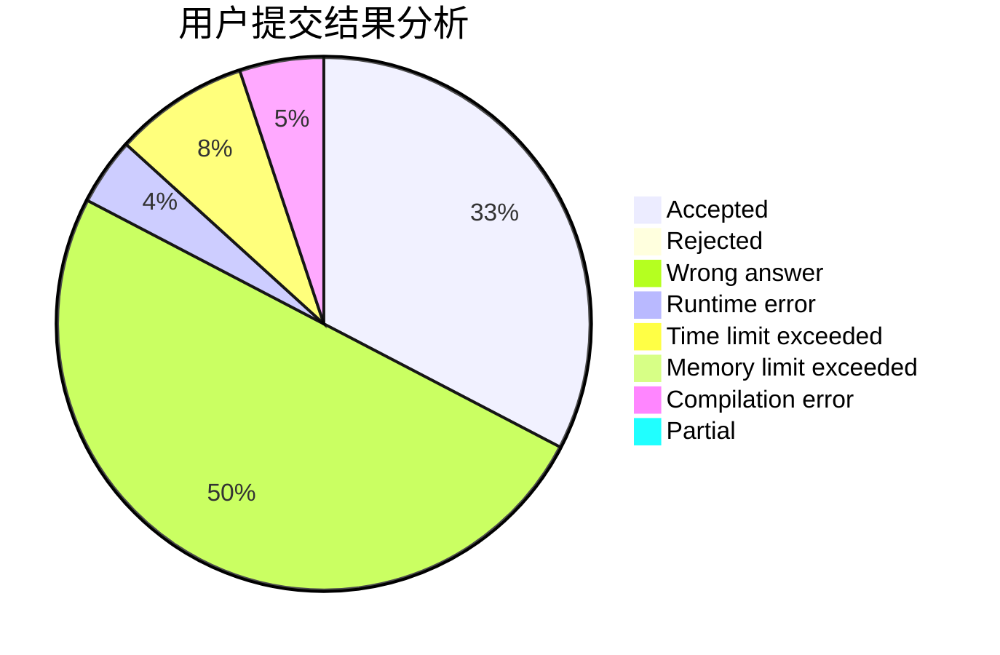
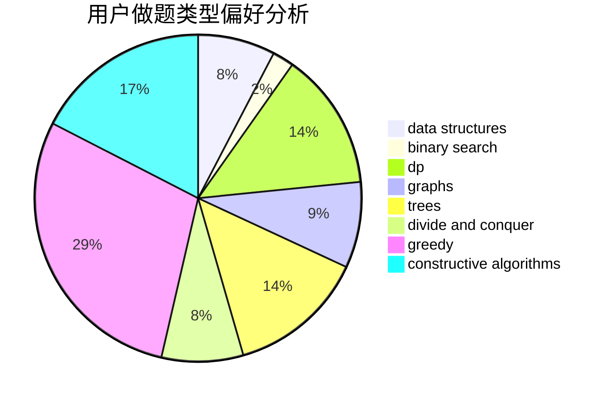
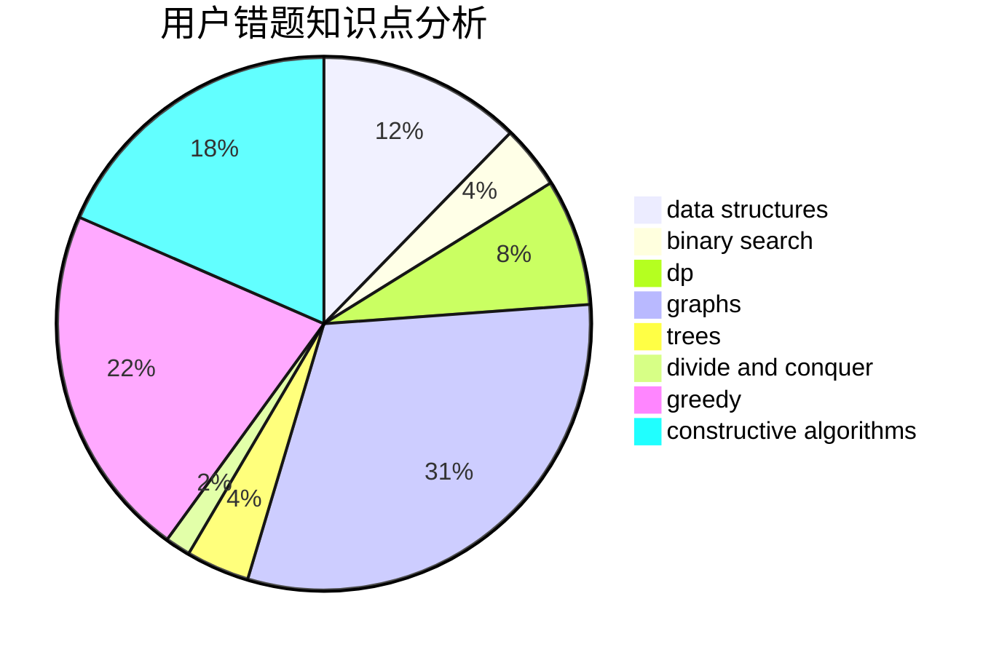

# qkm66666

<!-- tabs:start -->

#### **用户提交结果分析**

#### **用户做题类型偏好分析**

#### **用户错题知识点分析**

<!-- tabs:end -->
# 推荐题目
[558D](https://codeforces.com/contest/558/problem/D)		data structures,
                        implementation,
                        sortings		  
[343A](https://codeforces.com/contest/343/problem/A)		math,
                        number theory		  
[916A](https://codeforces.com/contest/916/problem/A)		brute force,
                        implementation,
                        math		  
[171H](https://codeforces.com/contest/171/problem/H)		*special problem,
                        implementation		  
[466A](https://codeforces.com/contest/466/problem/A)		implementation		  
[1139B](https://codeforces.com/contest/1139/problem/B)		greedy,
                        implementation		  
[1195E](https://codeforces.com/contest/1195/problem/E)		data structures,
                        two pointers		  
[405C](https://codeforces.com/contest/405/problem/C)		implementation,
                        math		  
[526G](https://codeforces.com/contest/526/problem/G)		greedy,
                        trees		  
[797C](https://codeforces.com/contest/797/problem/C)		data structures,
                        greedy,
                        strings		  
