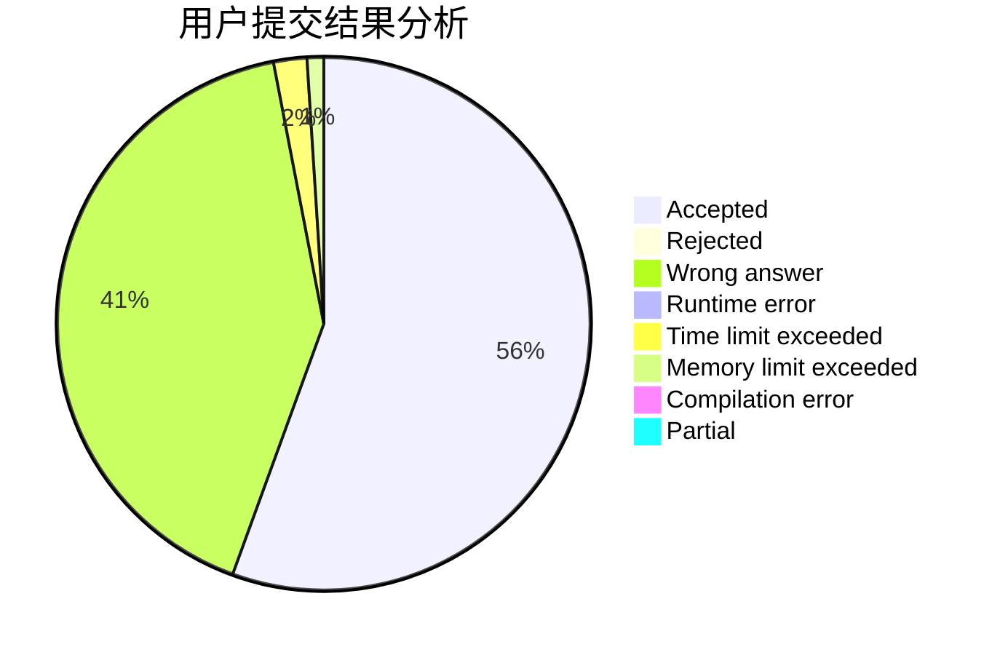
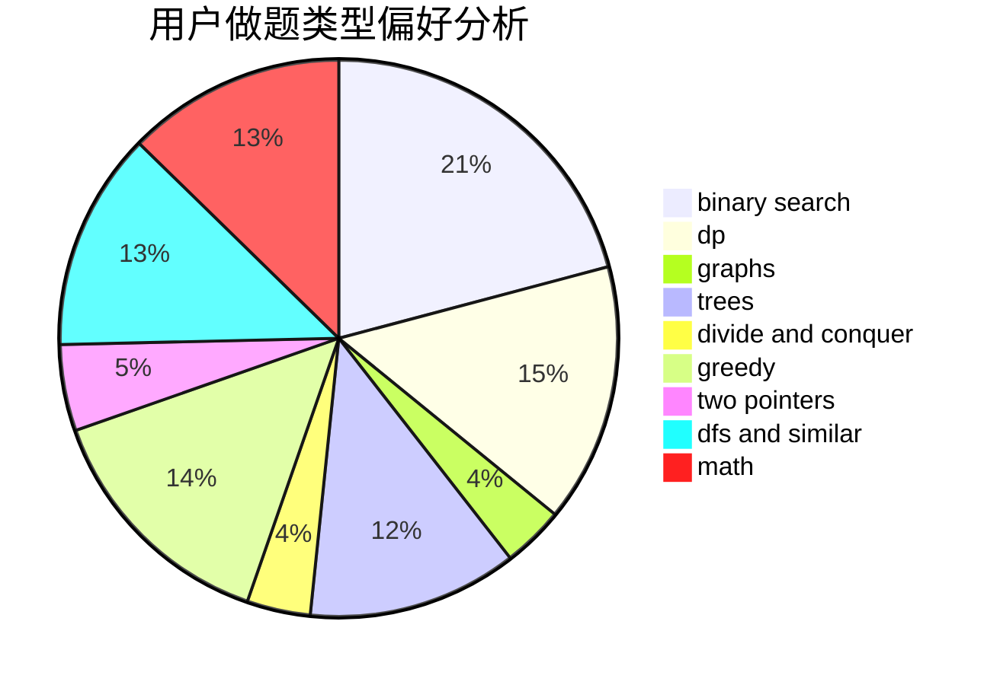

# qlwpc

<!-- tabs:start -->

#### **用户提交结果分析**

#### **用户做题类型偏好分析**

<!-- tabs:end -->
# 推荐题目
[1131A](https://codeforces.com/contest/1131/problem/A)
[274D](https://codeforces.com/contest/274/problem/D)
[843A](https://codeforces.com/contest/843/problem/A)
[1164P](https://codeforces.com/contest/1164/problem/P)
[1090D](https://codeforces.com/contest/1090/problem/D)
[166E](https://codeforces.com/contest/166/problem/E)
[462E](https://codeforces.com/contest/462/problem/E)
[1150E](https://codeforces.com/contest/1150/problem/E)
[55C](https://codeforces.com/contest/55/problem/C)
[1408H](https://codeforces.com/contest/1408/problem/H)
