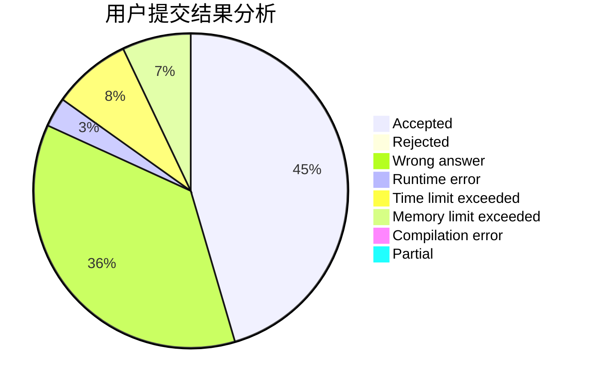
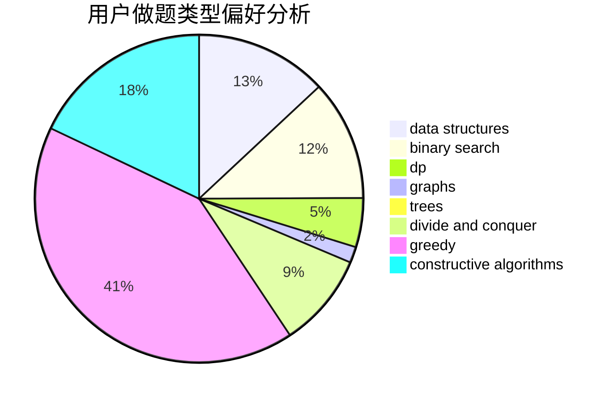
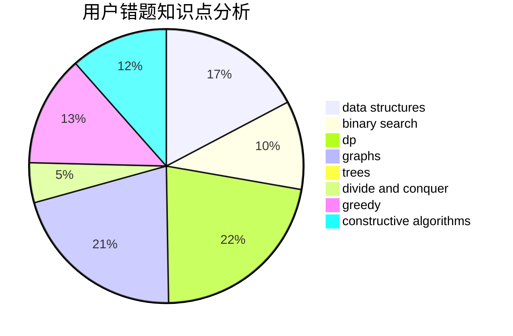

# qqq17770027225

<!-- tabs:start -->

#### **用户提交结果分析**

#### **用户做题类型偏好分析**

#### **用户错题知识点分析**

<!-- tabs:end -->
# 推荐题目
[746G](https://codeforces.com/contest/746/problem/G)		constructive algorithms,
                        graphs,
                        trees		  
[1006D](https://codeforces.com/contest/1006/problem/D)		implementation		  
[702F](https://codeforces.com/contest/702/problem/F)		data structures		  
[865G](https://codeforces.com/contest/865/problem/G)		combinatorics,
                        math,
                        matrices		  
[1214E](https://codeforces.com/contest/1214/problem/E)		constructive algorithms,
                        graphs,
                        math,
                        sortings,
                        trees		  
[919F](https://codeforces.com/contest/919/problem/F)		games,
                        graphs,
                        shortest paths		  
[838C](https://codeforces.com/contest/838/problem/C)		dp,
                        games		  
[865A](https://codeforces.com/contest/865/problem/A)		constructive algorithms		  
[797D](https://codeforces.com/contest/797/problem/D)		data structures,
                        dfs and similar		  
[674G](https://codeforces.com/contest/674/problem/G)		dsu,graphs,sortings,trees		  
