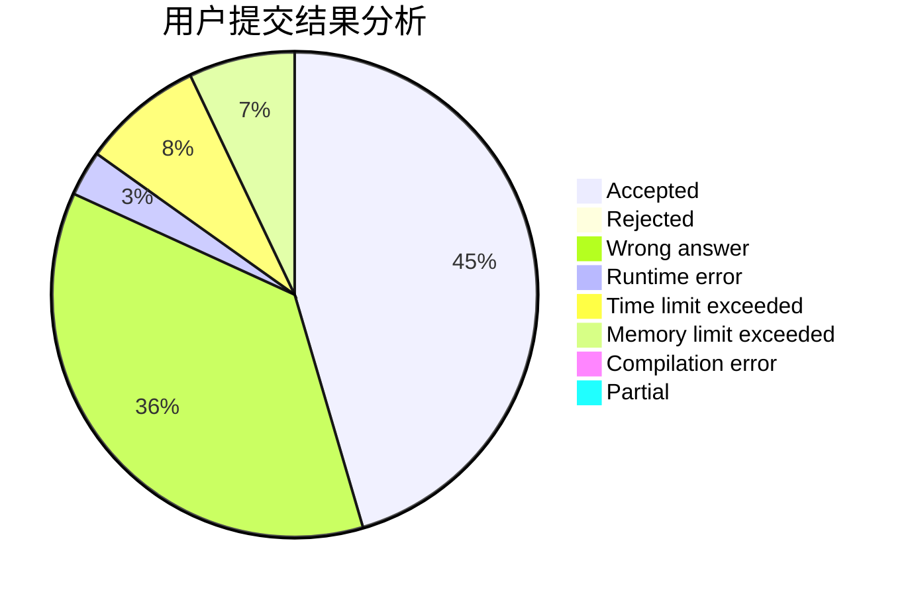
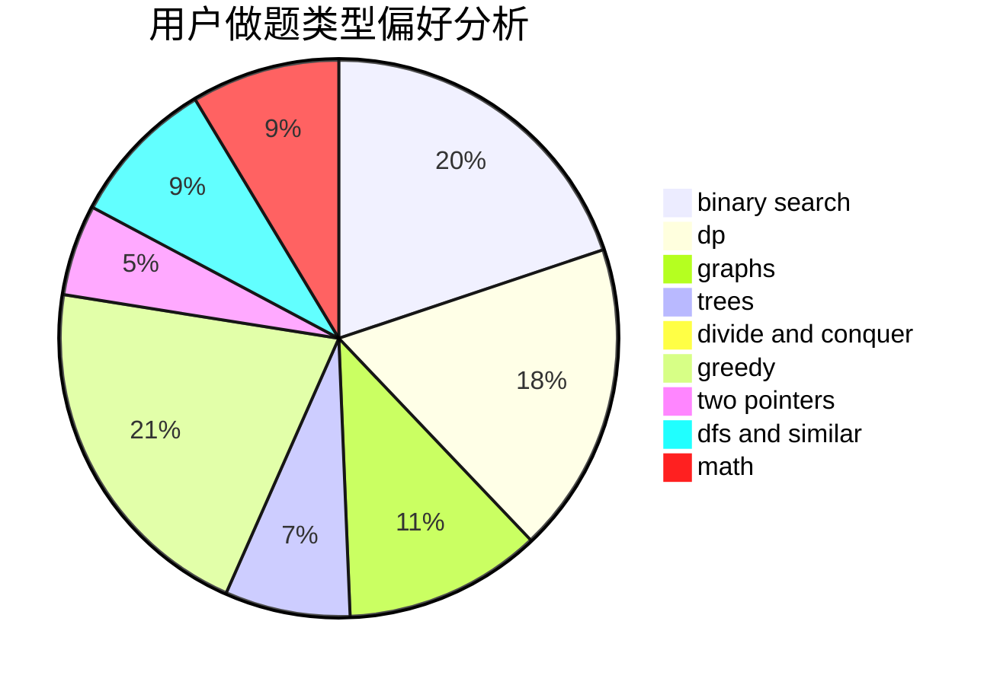

# qqq17770027225

<!-- tabs:start -->

#### **用户提交结果分析**

#### **用户做题类型偏好分析**

<!-- tabs:end -->
# 推荐题目
[766C](https://codeforces.com/contest/766/problem/C)
[1007A](https://codeforces.com/contest/1007/problem/A)
[721D](https://codeforces.com/contest/721/problem/D)
[886C](https://codeforces.com/contest/886/problem/C)
[1220A](https://codeforces.com/contest/1220/problem/A)
[93A](https://codeforces.com/contest/93/problem/A)
[856C](https://codeforces.com/contest/856/problem/C)
[884D](https://codeforces.com/contest/884/problem/D)
[811C](https://codeforces.com/contest/811/problem/C)
[699D](https://codeforces.com/contest/699/problem/D)
