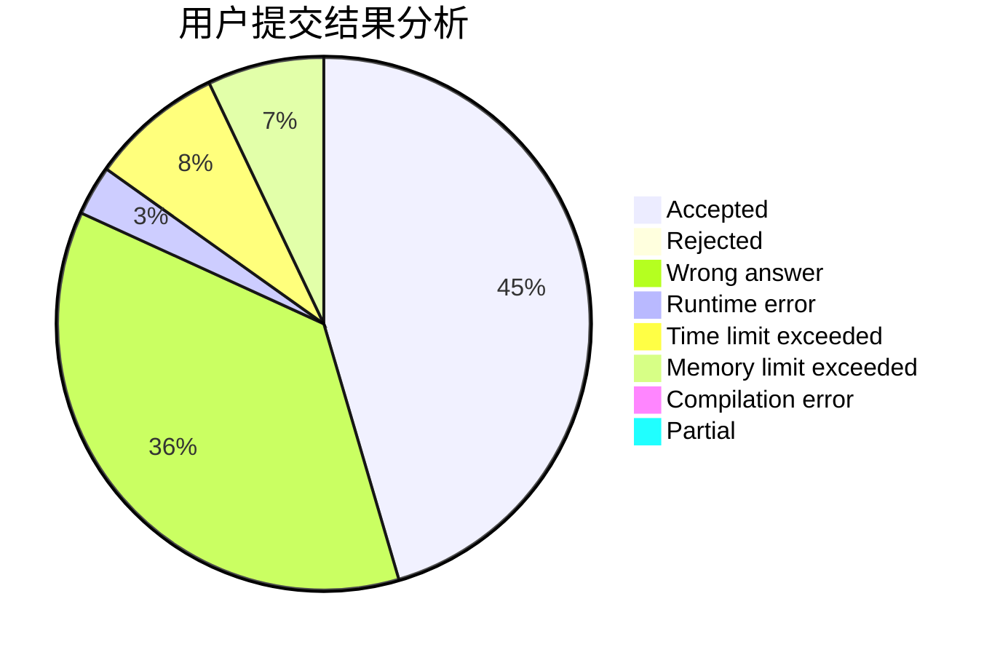
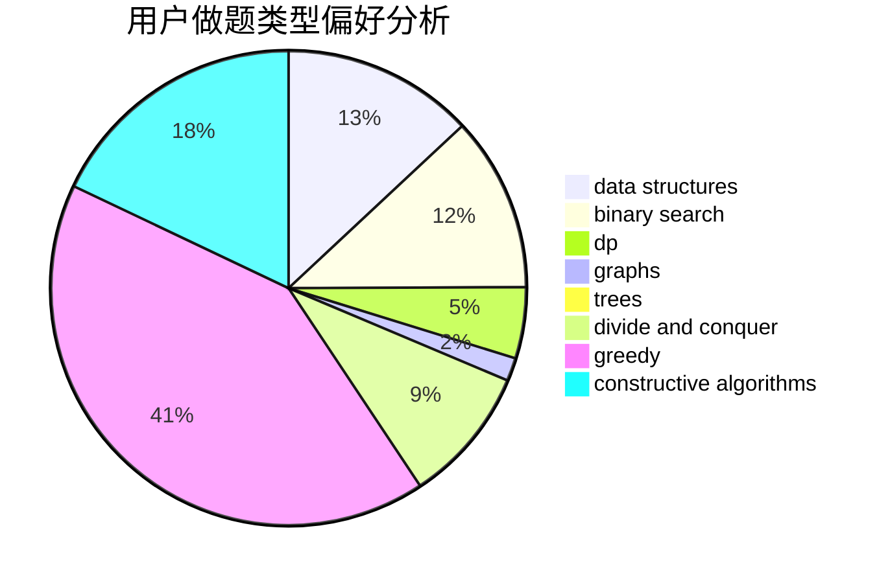
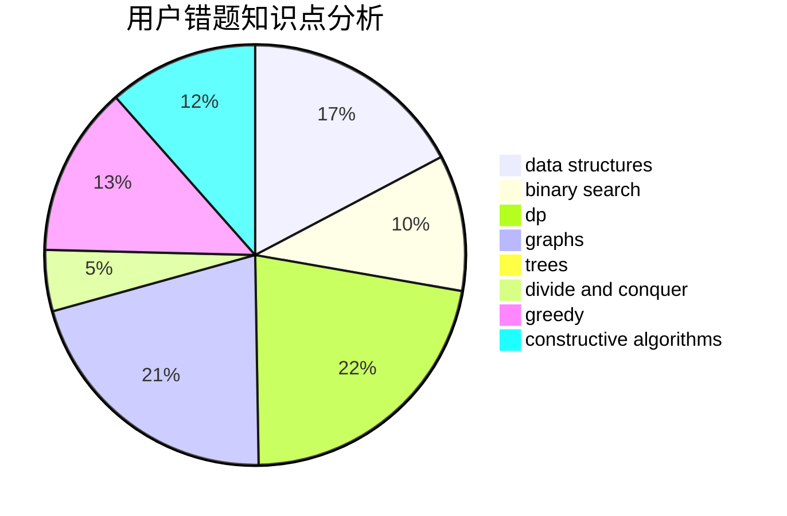

# qqq17770027225
<!-- tabs:start -->
#### **用户提交结果分析**

#### **用户做题类型偏好分析**

#### **用户错题知识点分析**

<!-- tabs:end -->
# 推荐题目
[New Roads](http://codeforces.com/problemset/problem/746/G)		constructive algorithms,
                        graphs,
                        trees		  
[Flowers and Chocolate](http://codeforces.com/problemset/problem/865/G)		combinatorics,
                        math,
                        matrices		  
[Chain Reaction](https://codeforces.com/contest/667/problem/E)		brute force,
                        geometry		  
[Save the problem!](http://codeforces.com/problemset/problem/865/A)		constructive algorithms		  
[Not Afraid](http://codeforces.com/problemset/problem/787/B)		greedy,
                        implementation,
                        math		  
[Jeremy Bearimy](https://codeforces.com/contest/1281/problem/E)		dfs and similar,
                        graphs,
                        greedy,
                        trees		  
[Distinguish Rz(θ) from Ry(θ)](http://codeforces.com/problemset/problem/1357/A5)		nan		  
[Don't Exceed](http://codeforces.com/problemset/problem/913/H)		math,
                        probabilities		  
[Future Failure](http://codeforces.com/problemset/problem/838/C)		dp,
                        games		  
[Messy](https://codeforces.com/contest/1262/problem/C)		constructive algorithms		  
<!-- tabs:start -->
#### **data structures**
[New Roads](http://codeforces.com/problemset/problem/702/F)		data structures		  
[Flowers and Chocolate](http://codeforces.com/problemset/problem/274/E)		data structures,
                        implementation		  
[Chain Reaction](http://codeforces.com/problemset/problem/1044/F)		data structures		  
[Save the problem!](https://codeforces.com/contest/674/problem/G)		data structures		  
[Not Afraid](https://codeforces.com/contest/1084/problem/D)		data structures,
                        dp,
                        trees		  
[Jeremy Bearimy](http://codeforces.com/problemset/problem/490/F)		data structures,
                        dfs and similar,
                        dp,
                        trees		  
[Distinguish Rz(θ) from Ry(θ)](https://codeforces.com/contest/1350/problem/C)		data structures,
                        math,
                        number theory		  
[Don't Exceed](http://codeforces.com/problemset/problem/797/D)		data structures,
                        dfs and similar		  
[Future Failure](http://codeforces.com/problemset/problem/1236/D)		brute force,
                        data structures,
                        greedy,
                        implementation		  
[Messy](http://codeforces.com/problemset/problem/731/D)		brute force,
                        data structures,
                        greedy,
                        sortings		  
#### **binary search**
[New Roads](http://codeforces.com/problemset/problem/1111/C)		binary search,
                        brute force,
                        divide and conquer,
                        math		  
[Flowers and Chocolate](http://codeforces.com/problemset/problem/1492/C)		binary search,
                        data structures,
                        dp,
                        greedy,
                        two pointers		  
[Chain Reaction](http://codeforces.com/problemset/problem/1463/D)		binary search,
                        constructive algorithms,
                        greedy,
                        two pointers		  
[Save the problem!](http://codeforces.com/problemset/problem/1490/G)		binary search,
                        data structures,
                        math		  
[Not Afraid](http://codeforces.com/problemset/problem/1479/D)		binary search,
                        bitmasks,
                        brute force,
                        data structures,
                        probabilities,
                        trees		  
[Jeremy Bearimy](http://codeforces.com/problemset/problem/1436/E)		binary search,
                        data structures,
                        two pointers		  
[Distinguish Rz(θ) from Ry(θ)](http://codeforces.com/problemset/problem/1461/D)		binary search,
                        brute force,
                        data structures,
                        divide and conquer,
                        implementation,
                        sortings		  
[Don't Exceed](http://codeforces.com/problemset/problem/1493/C)		binary search,
                        brute force,
                        constructive algorithms,
                        greedy,
                        strings		  
[Future Failure](http://codeforces.com/problemset/problem/1487/D)		binary search,
                        brute force,
                        math,
                        number theory		  
[Messy](http://codeforces.com/problemset/problem/1486/B)		binary search,
                        geometry,
                        shortest paths,
                        sortings		  
#### **dp**
[New Roads](http://codeforces.com/problemset/problem/838/C)		dp,
                        games		  
[Flowers and Chocolate](https://codeforces.com/contest/1084/problem/D)		data structures,
                        dp,
                        trees		  
[Chain Reaction](http://codeforces.com/problemset/problem/490/F)		data structures,
                        dfs and similar,
                        dp,
                        trees		  
[Save the problem!](https://codeforces.com/contest/810/problem/E)		combinatorics,
                        divide and conquer,
                        dp		  
[Not Afraid](http://codeforces.com/problemset/problem/1146/G)		dp,
                        flows,
                        graphs		  
[Jeremy Bearimy](http://codeforces.com/problemset/problem/651/A)		dp,
                        greedy,
                        implementation,
                        math		  
[Distinguish Rz(θ) from Ry(θ)](http://codeforces.com/problemset/problem/1492/C)		binary search,
                        data structures,
                        dp,
                        greedy,
                        two pointers		  
[Don't Exceed](https://codeforces.com/contest/1457/problem/C)		brute force,
                        dp,
                        implementation		  
[Future Failure](http://codeforces.com/problemset/problem/1491/C)		brute force,
                        data structures,
                        dp,
                        greedy,
                        implementation		  
[Messy](http://codeforces.com/problemset/problem/1437/C)		dp,
                        flows,
                        graph matchings,
                        greedy,
                        math,
                        sortings		  
#### **graph**
[New Roads](http://codeforces.com/problemset/problem/746/G)		constructive algorithms,
                        graphs,
                        trees		  
[Flowers and Chocolate](https://codeforces.com/contest/1281/problem/E)		dfs and similar,
                        graphs,
                        greedy,
                        trees		  
[Chain Reaction](http://codeforces.com/problemset/problem/1214/E)		constructive algorithms,
                        graphs,
                        math,
                        sortings,
                        trees		  
[Save the problem!](http://codeforces.com/problemset/problem/919/F)		games,
                        graphs,
                        shortest paths		  
[Not Afraid](http://codeforces.com/problemset/problem/1146/G)		dp,
                        flows,
                        graphs		  
[Jeremy Bearimy](http://codeforces.com/problemset/problem/1487/C)		brute force,
                        constructive algorithms,
                        dfs and similar,
                        graphs,
                        greedy,
                        implementation,
                        math		  
[Distinguish Rz(θ) from Ry(θ)](http://codeforces.com/problemset/problem/1437/C)		dp,
                        flows,
                        graph matchings,
                        greedy,
                        math,
                        sortings		  
[Don't Exceed](http://codeforces.com/problemset/problem/1470/D)		constructive algorithms,
                        dfs and similar,
                        graph matchings,
                        graphs,
                        greedy		  
[Future Failure](http://codeforces.com/problemset/problem/1476/C)		dp,
                        graphs,
                        greedy		  
[Messy](http://codeforces.com/problemset/problem/1304/D)		constructive algorithms,
                        graphs,
                        greedy,
                        two pointers		  
#### **trees**
[New Roads](http://codeforces.com/problemset/problem/746/G)		constructive algorithms,
                        graphs,
                        trees		  
[Flowers and Chocolate](https://codeforces.com/contest/1281/problem/E)		dfs and similar,
                        graphs,
                        greedy,
                        trees		  
[Chain Reaction](http://codeforces.com/problemset/problem/1214/E)		constructive algorithms,
                        graphs,
                        math,
                        sortings,
                        trees		  
[Save the problem!](https://codeforces.com/contest/1084/problem/D)		data structures,
                        dp,
                        trees		  
[Not Afraid](http://codeforces.com/problemset/problem/490/F)		data structures,
                        dfs and similar,
                        dp,
                        trees		  
[Jeremy Bearimy](https://codeforces.com/contest/890/problem/C)		dsu,
                        greedy,
                        implementation,
                        trees		  
[Distinguish Rz(θ) from Ry(θ)](http://codeforces.com/problemset/problem/1278/E)		constructive algorithms,
                        dfs and similar,
                        divide and conquer,
                        trees		  
[Don't Exceed](http://codeforces.com/problemset/problem/1479/D)		binary search,
                        bitmasks,
                        brute force,
                        data structures,
                        probabilities,
                        trees		  
[Future Failure](http://codeforces.com/problemset/problem/1511/C)		brute force,
                        data structures,
                        implementation,
                        trees		  
[Messy](http://codeforces.com/problemset/problem/1499/F)		combinatorics,
                        dfs and similar,
                        dp,
                        trees		  
#### **divide and conquer**
[New Roads](http://codeforces.com/problemset/problem/1111/C)		binary search,
                        brute force,
                        divide and conquer,
                        math		  
[Flowers and Chocolate](https://codeforces.com/contest/810/problem/E)		combinatorics,
                        divide and conquer,
                        dp		  
[Chain Reaction](http://codeforces.com/problemset/problem/1278/E)		constructive algorithms,
                        dfs and similar,
                        divide and conquer,
                        trees		  
[Save the problem!](http://codeforces.com/problemset/problem/1461/D)		binary search,
                        brute force,
                        data structures,
                        divide and conquer,
                        implementation,
                        sortings		  
[Not Afraid](http://codeforces.com/problemset/problem/1466/G)		combinatorics,
                        divide and conquer,
                        hashing,
                        math,
                        string suffix structures,
                        strings		  
[Jeremy Bearimy](http://codeforces.com/problemset/problem/1490/D)		dfs and similar,
                        divide and conquer,
                        implementation		  
[Distinguish Rz(θ) from Ry(θ)](https://codeforces.com/contest/1483/problem/C)		data structures,
                        divide and conquer,
                        dp		  
[Don't Exceed](http://codeforces.com/problemset/problem/1491/E)		brute force,
                        dfs and similar,
                        divide and conquer,
                        number theory,
                        trees		  
[Future Failure](http://codeforces.com/problemset/problem/1303/G)		data structures,
                        divide and conquer,
                        geometry,
                        trees		  
[Messy](http://codeforces.com/problemset/problem/1494/D)		constructive algorithms,
                        data structures,
                        dfs and similar,
                        divide and conquer,
                        dsu,
                        greedy,
                        sortings,
                        trees		  
#### **greedy**
[New Roads](http://codeforces.com/problemset/problem/787/B)		greedy,
                        implementation,
                        math		  
[Flowers and Chocolate](https://codeforces.com/contest/1281/problem/E)		dfs and similar,
                        graphs,
                        greedy,
                        trees		  
[Chain Reaction](http://codeforces.com/problemset/problem/142/B)		constructive algorithms,
                        greedy,
                        implementation		  
[Save the problem!](http://codeforces.com/problemset/problem/1178/C)		combinatorics,
                        greedy,
                        math		  
[Not Afraid](https://codeforces.com/contest/890/problem/C)		dsu,
                        greedy,
                        implementation,
                        trees		  
[Jeremy Bearimy](http://codeforces.com/problemset/problem/651/A)		dp,
                        greedy,
                        implementation,
                        math		  
[Distinguish Rz(θ) from Ry(θ)](http://codeforces.com/problemset/problem/1236/D)		brute force,
                        data structures,
                        greedy,
                        implementation		  
[Don't Exceed](http://codeforces.com/problemset/problem/731/D)		brute force,
                        data structures,
                        greedy,
                        sortings		  
[Future Failure](http://codeforces.com/problemset/problem/1189/B)		greedy,
                        math,
                        sortings		  
[Messy](http://codeforces.com/problemset/problem/801/B)		constructive algorithms,
                        greedy,
                        strings		  
#### **constructive algorithms**
[New Roads](http://codeforces.com/problemset/problem/746/G)		constructive algorithms,
                        graphs,
                        trees		  
[Flowers and Chocolate](http://codeforces.com/problemset/problem/865/A)		constructive algorithms		  
[Chain Reaction](https://codeforces.com/contest/1262/problem/C)		constructive algorithms		  
[Save the problem!](http://codeforces.com/problemset/problem/749/B)		brute force,
                        constructive algorithms,
                        geometry		  
[Not Afraid](http://codeforces.com/problemset/problem/1214/E)		constructive algorithms,
                        graphs,
                        math,
                        sortings,
                        trees		  
[Jeremy Bearimy](http://codeforces.com/problemset/problem/1090/F)		constructive algorithms,
                        interactive		  
[Distinguish Rz(θ) from Ry(θ)](http://codeforces.com/problemset/problem/142/B)		constructive algorithms,
                        greedy,
                        implementation		  
[Don't Exceed](http://codeforces.com/problemset/problem/23/C)		constructive algorithms,
                        sortings		  
[Future Failure](http://codeforces.com/problemset/problem/778/D)		constructive algorithms		  
[Messy](http://codeforces.com/problemset/problem/1148/F)		bitmasks,
                        constructive algorithms		  
#### **sortings**
[New Roads](http://codeforces.com/problemset/problem/1214/E)		constructive algorithms,
                        graphs,
                        math,
                        sortings,
                        trees		  
[Flowers and Chocolate](http://codeforces.com/problemset/problem/23/C)		constructive algorithms,
                        sortings		  
[Chain Reaction](http://codeforces.com/problemset/problem/731/D)		brute force,
                        data structures,
                        greedy,
                        sortings		  
[Save the problem!](http://codeforces.com/problemset/problem/1189/B)		greedy,
                        math,
                        sortings		  
[Not Afraid](http://codeforces.com/problemset/problem/1005/E2)		sortings		  
[Jeremy Bearimy](https://codeforces.com/contest/1496/problem/C)		geometry,
                        greedy,
                        math,
                        sortings		  
[Distinguish Rz(θ) from Ry(θ)](http://codeforces.com/problemset/problem/1495/A)		geometry,
                        greedy,
                        math,
                        sortings		  
[Don't Exceed](http://codeforces.com/problemset/problem/1497/A)		brute force,
                        data structures,
                        greedy,
                        sortings		  
[Future Failure](http://codeforces.com/problemset/problem/1427/A)		math,
                        sortings		  
[Messy](http://codeforces.com/problemset/problem/1461/D)		binary search,
                        brute force,
                        data structures,
                        divide and conquer,
                        implementation,
                        sortings		  
<!-- tabs:end -->
