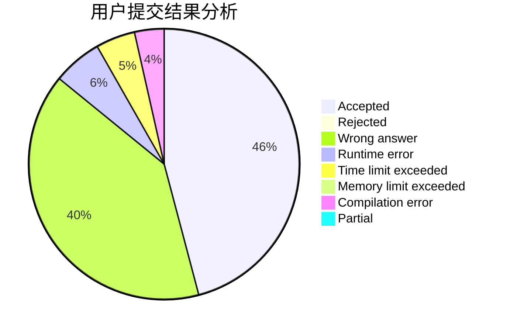
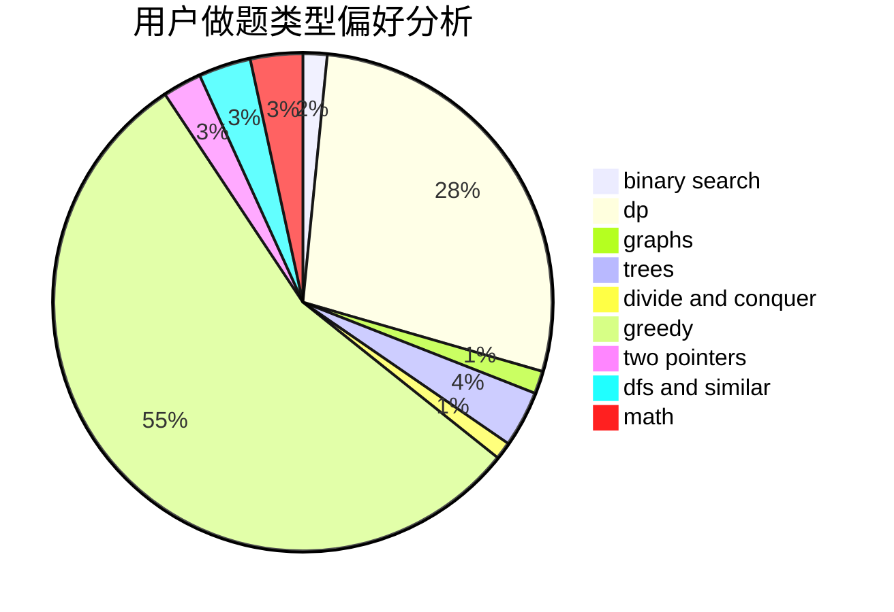

# qqqqc

<!-- tabs:start -->

#### **用户提交结果分析**

#### **用户做题类型偏好分析**

<!-- tabs:end -->
# 推荐题目
[814D](https://codeforces.com/contest/814/problem/D)
[691D](https://codeforces.com/contest/691/problem/D)
[1236B](https://codeforces.com/contest/1236/problem/B)
[784G](https://codeforces.com/contest/784/problem/G)
[906A](https://codeforces.com/contest/906/problem/A)
[1023A](https://codeforces.com/contest/1023/problem/A)
[1140D](https://codeforces.com/contest/1140/problem/D)
[883A](https://codeforces.com/contest/883/problem/A)
[878C](https://codeforces.com/contest/878/problem/C)
[acmsguru8](https://codeforces.com/contest/acmsguru/problem/8)
