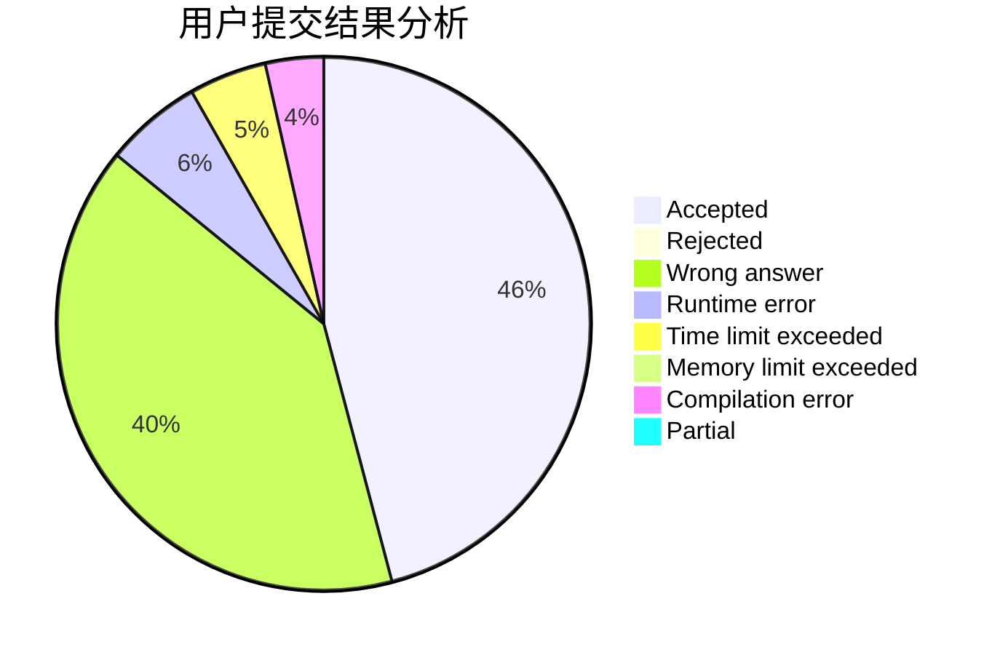
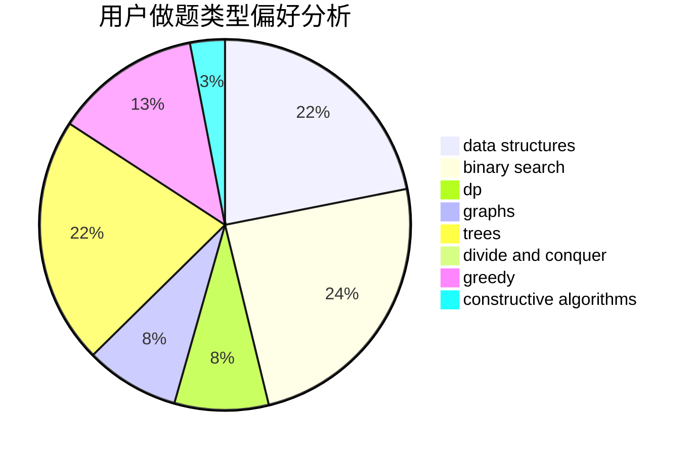
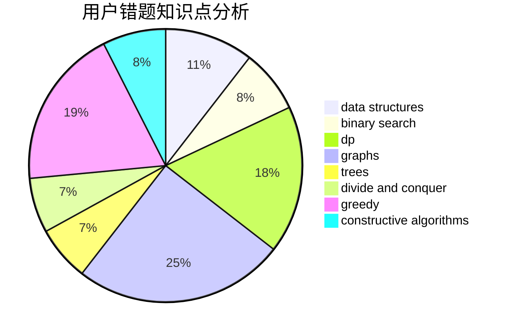

# qqqqc

<!-- tabs:start -->

#### **用户提交结果分析**

#### **用户做题类型偏好分析**

#### **用户错题知识点分析**

<!-- tabs:end -->
# 推荐题目
[7C](https://codeforces.com/contest/7/problem/C)		math,
                        number theory		  
[669D](https://codeforces.com/contest/669/problem/D)		dsu,graphs,sortings,trees		  
[1227D2](https://codeforces.com/contest/1227D/problem/2)		data structures,
                        greedy		  
[765D](https://codeforces.com/contest/765/problem/D)		constructive algorithms,
                        dsu,
                        math		  
[886F](https://codeforces.com/contest/886/problem/F)		geometry		  
[1020C](https://codeforces.com/contest/1020/problem/C)		dsu,graphs,sortings,trees		  
[1138F](https://codeforces.com/contest/1138/problem/F)		dsu,graphs,sortings,trees		  
[862D](https://codeforces.com/contest/862/problem/D)		binary search,
                        divide and conquer,
                        interactive		  
[860C](https://codeforces.com/contest/860/problem/C)		dsu,graphs,sortings,trees		  
[986F](https://codeforces.com/contest/986/problem/F)		graphs,
                        math,
                        number theory,
                        shortest paths		  
