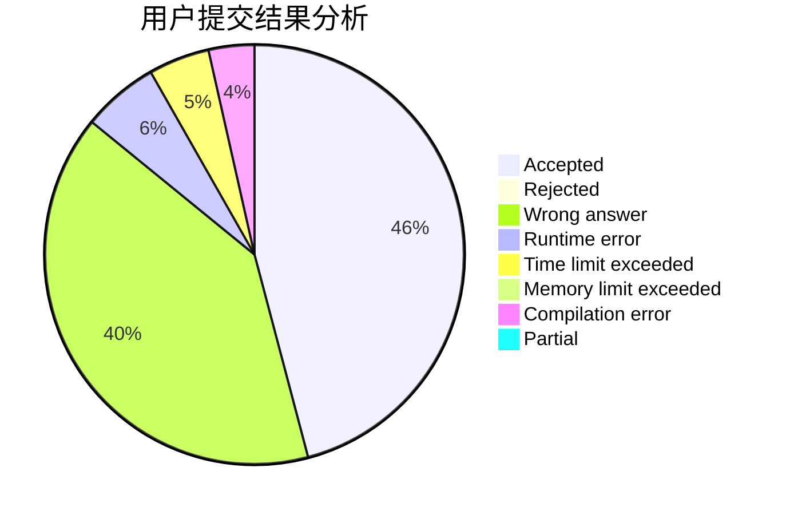
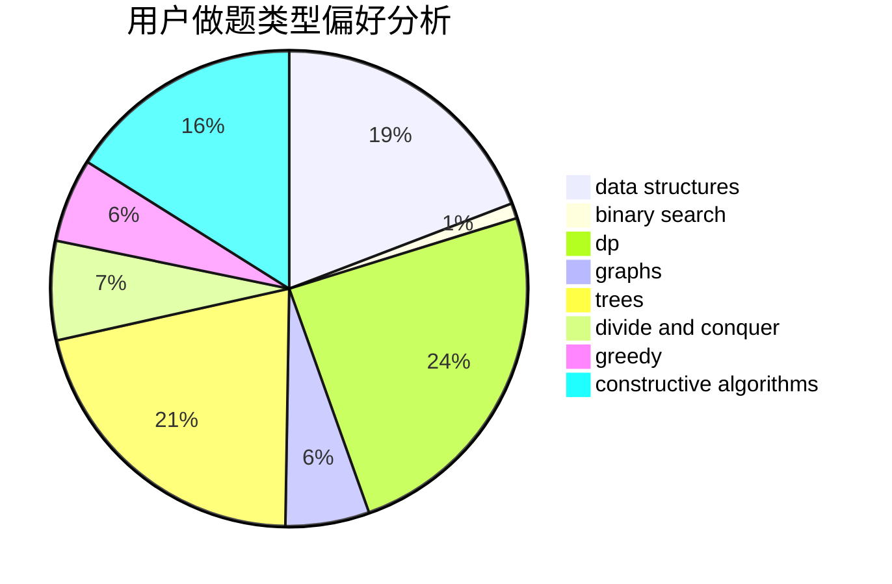
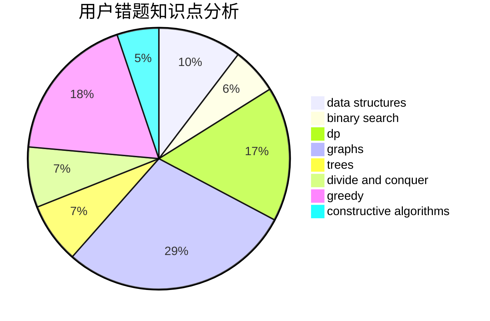

# qqqqc

<!-- tabs:start -->

#### **用户提交结果分析**

#### **用户做题类型偏好分析**

#### **用户错题知识点分析**

<!-- tabs:end -->
# 推荐题目
[814D](https://codeforces.com/contest/814/problem/D)		dfs and similar,
                        dp,
                        geometry,
                        greedy,
                        trees		  
[691D](https://codeforces.com/contest/691/problem/D)		dfs and similar,
                        dsu,
                        math		  
[1236B](https://codeforces.com/contest/1236/problem/B)		combinatorics,
                        math		  
[784G](https://codeforces.com/contest/784/problem/G)		*special problem		  
[906A](https://codeforces.com/contest/906/problem/A)		implementation,
                        strings		  
[1023A](https://codeforces.com/contest/1023/problem/A)		brute force,
                        implementation,
                        strings		  
[1140D](https://codeforces.com/contest/1140/problem/D)		dp,
                        greedy,
                        math		  
[883A](https://codeforces.com/contest/883/problem/A)		implementation		  
[878C](https://codeforces.com/contest/878/problem/C)		data structures,
                        graphs		  
[acmsguru8](https://codeforces.com/contest/acmsguru/problem/8)		dsu,graphs,sortings,trees		  
