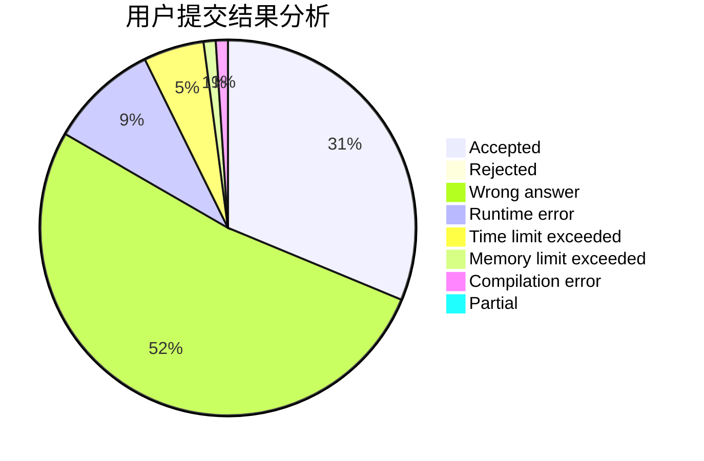
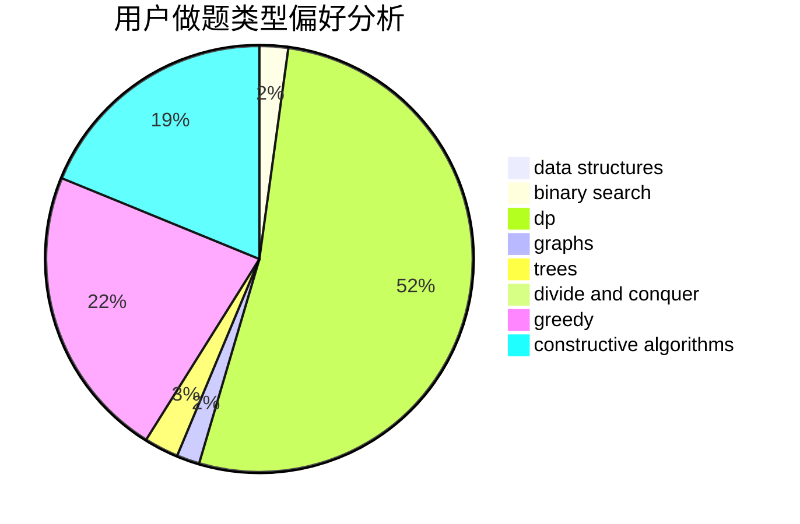
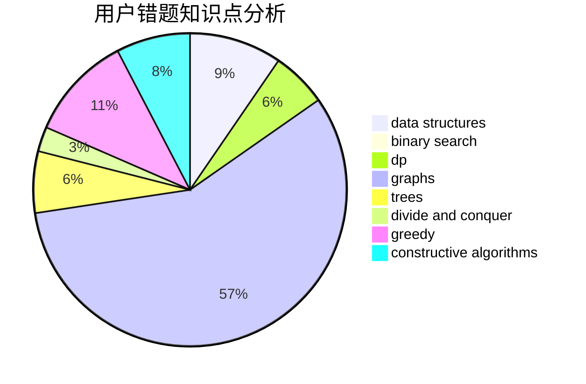

# qqricky

<!-- tabs:start -->

#### **用户提交结果分析**

#### **用户做题类型偏好分析**

#### **用户错题知识点分析**

<!-- tabs:end -->
# 推荐题目
[860B](https://codeforces.com/contest/860/problem/B)		dsu,graphs,sortings,trees		  
[608D](https://codeforces.com/contest/608/problem/D)		dsu,graphs,sortings,trees		  
[705A](https://codeforces.com/contest/705/problem/A)		implementation		  
[1070K](https://codeforces.com/contest/1070/problem/K)		implementation		  
[1314D](https://codeforces.com/contest/1314/problem/D)		dsu,graphs,sortings,trees		  
[1187G](https://codeforces.com/contest/1187/problem/G)		flows,
                        graphs		  
[1169C](https://codeforces.com/contest/1169/problem/C)		dsu,graphs,sortings,trees		  
[1361A](https://codeforces.com/contest/1361/problem/A)		constructive algorithms,
                        graphs,
                        greedy,
                        sortings		  
[205A](https://codeforces.com/contest/205/problem/A)		brute force,
                        implementation		  
[853A](https://codeforces.com/contest/853/problem/A)		greedy		  
