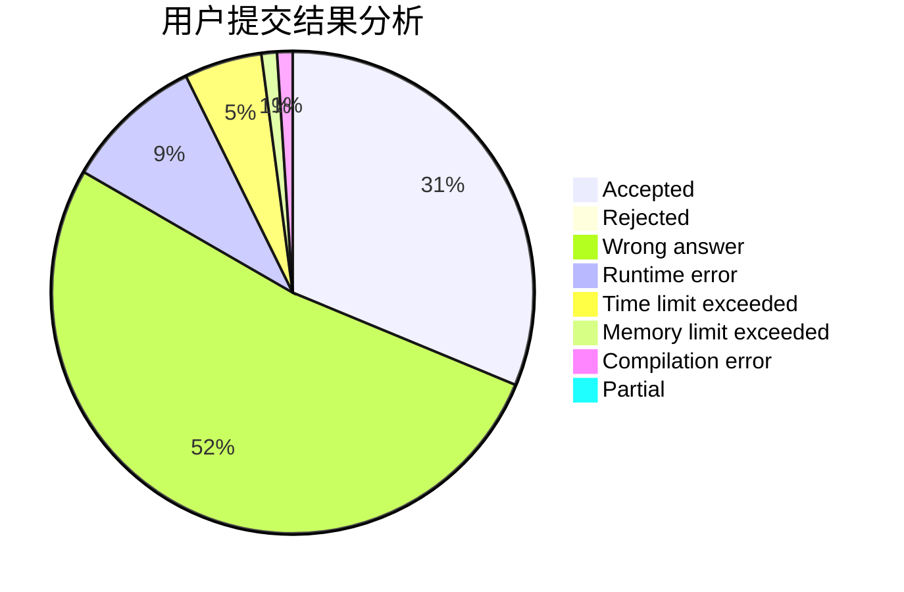
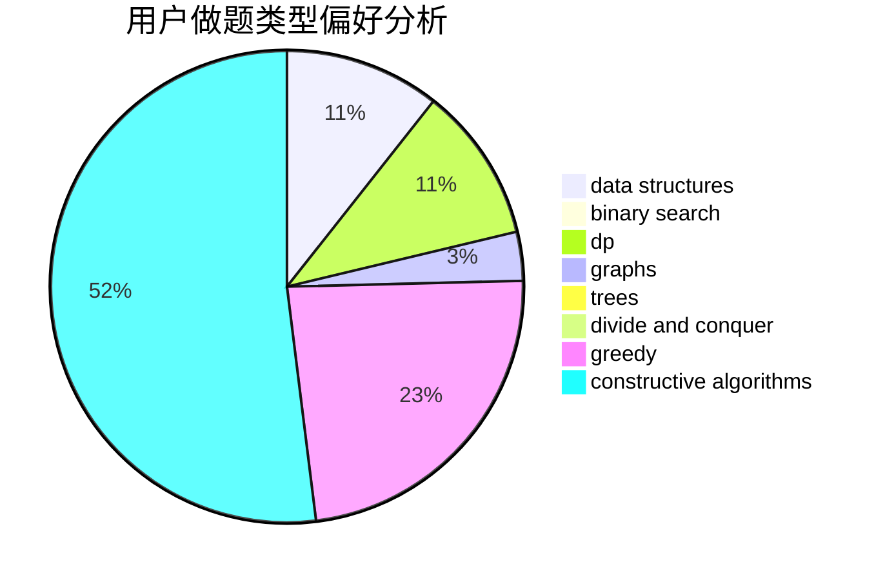
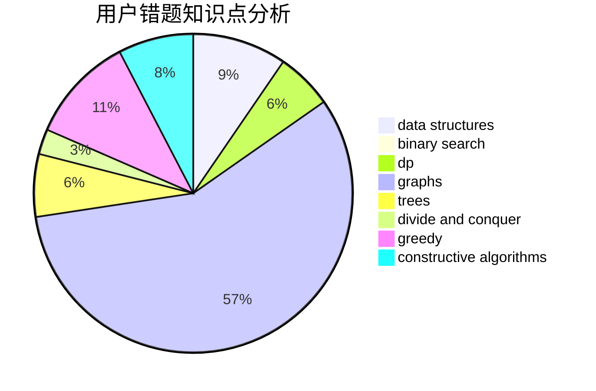

# qqricky

<!-- tabs:start -->

#### **用户提交结果分析**

#### **用户做题类型偏好分析**

#### **用户错题知识点分析**

<!-- tabs:end -->
# 推荐题目
[841B](https://codeforces.com/contest/841/problem/B)		games,
                        math		  
[588B](https://codeforces.com/contest/588/problem/B)		math		  
[681B](https://codeforces.com/contest/681/problem/B)		brute force		  
[1070H](https://codeforces.com/contest/1070/problem/H)		brute force,
                        implementation		  
[1305E](https://codeforces.com/contest/1305/problem/E)		constructive algorithms,
                        greedy,
                        implementation,
                        math		  
[1184C1](https://codeforces.com/contest/1184C/problem/1)		implementation		  
[1166D](https://codeforces.com/contest/1166/problem/D)		binary search,
                        brute force,
                        greedy,
                        math		  
[1354D](https://codeforces.com/contest/1354/problem/D)		binary search,
                        data structures		  
[178F3](https://codeforces.com/contest/178F/problem/3)		nan		  
[835C](https://codeforces.com/contest/835/problem/C)		dp,
                        implementation		  
