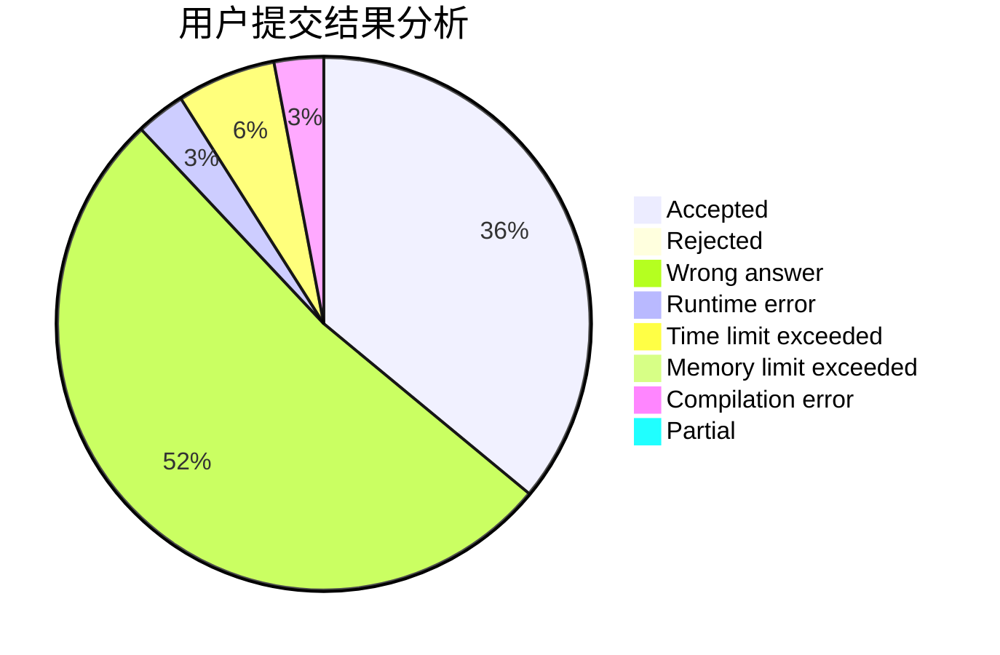
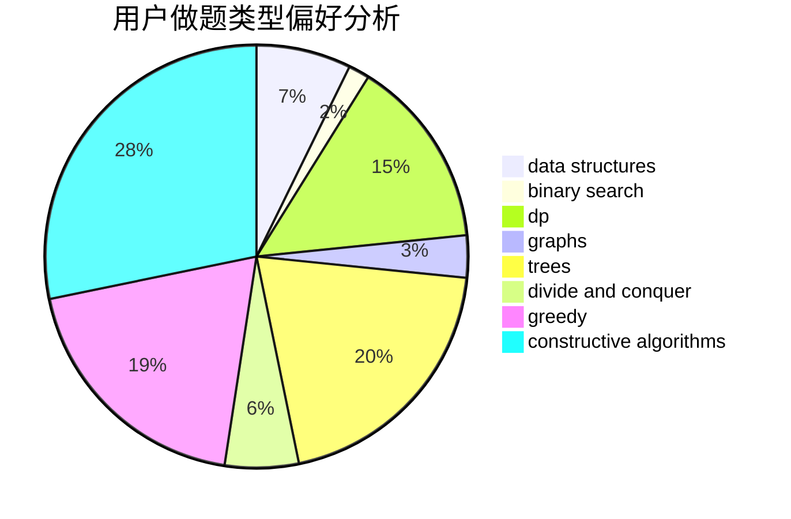
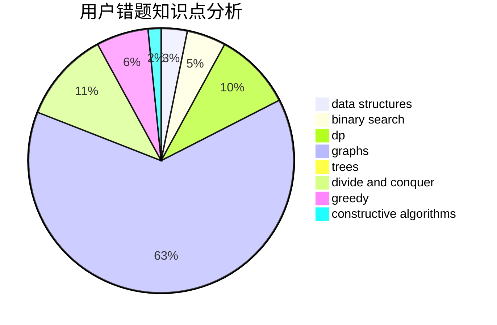

# qsmcgogo

<!-- tabs:start -->

#### **用户提交结果分析**

#### **用户做题类型偏好分析**

#### **用户错题知识点分析**

<!-- tabs:end -->
# 推荐题目
[893D](https://codeforces.com/contest/893/problem/D)		data structures,
                        dp,
                        greedy,
                        implementation		  
[1102D](https://codeforces.com/contest/1102/problem/D)		greedy,
                        strings		  
[671C](https://codeforces.com/contest/671/problem/C)		data structures,
                        number theory		  
[1290F](https://codeforces.com/contest/1290/problem/F)		dp		  
[962F](https://codeforces.com/contest/962/problem/F)		dfs and similar,
                        graphs,
                        trees		  
[599D](https://codeforces.com/contest/599/problem/D)		brute force,
                        math		  
[1011E](https://codeforces.com/contest/1011/problem/E)		dsu,graphs,sortings,trees		  
[1038E](https://codeforces.com/contest/1038/problem/E)		bitmasks,
                        brute force,
                        dfs and similar,
                        dp,
                        graphs		  
[149E](https://codeforces.com/contest/149/problem/E)		string suffix structures,
                        strings		  
[52B](https://codeforces.com/contest/52/problem/B)		combinatorics		  
