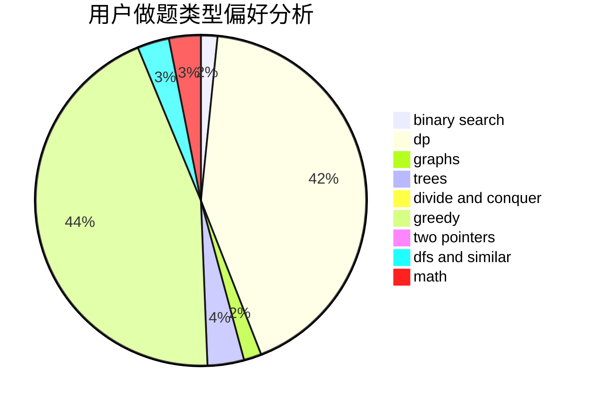

# qsmcgogo

<!-- tabs:start -->

#### **用户提交结果分析**

#### **用户做题类型偏好分析**

<!-- tabs:end -->
# 推荐题目
[893D](https://codeforces.com/contest/893/problem/D)
[1102D](https://codeforces.com/contest/1102/problem/D)
[671C](https://codeforces.com/contest/671/problem/C)
[1290F](https://codeforces.com/contest/1290/problem/F)
[962F](https://codeforces.com/contest/962/problem/F)
[599D](https://codeforces.com/contest/599/problem/D)
[1011E](https://codeforces.com/contest/1011/problem/E)
[1038E](https://codeforces.com/contest/1038/problem/E)
[149E](https://codeforces.com/contest/149/problem/E)
[52B](https://codeforces.com/contest/52/problem/B)
