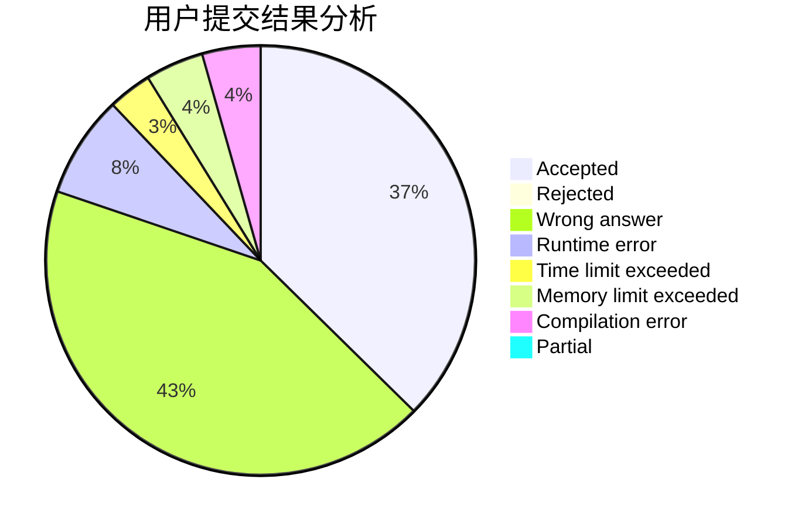
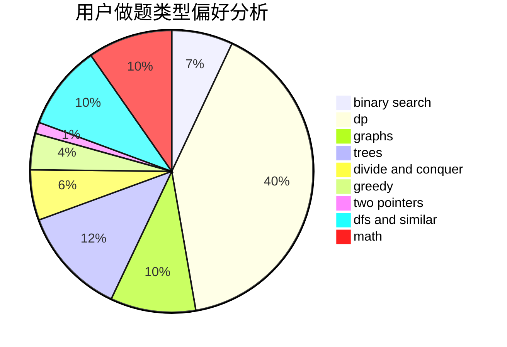

# C20192413

<!-- tabs:start -->

#### **用户提交结果分析**

#### **用户做题类型偏好分析**

<!-- tabs:end -->
# 推荐题目
[600D](https://codeforces.com/contest/600/problem/D)
[421B](https://codeforces.com/contest/421/problem/B)
[12131](https://codeforces.com/contest/1213/problem/1)
[433B](https://codeforces.com/contest/433/problem/B)
[601B](https://codeforces.com/contest/601/problem/B)
[601C](https://codeforces.com/contest/601/problem/C)
[1330D](https://codeforces.com/contest/1330/problem/D)
[273D](https://codeforces.com/contest/273/problem/D)
[601A](https://codeforces.com/contest/601/problem/A)
[1252L](https://codeforces.com/contest/1252/problem/L)
