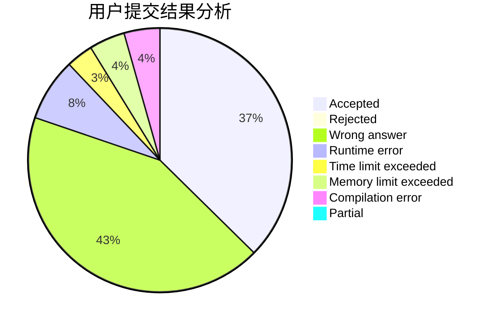
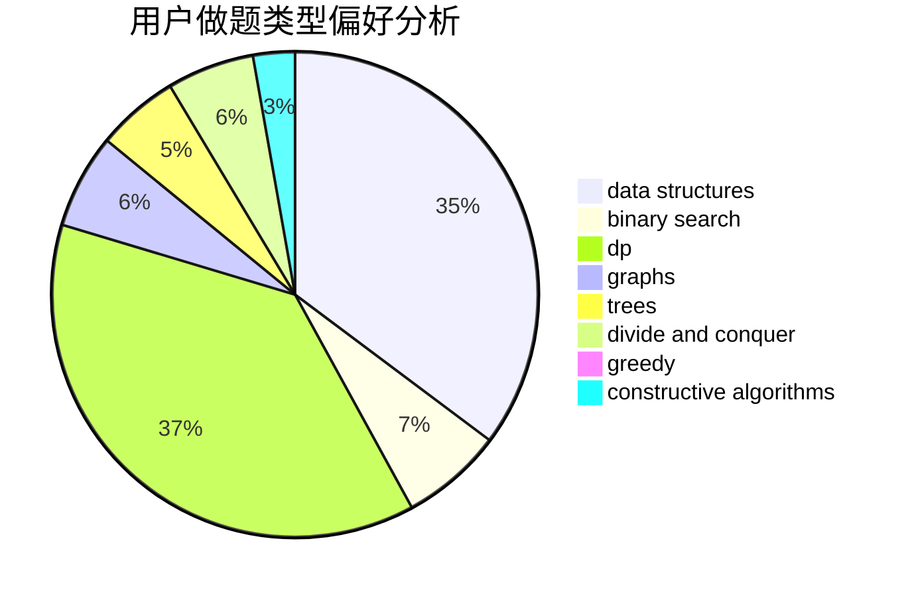
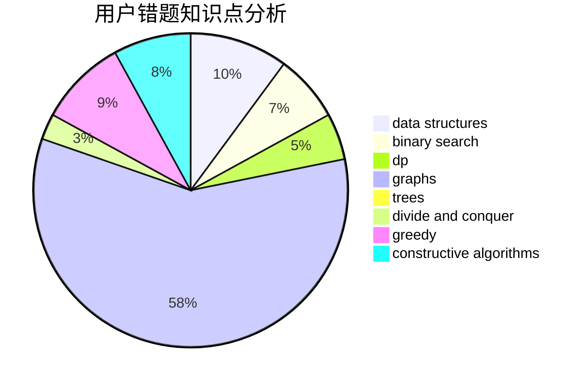

# C20192413

<!-- tabs:start -->

#### **用户提交结果分析**

#### **用户做题类型偏好分析**

#### **用户错题知识点分析**

<!-- tabs:end -->
# 推荐题目
[600D](https://codeforces.com/contest/600/problem/D)		geometry		  
[421B](https://codeforces.com/contest/421/problem/B)		dsu,graphs,sortings,trees		  
[12131](https://codeforces.com/contest/1213/problem/1)		dsu,graphs,sortings,trees		  
[433B](https://codeforces.com/contest/433/problem/B)		dp,
                        implementation,
                        sortings		  
[601B](https://codeforces.com/contest/601/problem/B)		data structures,
                        math		  
[601C](https://codeforces.com/contest/601/problem/C)		dp,
                        math,
                        probabilities		  
[1330D](https://codeforces.com/contest/1330/problem/D)		dsu,graphs,sortings,trees		  
[273D](https://codeforces.com/contest/273/problem/D)		dp		  
[601A](https://codeforces.com/contest/601/problem/A)		graphs,
                        shortest paths		  
[1252L](https://codeforces.com/contest/1252/problem/L)		flows,
                        graphs		  
