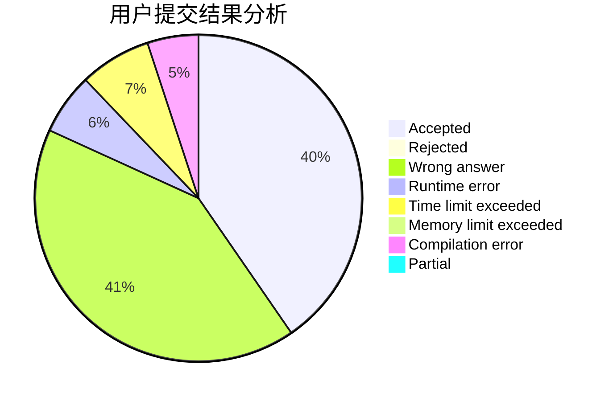
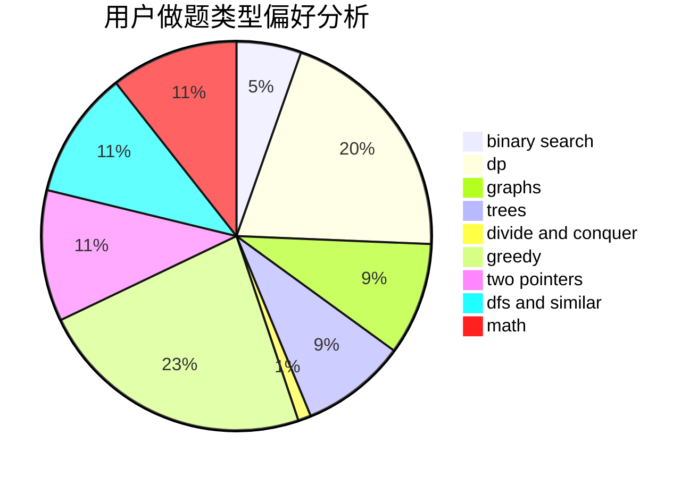

# quest_2

<!-- tabs:start -->

#### **用户提交结果分析**

#### **用户做题类型偏好分析**

<!-- tabs:end -->
# 推荐题目
[1344A](https://codeforces.com/contest/1344/problem/A)
[914H](https://codeforces.com/contest/914/problem/H)
[781C](https://codeforces.com/contest/781/problem/C)
[1187E](https://codeforces.com/contest/1187/problem/E)
[1130E](https://codeforces.com/contest/1130/problem/E)
[1282C](https://codeforces.com/contest/1282/problem/C)
[208D](https://codeforces.com/contest/208/problem/D)
[468E](https://codeforces.com/contest/468/problem/E)
[1251D](https://codeforces.com/contest/1251/problem/D)
[1241B](https://codeforces.com/contest/1241/problem/B)
