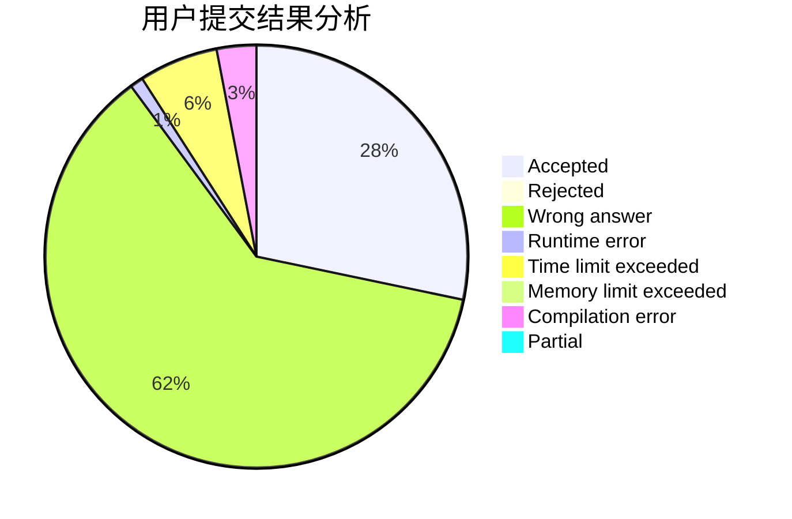
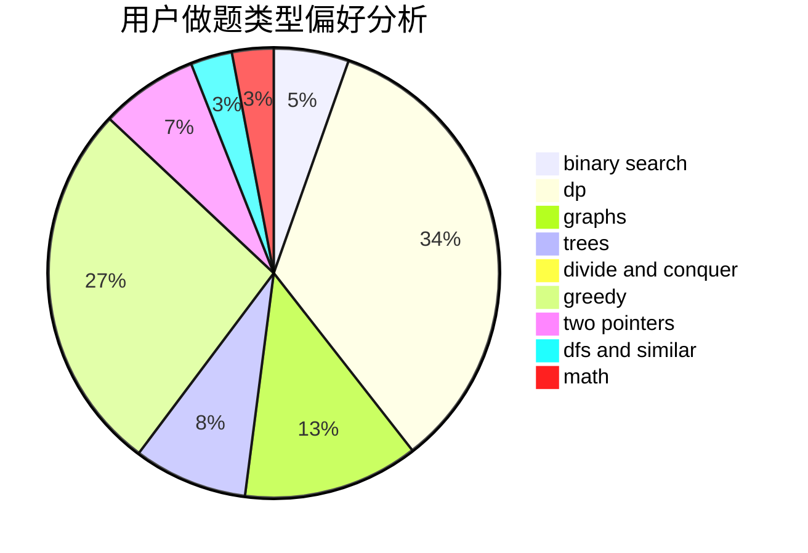

# quhengyi11

<!-- tabs:start -->

#### **用户提交结果分析**

#### **用户做题类型偏好分析**

<!-- tabs:end -->
# 推荐题目
[1383A](https://codeforces.com/contest/1383/problem/A)
[638A](https://codeforces.com/contest/638/problem/A)
[1435E](https://codeforces.com/contest/1435/problem/E)
[1073D](https://codeforces.com/contest/1073/problem/D)
[12131](https://codeforces.com/contest/1213/problem/1)
[1772](https://codeforces.com/contest/177/problem/2)
[244C](https://codeforces.com/contest/244/problem/C)
[10024](https://codeforces.com/contest/1002/problem/4)
[876C](https://codeforces.com/contest/876/problem/C)
[1063D](https://codeforces.com/contest/1063/problem/D)
