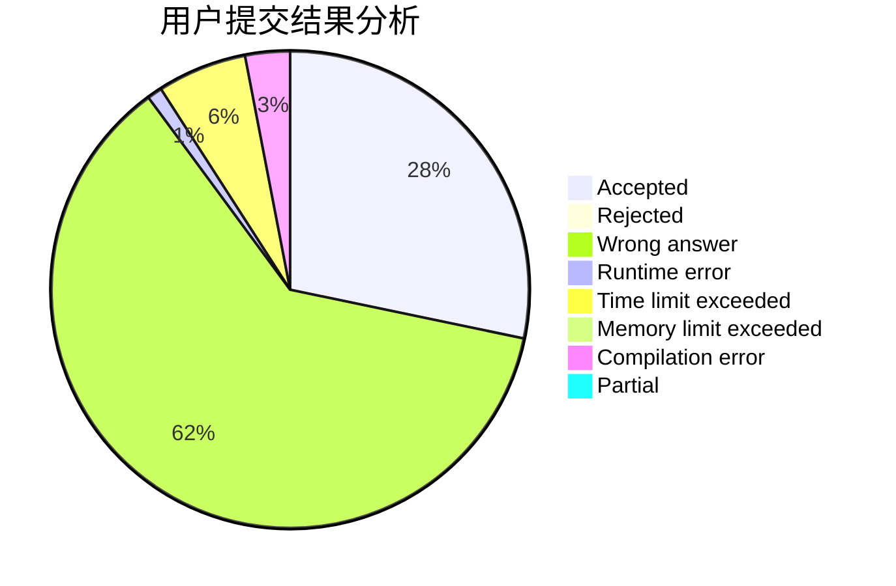
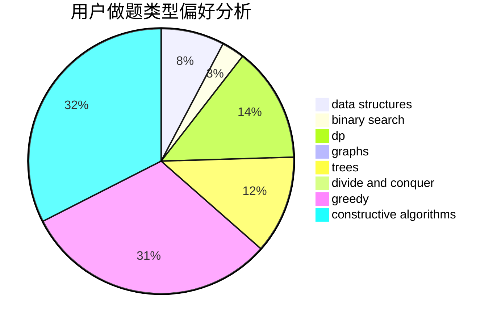
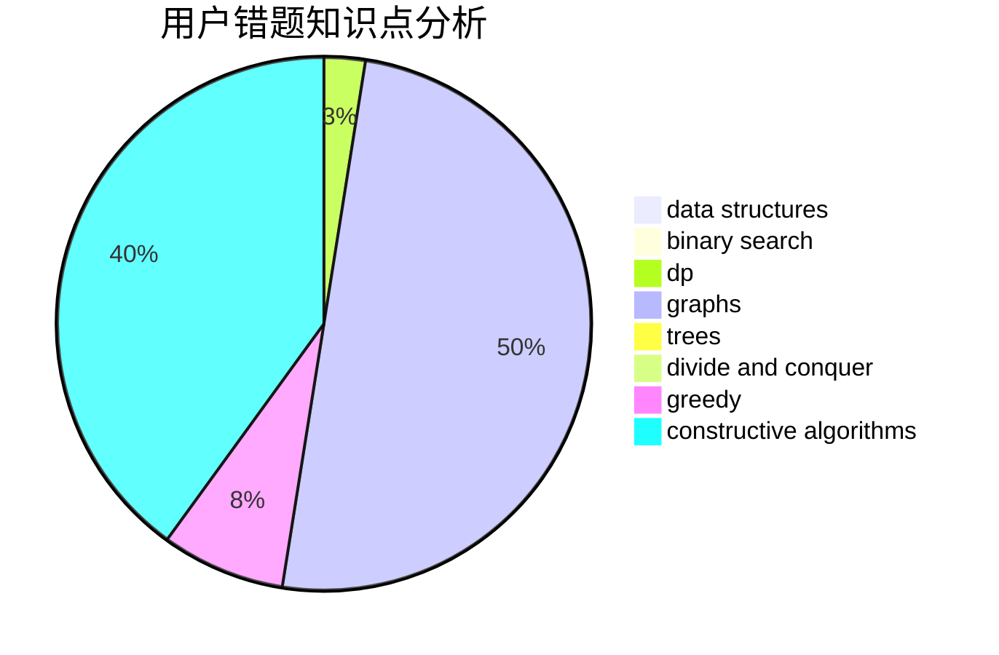

# quhengyi11

<!-- tabs:start -->

#### **用户提交结果分析**

#### **用户做题类型偏好分析**

#### **用户错题知识点分析**

<!-- tabs:end -->
# 推荐题目
[1374B](https://codeforces.com/contest/1374/problem/B)		math		  
[618B](https://codeforces.com/contest/618/problem/B)		constructive algorithms		  
[1427B](https://codeforces.com/contest/1427/problem/B)		greedy,
                        implementation,
                        sortings		  
[1073A](https://codeforces.com/contest/1073/problem/A)		implementation,
                        strings		  
[1207C](https://codeforces.com/contest/1207/problem/C)		dp,
                        greedy		  
[156D](https://codeforces.com/contest/156/problem/D)		combinatorics,
                        graphs		  
[225E](https://codeforces.com/contest/225/problem/E)		math,
                        number theory		  
[1002C2](https://codeforces.com/contest/1002C/problem/2)		nan		  
[858F](https://codeforces.com/contest/858/problem/F)		constructive algorithms,
                        dfs and similar,
                        graphs		  
[1063A](https://codeforces.com/contest/1063/problem/A)		constructive algorithms,
                        strings		  
