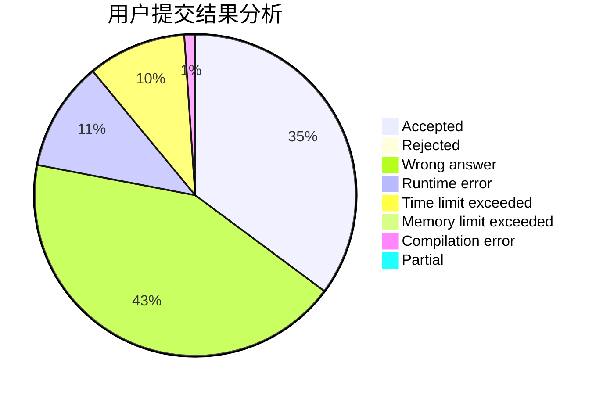
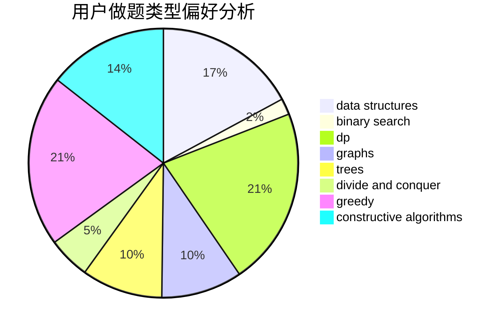
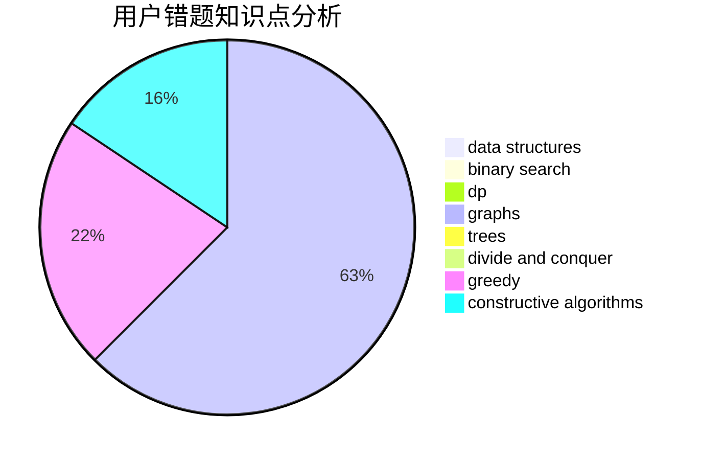

# quick_sort

<!-- tabs:start -->

#### **用户提交结果分析**

#### **用户做题类型偏好分析**

#### **用户错题知识点分析**

<!-- tabs:end -->
# 推荐题目
[1340D](https://codeforces.com/contest/1340/problem/D)		constructive algorithms,
                        dfs and similar,
                        graphs,
                        trees		  
[1142D](https://codeforces.com/contest/1142/problem/D)		dp		  
[1040A](https://codeforces.com/contest/1040/problem/A)		greedy		  
[281A](https://codeforces.com/contest/281/problem/A)		implementation,
                        strings		  
[922B](https://codeforces.com/contest/922/problem/B)		brute force		  
[117C](https://codeforces.com/contest/117/problem/C)		dfs and similar,
                        graphs		  
[501E](https://codeforces.com/contest/501/problem/E)		binary search,
                        combinatorics,
                        implementation		  
[1129C](https://codeforces.com/contest/1129/problem/C)		binary search,
                        data structures,
                        dp,
                        hashing,
                        sortings,
                        string suffix structures,
                        strings		  
[1503F](https://codeforces.com/contest/1503/problem/F)		constructive algorithms,
                        data structures,
                        divide and conquer,
                        geometry,
                        graphs,
                        implementation		  
[866E](https://codeforces.com/contest/866/problem/E)		dsu,graphs,sortings,trees		  
