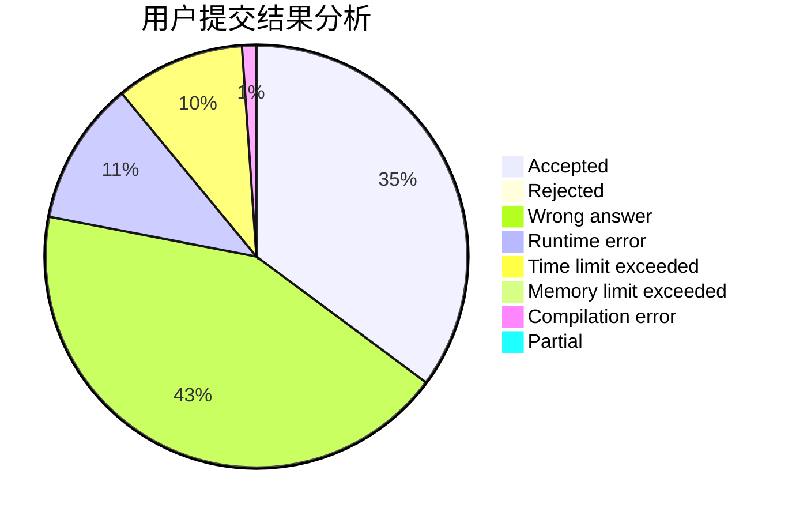
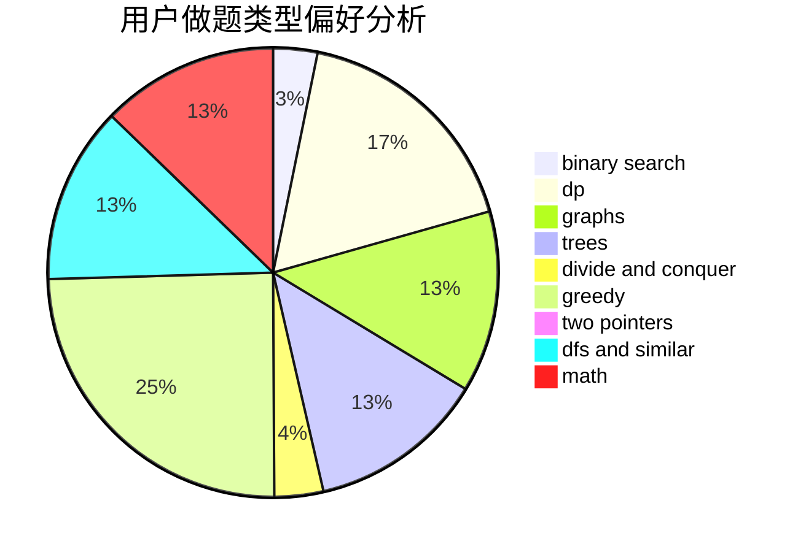

# quick_sort

<!-- tabs:start -->

#### **用户提交结果分析**

#### **用户做题类型偏好分析**

<!-- tabs:end -->
# 推荐题目
[1340D](https://codeforces.com/contest/1340/problem/D)
[1142D](https://codeforces.com/contest/1142/problem/D)
[1040A](https://codeforces.com/contest/1040/problem/A)
[281A](https://codeforces.com/contest/281/problem/A)
[922B](https://codeforces.com/contest/922/problem/B)
[117C](https://codeforces.com/contest/117/problem/C)
[501E](https://codeforces.com/contest/501/problem/E)
[1129C](https://codeforces.com/contest/1129/problem/C)
[1503F](https://codeforces.com/contest/1503/problem/F)
[866E](https://codeforces.com/contest/866/problem/E)
