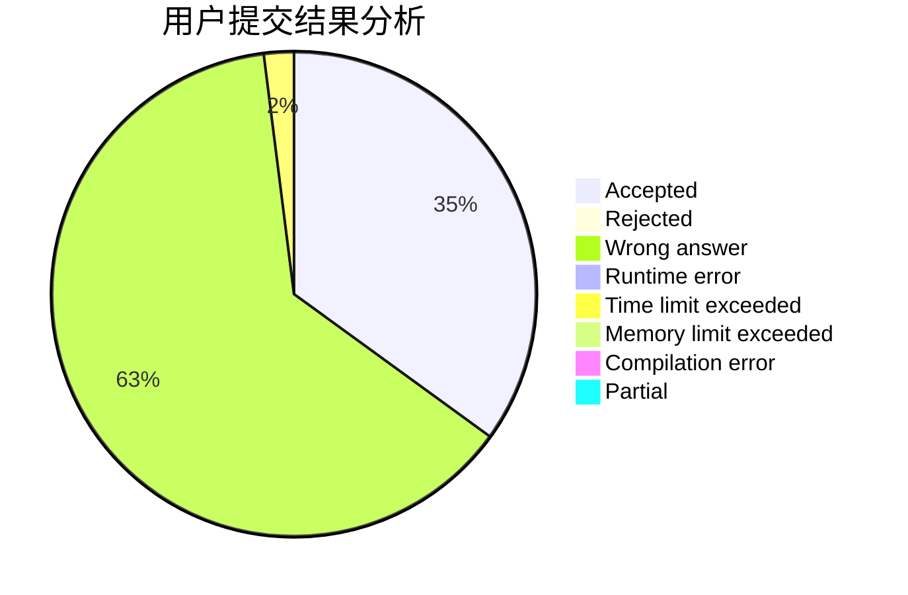
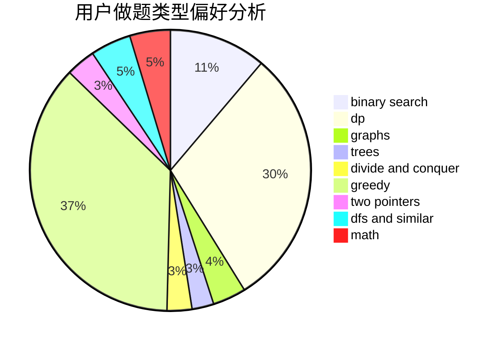

# quickers

<!-- tabs:start -->

#### **用户提交结果分析**

#### **用户做题类型偏好分析**

<!-- tabs:end -->
# 推荐题目
[853C](https://codeforces.com/contest/853/problem/C)
[347A](https://codeforces.com/contest/347/problem/A)
[1200D](https://codeforces.com/contest/1200/problem/D)
[1250B](https://codeforces.com/contest/1250/problem/B)
[1254E](https://codeforces.com/contest/1254/problem/E)
[429D](https://codeforces.com/contest/429/problem/D)
[715A](https://codeforces.com/contest/715/problem/A)
[967B](https://codeforces.com/contest/967/problem/B)
[627F](https://codeforces.com/contest/627/problem/F)
[873A](https://codeforces.com/contest/873/problem/A)
