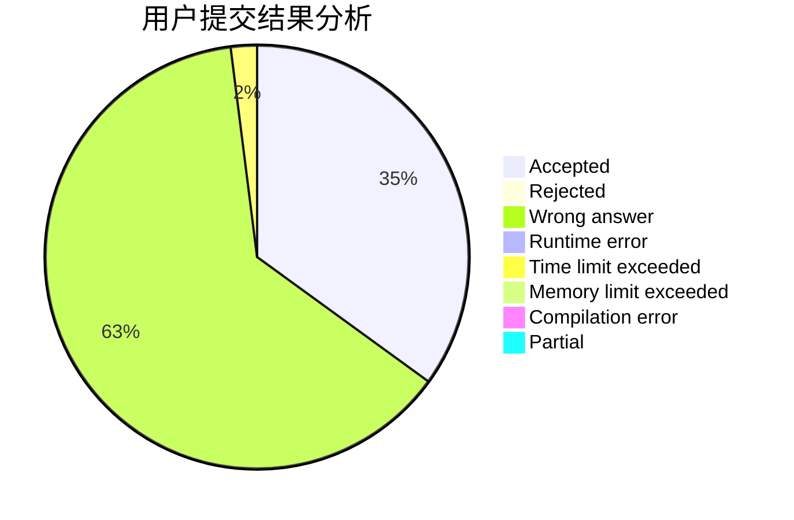
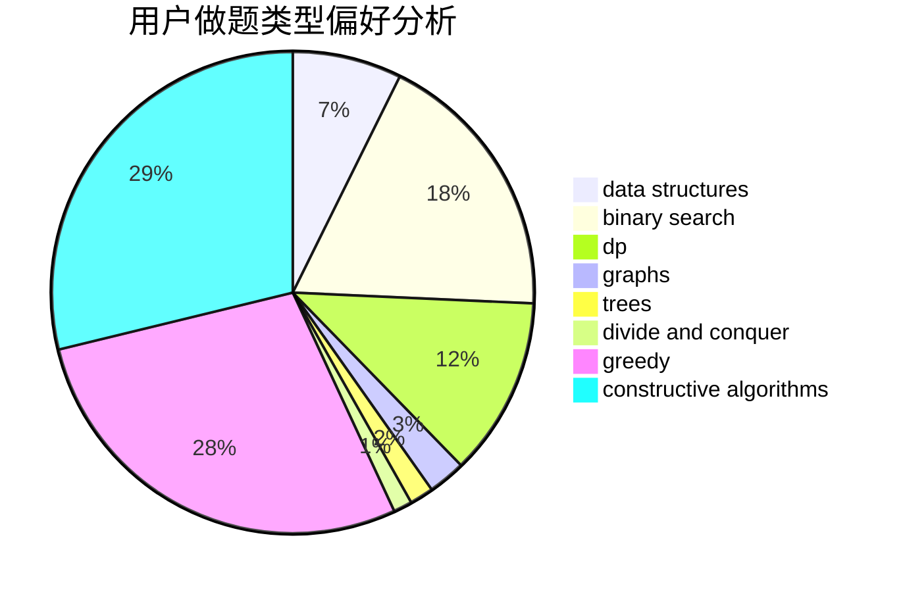
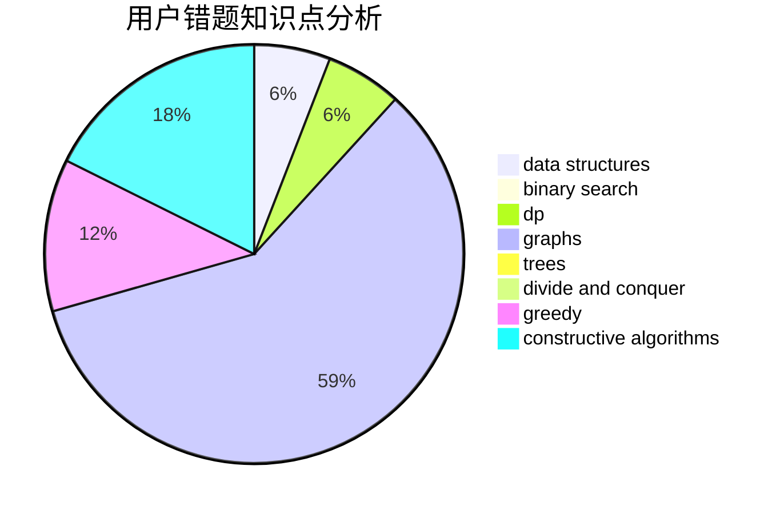

# quickers
<!-- tabs:start -->
#### **用户提交结果分析**

#### **用户做题类型偏好分析**

#### **用户错题知识点分析**

<!-- tabs:end -->
# 推荐题目
[Eels](http://codeforces.com/problemset/problem/1098/D)		data structures		  
[The penguin's game](http://codeforces.com/problemset/problem/835/E)		binary search,
                        constructive algorithms,
                        interactive		  
[Game with Powers](http://codeforces.com/problemset/problem/317/D)		dp,
                        games		  
[Running in Pairs](http://codeforces.com/problemset/problem/1244/G)		constructive algorithms,
                        greedy,
                        math		  
[Data Center](http://codeforces.com/problemset/problem/1250/F)		brute force,
                        implementation		  
[Tic-tac-toe](http://codeforces.com/problemset/problem/3/C)		brute force,
                        games,
                        implementation		  
[Prime Number](http://codeforces.com/problemset/problem/359/C)		math,
                        number theory		  
[Planning](https://codeforces.com/contest/854/problem/C)		greedy		  
[Ant colony](http://codeforces.com/problemset/problem/474/F)		data structures,
                        math,
                        number theory		  
[Train](http://codeforces.com/problemset/problem/74/B)		dp,
                        games,
                        greedy		  
<!-- tabs:start -->
#### **data structures**
[Eels](http://codeforces.com/problemset/problem/1098/D)		data structures		  
[The penguin's game](http://codeforces.com/problemset/problem/474/F)		data structures,
                        math,
                        number theory		  
[Game with Powers](http://codeforces.com/problemset/problem/101/B)		binary search,
                        data structures,
                        dp		  
[Running in Pairs](http://codeforces.com/problemset/problem/1129/C)		binary search,
                        data structures,
                        dp,
                        hashing,
                        sortings,
                        string suffix structures,
                        strings		  
[Data Center](http://codeforces.com/problemset/problem/877/E)		bitmasks,
                        data structures,
                        trees		  
[Tic-tac-toe](http://codeforces.com/problemset/problem/750/E)		data structures,
                        divide and conquer,
                        dp,
                        matrices		  
[Prime Number](http://codeforces.com/problemset/problem/1286/D)		data structures,
                        math,
                        matrices,
                        probabilities		  
[Planning](https://codeforces.com/contest/709/problem/E)		data structures,
                        dfs and similar,
                        dp,
                        graphs,
                        greedy,
                        trees		  
[Ant colony](http://codeforces.com/problemset/problem/1009/F)		data structures,
                        dsu,
                        trees		  
[Train](http://codeforces.com/problemset/problem/1430/E)		data structures,
                        greedy,
                        strings		  
#### **binary search**
[Eels](http://codeforces.com/problemset/problem/835/E)		binary search,
                        constructive algorithms,
                        interactive		  
[The penguin's game](http://codeforces.com/problemset/problem/490/E)		binary search,
                        brute force,
                        greedy,
                        implementation		  
[Game with Powers](http://codeforces.com/problemset/problem/101/B)		binary search,
                        data structures,
                        dp		  
[Running in Pairs](http://codeforces.com/problemset/problem/360/B)		binary search,
                        dp		  
[Data Center](https://codeforces.com/contest/1314/problem/C)		binary search,
                        dp,
                        strings		  
[Tic-tac-toe](http://codeforces.com/problemset/problem/1129/C)		binary search,
                        data structures,
                        dp,
                        hashing,
                        sortings,
                        string suffix structures,
                        strings		  
[Prime Number](http://codeforces.com/problemset/problem/813/E)		binary search,
                        data structures		  
[Planning](http://codeforces.com/problemset/problem/1492/C)		binary search,
                        data structures,
                        dp,
                        greedy,
                        two pointers		  
[Ant colony](http://codeforces.com/problemset/problem/1463/D)		binary search,
                        constructive algorithms,
                        greedy,
                        two pointers		  
[Train](http://codeforces.com/problemset/problem/1490/G)		binary search,
                        data structures,
                        math		  
#### **dp**
[Eels](http://codeforces.com/problemset/problem/317/D)		dp,
                        games		  
[The penguin's game](http://codeforces.com/problemset/problem/74/B)		dp,
                        games,
                        greedy		  
[Game with Powers](http://codeforces.com/problemset/problem/1082/F)		dp,
                        strings,
                        trees		  
[Running in Pairs](http://codeforces.com/problemset/problem/513/G1)		brute force,
                        dfs and similar,
                        dp,
                        meet-in-the-middle		  
[Data Center](http://codeforces.com/problemset/problem/698/C)		bitmasks,
                        dp,
                        math,
                        probabilities		  
[Tic-tac-toe](http://codeforces.com/problemset/problem/101/B)		binary search,
                        data structures,
                        dp		  
[Prime Number](http://codeforces.com/problemset/problem/360/B)		binary search,
                        dp		  
[Planning](https://codeforces.com/contest/1314/problem/C)		binary search,
                        dp,
                        strings		  
[Ant colony](http://codeforces.com/problemset/problem/1129/C)		binary search,
                        data structures,
                        dp,
                        hashing,
                        sortings,
                        string suffix structures,
                        strings		  
[Train](http://codeforces.com/problemset/problem/852/E)		dp		  
#### **graph**
[Eels](https://codeforces.com/contest/197/problem/D)		dfs and similar,
                        graphs		  
[The penguin's game](http://codeforces.com/problemset/problem/196/E)		dsu,
                        graphs,
                        shortest paths		  
[Game with Powers](http://codeforces.com/problemset/problem/983/C)		dp,
                        graphs,
                        shortest paths		  
[Running in Pairs](http://codeforces.com/problemset/problem/156/D)		combinatorics,
                        graphs		  
[Data Center](https://codeforces.com/contest/709/problem/E)		data structures,
                        dfs and similar,
                        dp,
                        graphs,
                        greedy,
                        trees		  
[Tic-tac-toe](http://codeforces.com/problemset/problem/1487/C)		brute force,
                        constructive algorithms,
                        dfs and similar,
                        graphs,
                        greedy,
                        implementation,
                        math		  
[Prime Number](http://codeforces.com/problemset/problem/1437/C)		dp,
                        flows,
                        graph matchings,
                        greedy,
                        math,
                        sortings		  
[Planning](http://codeforces.com/problemset/problem/1470/D)		constructive algorithms,
                        dfs and similar,
                        graph matchings,
                        graphs,
                        greedy		  
[Ant colony](http://codeforces.com/problemset/problem/1476/C)		dp,
                        graphs,
                        greedy		  
[Train](http://codeforces.com/problemset/problem/1304/D)		constructive algorithms,
                        graphs,
                        greedy,
                        two pointers		  
#### **trees**
[Eels](http://codeforces.com/problemset/problem/1082/F)		dp,
                        strings,
                        trees		  
[The penguin's game](http://codeforces.com/problemset/problem/452/B)		brute force,
                        constructive algorithms,
                        geometry,
                        trees		  
[Game with Powers](http://codeforces.com/problemset/problem/877/E)		bitmasks,
                        data structures,
                        trees		  
[Running in Pairs](https://codeforces.com/contest/709/problem/E)		data structures,
                        dfs and similar,
                        dp,
                        graphs,
                        greedy,
                        trees		  
[Data Center](http://codeforces.com/problemset/problem/1172/B)		combinatorics,
                        dfs and similar,
                        dp,
                        trees		  
[Tic-tac-toe](http://codeforces.com/problemset/problem/1009/F)		data structures,
                        dsu,
                        trees		  
[Prime Number](http://codeforces.com/problemset/problem/1479/D)		binary search,
                        bitmasks,
                        brute force,
                        data structures,
                        probabilities,
                        trees		  
[Planning](http://codeforces.com/problemset/problem/1511/C)		brute force,
                        data structures,
                        implementation,
                        trees		  
[Ant colony](http://codeforces.com/problemset/problem/1499/F)		combinatorics,
                        dfs and similar,
                        dp,
                        trees		  
[Train](http://codeforces.com/problemset/problem/1491/E)		brute force,
                        dfs and similar,
                        divide and conquer,
                        number theory,
                        trees		  
#### **divide and conquer**
[Eels](http://codeforces.com/problemset/problem/744/B)		bitmasks,
                        divide and conquer,
                        interactive		  
[The penguin's game](http://codeforces.com/problemset/problem/750/E)		data structures,
                        divide and conquer,
                        dp,
                        matrices		  
[Game with Powers](http://codeforces.com/problemset/problem/1461/D)		binary search,
                        brute force,
                        data structures,
                        divide and conquer,
                        implementation,
                        sortings		  
[Running in Pairs](http://codeforces.com/problemset/problem/1466/G)		combinatorics,
                        divide and conquer,
                        hashing,
                        math,
                        string suffix structures,
                        strings		  
[Data Center](http://codeforces.com/problemset/problem/1490/D)		dfs and similar,
                        divide and conquer,
                        implementation		  
[Tic-tac-toe](https://codeforces.com/contest/1483/problem/C)		data structures,
                        divide and conquer,
                        dp		  
[Prime Number](http://codeforces.com/problemset/problem/1491/E)		brute force,
                        dfs and similar,
                        divide and conquer,
                        number theory,
                        trees		  
[Planning](http://codeforces.com/problemset/problem/1303/G)		data structures,
                        divide and conquer,
                        geometry,
                        trees		  
[Ant colony](http://codeforces.com/problemset/problem/1494/D)		constructive algorithms,
                        data structures,
                        dfs and similar,
                        divide and conquer,
                        dsu,
                        greedy,
                        sortings,
                        trees		  
[Train](http://codeforces.com/problemset/problem/1482/E)		data structures,
                        divide and conquer,
                        dp		  
#### **greedy**
[Eels](http://codeforces.com/problemset/problem/1244/G)		constructive algorithms,
                        greedy,
                        math		  
[The penguin's game](https://codeforces.com/contest/854/problem/C)		greedy		  
[Game with Powers](http://codeforces.com/problemset/problem/74/B)		dp,
                        games,
                        greedy		  
[Running in Pairs](http://codeforces.com/problemset/problem/609/A)		greedy,
                        implementation,
                        sortings		  
[Data Center](http://codeforces.com/problemset/problem/1197/B)		greedy,
                        implementation		  
[Tic-tac-toe](http://codeforces.com/problemset/problem/490/E)		binary search,
                        brute force,
                        greedy,
                        implementation		  
[Prime Number](http://codeforces.com/problemset/problem/792/E)		greedy,
                        math,
                        number theory		  
[Planning](http://codeforces.com/problemset/problem/1276/A)		dp,
                        greedy		  
[Ant colony](http://codeforces.com/problemset/problem/1214/F)		greedy,
                        sortings		  
[Train](http://codeforces.com/problemset/problem/917/A)		dp,
                        greedy,
                        implementation,
                        math		  
#### **constructive algorithms**
[Eels](http://codeforces.com/problemset/problem/835/E)		binary search,
                        constructive algorithms,
                        interactive		  
[The penguin's game](http://codeforces.com/problemset/problem/1244/G)		constructive algorithms,
                        greedy,
                        math		  
[Game with Powers](http://codeforces.com/problemset/problem/1003/B)		constructive algorithms		  
[Running in Pairs](https://codeforces.com/contest/1104/problem/C)		constructive algorithms,
                        implementation		  
[Data Center](http://codeforces.com/problemset/problem/912/B)		bitmasks,
                        constructive algorithms,
                        number theory		  
[Tic-tac-toe](http://codeforces.com/problemset/problem/452/B)		brute force,
                        constructive algorithms,
                        geometry,
                        trees		  
[Prime Number](http://codeforces.com/problemset/problem/820/B)		constructive algorithms,
                        geometry,
                        math		  
[Planning](http://codeforces.com/problemset/problem/1421/D)		brute force,
                        constructive algorithms,
                        greedy,
                        implementation,
                        math,
                        shortest paths		  
[Ant colony](http://codeforces.com/problemset/problem/1493/A)		constructive algorithms,
                        greedy		  
[Train](http://codeforces.com/problemset/problem/1463/D)		binary search,
                        constructive algorithms,
                        greedy,
                        two pointers		  
#### **sortings**
[Eels](http://codeforces.com/problemset/problem/609/A)		greedy,
                        implementation,
                        sortings		  
[The penguin's game](http://codeforces.com/problemset/problem/769/A)		*special problem,
                        implementation,
                        sortings		  
[Game with Powers](http://codeforces.com/problemset/problem/1129/C)		binary search,
                        data structures,
                        dp,
                        hashing,
                        sortings,
                        string suffix structures,
                        strings		  
[Running in Pairs](http://codeforces.com/problemset/problem/1214/F)		greedy,
                        sortings		  
[Data Center](https://codeforces.com/contest/1496/problem/C)		geometry,
                        greedy,
                        math,
                        sortings		  
[Tic-tac-toe](http://codeforces.com/problemset/problem/1495/A)		geometry,
                        greedy,
                        math,
                        sortings		  
[Prime Number](http://codeforces.com/problemset/problem/1497/A)		brute force,
                        data structures,
                        greedy,
                        sortings		  
[Planning](http://codeforces.com/problemset/problem/1427/A)		math,
                        sortings		  
[Ant colony](http://codeforces.com/problemset/problem/1461/D)		binary search,
                        brute force,
                        data structures,
                        divide and conquer,
                        implementation,
                        sortings		  
[Train](http://codeforces.com/problemset/problem/1437/C)		dp,
                        flows,
                        graph matchings,
                        greedy,
                        math,
                        sortings		  
<!-- tabs:end -->
